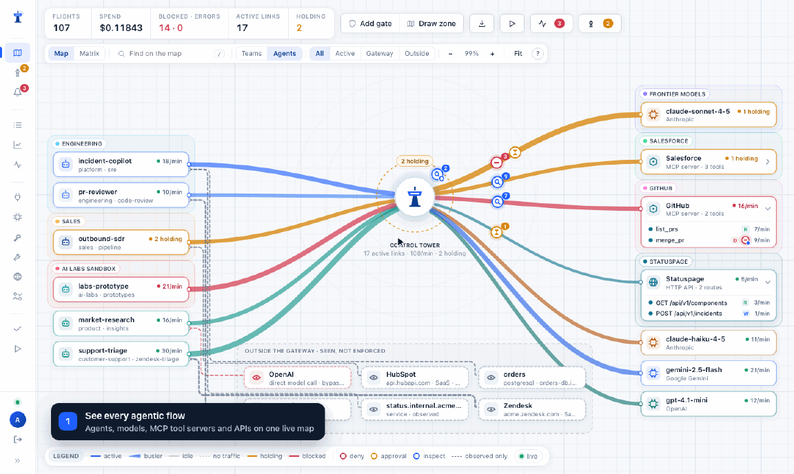

<p align="center">
  <br/>
  The self-hosted AI gateway that <em>shows</em> you where your agents go — and lets you stop them at the border.<br/>
  <a href="https://joshmaster2165.github.io/controltower/">Website</a> · <a href="#quickstart">Quickstart</a> · <a href="docs/threat-model.md">What is enforced</a> · <a href="CONTRIBUTING.md">Contributing</a>
</p>

<p align="center">
  <br/>
  <sub>The real console with the demo fleet: <b>see</b> every flow, <b>trace</b> an agent, <b>draw a gate</b>, <b>approve</b> the held call. Recorded with <code>pnpm demo:gif</code>.</sub>
</p>

---

**Mission:** map and document every agentic dataflow across your environment — which agents reach which models, MCP servers, tools and integrations — while enforcing permissions and security on those flows and monitoring usage and spend.

**Control Tower** is an open-source AI gateway with a live map of agent traffic. Point your agents at it like you would any OpenAI-compatible endpoint; every model call and every MCP tool call becomes a *flight* on the **Airspace**. Draw **zones** around systems, put **gates** on the boundaries, and require a human to approve a flight before it crosses. It is an enforcement point, not a dashboard: a gate that says *no* returns a 403 to the agent.

- **See it.** Agents, models, MCP servers and their tools on one interactive map. Every connection shows its state — active, idle, unused, holding, blocked — so it stays readable at hundreds of agents. Drag nodes to arrange the map (the arrangement is saved and shared), pan and zoom, and click any node to trace everything it connects to.
- **Draw the rules.** Lasso stations into a zone, click a boundary, pick *allow / deny / require approval / allow with limits*. YAML is the *output*, for review and Git.
- **Try before you enforce.** *Simulate* replays the last 24 hours of recorded traffic through a draft gate — "would block 37 requests from 4 agents, hold 12, stop $4.10 of spend" — and highlights the affected paths on the map. On an existing gate, *Impact* shows what it actually changed.
- **Stop it.** Approvals hold the agent's request at the gate; a human clicks approve in the **Tower** and the flight continues. Unanswered holds turn into a resumable ticket, never a silent timeout.
- **Inspect it.** *Inspect gates* scan what passes along a path — prompts, model replies, MCP tool arguments and tool results — for secrets, personal data, prompt injection or your own keywords, and mask it, block it, or flag it.
- **Hear about it.** Alerts on any gate (*blocked*, *held*, *masked*, *approval misused* …), provider outages and recoveries, failing or slow requests, budgets nearly or fully used, and a daily summary — every time or only when it repeats (e.g. 5× in 10 min). They land in the console inbox and can go to Slack or a signed webhook; a cooldown rolls bursts into one summary. Prometheus metrics at `/metrics`.
- **Count it.** Per-key, per-team, per-model spend and tokens with budgets and rate limits — the accounting you'd expect from an LLM gateway, with the map on top.

> Status: **v0.1 preview.** Working today: the OpenAI-compatible and Anthropic-native gateway (OpenAI, Azure, Anthropic, Google Gemini, Google Vertex AI, AWS Bedrock, Groq, Together, Mistral, DeepSeek, xAI, OpenRouter, Ollama, vLLM, any OpenAI-compatible URL) with chat, embeddings and OpenAI's Responses API, API keys with limits and budgets, cost accounting from a vendored price table, the live Airspace (including traffic that bypasses the gateway), zones and gates drawn on the map, human approvals with hold → ticket → grant (also from Slack), inspect gates, alerts, simulating a gate on past traffic, the Ledger, data-flow export, `/metrics`, a LiteLLM config importer, the MCP tool gateway, an HTTP gateway for plain REST APIs, and demo mode. Not yet: Flight Recorder replay, YAML policy import/export, email approvals, an egress proxy for traffic that skips the gateway, Postgres/Redis for multiple instances, and users/SSO. See the roadmap and [docs/threat-model.md](docs/threat-model.md).

## Quickstart

```bash
docker run -p 4000:4000 -v controltower-data:/data ghcr.io/joshmaster2165/controltower
```

Open <http://localhost:4000> and set your admin password. The **Get started** guide takes you from there: connect a provider, create a key for your agent (with copy-paste setup and a live "connected" check), and see it on the map — about five minutes, and no code changes for most agents. The terminal prints the same URLs when the server starts.

Just exploring? `CT_DEMO=1` (or *Start the demo fleet* on the Get started page) fills the map with a synthetic fleet — six agents such as `support-triage` and `pr-reviewer`, calling Claude, GPT and Gemini models, Salesforce/GitHub tool servers and a Statuspage API — through the real pipeline. Demo providers are stand-ins: nothing leaves your machine, but models are priced like the real ones. *Stop demo and clear it* removes every demo row and its traffic, and leaves your own setup alone; demo mode refuses to start if your setup already uses one of its model or tool names, so demo traffic can never reach real providers.

### Other ways to run it

- **Docker Compose:** `docker compose -f deploy/docker-compose.yml up -d`
- **Render, one click:** [](https://render.com/deploy?repo=https://github.com/joshmaster2165/controltower) — the published image on a Starter instance with a 1 GB disk for the database (Render disks need a paid instance). The console is at the `onrender.com` URL Render gives you.
- **Fly.io:** with [`flyctl`](https://fly.io/docs/flyctl/install/):

  ```bash
  fly launch --config deploy/fly.toml --copy-config --no-deploy   # pick an app name and region
  fly volumes create controltower_data --size 1
  fly deploy --config deploy/fly.toml
  ```
- **Anywhere that runs containers:** use `ghcr.io/joshmaster2165/controltower`, mount a volume at `/data`, and send traffic to port 4000 (or the `PORT` the platform sets — the image honours it). Links in alerts use `CT_PUBLIC_URL`; on Render and Fly it is detected automatically.

Then, in the browser:

1. **Providers** → add OpenAI / Anthropic / Azure / Gemini / Vertex AI / Bedrock / any OpenAI-compatible URL, paste credentials, *Test Connect*.
2. **Keys** → create a key per agent. The console shows copy-paste setup for OpenAI SDKs, Claude Code, Anthropic SDKs and MCP clients with the key filled in, and turns green when the agent's first request arrives.
3. Point the agent at Control Tower — usually just two environment variables, no code changes:

   ```bash
   export OPENAI_BASE_URL=http://localhost:4000/v1      # OpenAI SDKs
   export OPENAI_API_KEY=ct_sk_…
   export ANTHROPIC_BASE_URL=http://localhost:4000      # Claude Code: ANTHROPIC_AUTH_TOKEN=ct_sk_…
   ```

   The OpenAI Agents SDK and Codex use the Responses API: `/v1/responses` is forwarded to OpenAI, Azure OpenAI and OpenAI-compatible providers, with the same keys, gates, approvals and accounting. (Claude and Gemini models don't have a Responses API; call them through `/v1/chat/completions` or `/v1/messages`.)

   Model names stay as they are: the first time an agent asks for a model a connected provider serves (`gpt-4.1-mini`, `claude-sonnet-4-5`, a model on your Ollama…), Control Tower adds it and prices it. Pin a provider with `<provider>/<model>`. **Models** is for extras: renaming, aliases with fallbacks, price overrides.
4. **MCP servers** → register tool servers; point MCP clients at `http://localhost:4000/mcp` with the same key. Tools a key may not use are not listed.
5. **Airspace** → *Draw zone*, lasso some stations, click a zone label to add a gate: allow, deny, or require approval. Held flights show up in the **Tower**.

```python
from openai import OpenAI
client = OpenAI(base_url="http://localhost:4000/v1", api_key="ct_sk_...")
client.chat.completions.create(model="gpt-4.1-mini", messages=[{"role": "user", "content": "hello tower"}])
```

## Run from source

Requires Node 24 and pnpm.

```bash
pnpm install
pnpm --filter @controltower/ui build      # builds the console into ui/dist
CT_DEMO=1 pnpm dev                        # http://localhost:4000
```

For UI development with hot reload run `pnpm dev:ui` in a second terminal and open <http://localhost:5173> (it proxies the API to :4000).

## Concepts

| Term | Meaning |
|---|---|
| **Airspace** | The live map. Stations are systems; regions are zones; traffic is animated. |
| **Station** | Agent (API key), model deployment, MCP server / tool, browser, integration, data store. |
| **Zone** | A region grouping stations, drawn by lasso. |
| **Lane** | An edge between stations. Solid = enforced by the gateway, dashed = observed only. |
| **Flight** | One request — an LLM call or a tool call. |
| **Gate** | A rule on a zone boundary: open, barrier, checkpoint (approval), toll (limits). |
| **Tower** | The approvals queue. |
| **Inspect gate** | A guardrail on a path: what to look for, which direction, and whether to mask, block or flag. Runs alongside access gates. |
| **Alert** | A notification rule on a gate: which outcomes, how often, where to send it. |
| **Ledger** | Cost, tokens, latency. |
| **Flight Recorder** | Replay and *simulate* — what would this rule have done to yesterday's traffic? |

## Document it

- **Export → Map image**: the whole map (every node, not just what's on screen) as a 2× PNG with a title strip — for architecture docs and security reviews.
- **Inventory** (nav) / **Export → Data-flow inventory**: every agent, model and MCP tool server, and every agent → model/tool path seen in the last 24 h / 7 d / 30 d, with requests, errors, blocked, held and spend — and, per path, what Control Tower does today: the access decision and the gate behind it, the inspect gates that scan it, and whether the agent's key even allows it. Printable, or download as Markdown (`/admin/api/export/dataflow?format=md`) or CSV (`?format=csv`).

## Simulate

In the gate composer, **Simulate on last 24 h** replays recorded flights through the current gates and through the gates with your draft added, and reports only the flights whose outcome changes: how many would be blocked, held for approval or let through, by which agents, to which targets, and the spend that blocked requests accounted for. On an existing gate, **Impact in the last 24 h** compares the gates without it to the gates with it; after changing its effect, **Simulate this change** shows the difference. Affected paths are drawn dashed on the map with their counts until the panel closes.

Limits, shown with each result: tool arguments and bodies are not stored, so argument conditions can't be replayed and inspect gates can't be simulated; held requests count as held, not guessed approved. The replay covers up to 200,000 recent flights and yields to live traffic as it runs. API: `POST /admin/api/policy/simulate`.

## Coming from LiteLLM

LiteLLM's proxy setup steps work here as written: same config file, same flags, same master key, same client settings. `e2e/litellm-parity.spec.ts` runs them against a real server with the official OpenAI, Anthropic and MCP SDKs.

| LiteLLM docs | Control Tower |
|---|---|
| `litellm --config config.yaml` | `pnpm build && pnpm start --config config.yaml` from a checkout (also `--port`, `--host`, `--detailed_debug`, `--model openai/gpt-4o`, `--help`) |
| `docker run -v ./config.yaml:/app/config.yaml … --config /app/config.yaml` | `docker run -v ./config.yaml:/app/config.yaml -p 4000:4000 ghcr.io/joshmaster2165/controltower --config /app/config.yaml` |
| `LITELLM_MASTER_KEY` or `general_settings.master_key` | Same. The master key is the admin API bearer, an all-access key for model calls, and the console password for user `admin` (`UI_USERNAME`/`UI_PASSWORD` override). `CT_ADMIN_KEY` is the native name. |
| `POST /key/generate` with `models`, `max_budget`, `budget_duration`, `rpm_limit`, `tpm_limit`, `max_parallel_requests`, `duration`, `key_alias`, `metadata`, `object_permission.mcp_servers` | Same request, same response fields. `/key/info`, `/key/update`, `/key/list`, `/key/delete`, `/key/block`, `/key/unblock`, `/key/regenerate` too. A custom `key` (e.g. an existing `sk-…`) is accepted, so agents keep working after a move. |
| `/model/info`, `/model/new`, `/model/delete` | Same. Models declared in `--config` can't be deleted through the API, as in LiteLLM. |
| `base_url="http://0.0.0.0:4000"` (no `/v1`) | Both work: `/chat/completions`, `/embeddings`, `/models` answer with and without `/v1`. |
| `Authorization: Bearer`, `x-litellm-api-key`, Azure `api-key`, `/openai/deployments/<model>/…` | All accepted. |
| Claude Code with `ANTHROPIC_BASE_URL` and `ANTHROPIC_AUTH_TOKEN` | Same, including `/v1/messages/count_tokens` (forwarded to Anthropic for exact counts). |
| `/health/liveliness`, `/health/readiness`, `/health` | Same paths and shapes. |
| `/ui` | Redirects to the console. |

**The config file.** With `--config` (or `CT_CONFIG` / `CONFIG_FILE_PATH`), the file is the source of truth for what it declares: it is applied at every start, edits and removals take effect on restart, and nothing is duplicated. Rows it created keep stable ids, so the map and history keep pointing at the same stations. Models, keys and gates added in the console or through the API are separate and stay. A file that can't be read or parsed stops startup, with the reason.

- `model_list` entries become providers (one per distinct endpoint + credential; `credential_list` names are kept) and deployments. Groups with several entries, `order` tiers and `fallbacks` become aliases: `order` maps to priority, `weight`/`rpm`/`tpm` to weight, and `routing_strategy` to weighted, fastest-first or cheapest-first. `input_cost_per_token`/`output_cost_per_token` become per-deployment pricing.
- Wildcards: `openai/*` connects the provider and adds each model the first time it's requested; `model_name: "*"` does that for every provider whose key is in the environment.
- `mcp_servers` with an HTTP URL become MCP servers, with `auth_type` (`bearer_token`, `api_key`, `basic`), `auth_value` and `static_headers`.
- `general_settings.alerting: ["slack"]` with `SLACK_WEBHOOK_URL` creates a Slack alert channel; `alert_types` map to alert rules (`llm_exceptions`, `llm_too_slow`, `budget_alerts`, `cooldown_deployment`, `daily_reports`, and their aliases).
- Providers: OpenAI, Azure OpenAI, Anthropic, Gemini, Vertex AI, Bedrock, Groq, Mistral, Together, Fireworks, DeepSeek, xAI, OpenRouter, Perplexity, Cerebras, DeepInfra, Ollama, vLLM, LM Studio and any `openai/` + `api_base` endpoint.
- Secrets: values in the file are used as-is; `os.environ/NAME` (and LiteLLM's default variables such as `OPENAI_API_KEY`) are read from the environment. A provider whose key is missing is skipped with a warning, and the server still starts.

Prefer clicking? **Models → Import from LiteLLM** takes the same file, shows what it becomes, and imports it once.

**What differs.** There is no Postgres: data lives in SQLite under `/data`, so `DATABASE_URL`, `LITELLM_SALT_KEY` and `STORE_MODEL_IN_DB` are not needed (the server says so if they're set). Credentials are encrypted with `/data/master.key`. It runs as one process, so `--num_workers` does nothing. Keys stored in LiteLLM's database can't be read out of it; recreate them with `/key/generate` and the same `key` value. Not implemented yet: `/spend/*`, team/user/organization endpoints, callbacks and guardrails from the config, `include` files, context-window and content-policy fallbacks, and LiteLLM's Prometheus metric names (see [Metrics](#metrics) for ours).

## Inspect gates (guardrails)

Pick **Inspect** when adding a gate. A gate with no agent or destination covers everything and sits on the tower itself.

- **Detectors**: secrets and credentials (AWS, GitHub, Slack, Stripe, OpenAI, Anthropic and Google keys, JWTs, private keys, connection strings with passwords, Control Tower keys); personal data (email, phone, card numbers with a Luhn check, US SSN, IBAN with its checksum, IP address); prompt injection (ignore-your-instructions phrasing, role overrides, system-prompt extraction, chat-template markup, "send the credentials to…"); and your own keywords.
- **Direction**: what agents send (prompts, tool arguments), what comes back (model replies, tool results), or both. Scanning tool results is where indirect prompt injection and data leaks are caught before the model reads them.
- **Action**: *mask* replaces the match with a placeholder such as `[EMAIL]` or `[SECRET:AWS_KEY]`; *block* returns `400 content_blocked` with a message the agent can act on (for MCP, an `isError` tool result); *flag* lets it through and records it. Every match shows on the map and can trigger an alert (`blocked`, `masked`, `flagged`).
- **Honest limits**: detectors are pattern-based and catch well-formed, common cases, not deliberate evasion. Streamed model replies are checked after delivery, so on a stream a match is flagged, never masked or blocked. Findings record which detectors matched and how often — never the matched text.

## Alerts

Click a gate on the Airspace and choose **Add alert**, tick *Alert me* when creating a gate, or use the **Alerts** page (which also holds the inbox and the channels). An alert rule watches one of:

| Kind | Fires on |
|---|---|
| Gate | `blocked`, `held`, `approved`, `rejected` (by an approver), `unanswered` (hold or approval expired), `allowed`, `scope_mismatch` (an approval redeemed with different arguments — a security event), `masked` / `flagged` (inspect gates) |
| Provider outage | `outage`: N upstream timeouts, network errors or 5xx for one model or MCP server within a window (rate limits and 4xx don't count; each deployment has its own window) · `recovered`: the first success after an outage alert |
| Failed requests | `failed`: requests that still failed after fallbacks, optionally for chosen agents or models |
| Slow requests | `slow`: requests slower than a threshold (default 30 s) |
| Budget | `budget_warning` at a percentage (default 80%) and `budget_exceeded`, for every key, team and project budget — once per budget period |
| Daily summary | `daily`: requests, tokens, spend, blocked / held / masked counts, errors, top spenders, most-failing and slowest models, at a chosen UTC hour; skipped on days without traffic |

- **Condition**: every time, or *N times within M minutes*. After firing, the rule stays quiet for its cooldown and then sends one digest of what happened meanwhile.
- **Channels**: the console inbox (always, with a nav badge and live toasts), Slack incoming webhooks (also Mattermost / Rocket.Chat), and generic webhooks. Channel URLs and secrets are encrypted at rest and never returned by the API.
- **Webhook payload**: `POST` JSON `{ "type": "controltower.alert", "kind", "title", "trigger", "count", "subject": {kind, id, name}, "gate": {id, name, effect}, "agents": [{name, count}], "destinations": [...], "reason", "lines": [...], "flights": [ids], "console_url", ... }`. With a signing secret, `x-ct-signature: t=<unix>,v1=<hex>` where `v1 = HMAC-SHA256(secret, "<t>.<raw body>")`. Delivery retries twice on network errors, 408, 429 and 5xx.
- **Approvals from Slack**: a `held` alert about one request links straight to that approval card (`/#/tower/<approval id>`) — Slack gets a *Review & approve* button and a "Decision needed: Approve ONE call to … from …" line; webhooks get `approval: {id, scope, url}`. The link only opens the card: approving is always an authenticated action in the console, never a click on a URL (link unfurlers can't approve anything). If someone already decided, the card says who and when.
- Alerts carry names and counts only — never prompts, tool arguments or responses. Set `CT_PUBLIC_URL` so links in Slack and webhooks point at your console.

## Metrics

`GET /metrics` serves Prometheus text format. It names agents and shows spend, so it is never anonymous: set `CT_METRICS_TOKEN` and scrape with `Authorization: Bearer <token>` (a signed-in admin can also open it).

```yaml
scrape_configs:
  - job_name: controltower
    authorization: { credentials: <CT_METRICS_TOKEN> }
    static_configs: [{ targets: ['controltower:4000'] }]
```

Counters: `controltower_requests_total{agent,team,kind,model,provider,status}`, `controltower_tokens_total{agent,model,type}`, `controltower_spend_usd_total{agent,team,model}`, `controltower_upstream_failures_total{model,code}`, `controltower_fallbacks_total{model}`, `controltower_gate_decisions_total{gate,decision}`, `controltower_approvals_total{outcome}`. Histograms (5 ms … 600 s): `controltower_request_duration_seconds`, `controltower_time_to_first_token_seconds`, plus `controltower_gateway_overhead_seconds`. Gauges: requests in flight, held requests, event backlog, `controltower_deployment_state` (0 healthy, 1 cooling down), `controltower_mcp_server_up`, budget limit / spent / remaining per scope, build info and uptime. Labels are bounded: a model name the gateway doesn't know is reported as `other`, so clients can't create series at will.

## HTTP APIs

Plain REST APIs — a status page, an internal service, a SaaS API without an MCP server — can go through Control Tower too. Register one under **HTTP APIs** (name, base URL, and its credentials, stored encrypted), then point the agent at `/http/<slug>` instead of the API's own host:

```bash
curl http://localhost:4000/http/statuspage/api/v1/components -H "x-ct-key: $CT_KEY"
```

- The agent sends only its **own Control Tower key** (`x-ct-key`, or `Authorization: Bearer ct_sk_…`). Control Tower strips it, adds the API's stored credentials and forwards the request, so the agent never holds the API's secret.
- Every call is a flight named by route — `statuspage › POST /api/v1/incidents`, with record ids folded (`GET /v2/users/:id`) — and each route is a row under the API on the map.
- Gates work exactly as they do for MCP tools: match an API, a route glob (`statuspage__DELETE *`), or an operation — `GET`/`HEAD` are *read*, `POST`/`PUT`/`PATCH` *write*, `DELETE` *destructive*. Approvals, inspect gates on request and response bodies, rate limits, alerts and the inventory all apply.
- A held call answers `403` with `x-ct-status: approval_required` and a ticket; retry the same request with `x-ct-approval: <ticket>` once a human approves.
- Agents can reach only paths under the registered base URL: dot segments and encoded dots are refused before anything is sent. Bodies up to 10 MB each way are relayed; streaming responses are buffered.

On the map, **Bring it inside** on an observed SaaS or HTTP system pre-fills this form with its name and host.

## Traffic that doesn't go through Control Tower

Agents also call databases, SaaS APIs and internal services directly. Report those calls and they appear on the map as **dashed lines straight from the agent to the system — not through the tower** — and in the inventory under *Seen, not enforced*. A model provider called directly (OpenAI, Anthropic, Bedrock, …) is drawn **red**: that traffic is skipping the gateway, its gates and its budgets.

Authenticate with the agent's own Control Tower key.

```bash
curl -X POST http://localhost:4000/v1/observe \
  -H "Authorization: Bearer $CT_KEY" -H "content-type: application/json" \
  -d '{"events":[{"target":"https://api.stripe.com/v1/refunds","operation":"write"},{"target":"postgresql://orders-db:5432/orders","kind":"database","count":12}]}'
```

Or point any OpenTelemetry SDK at Control Tower — outbound (`CLIENT`/`PRODUCER`) spans become observed calls, using the standard HTTP, database, messaging, RPC and GenAI attributes; calls to Control Tower itself are ignored:

```bash
OTEL_EXPORTER_OTLP_TRACES_ENDPOINT=http://localhost:4000/v1/traces
OTEL_EXPORTER_OTLP_TRACES_PROTOCOL=http/json
OTEL_EXPORTER_OTLP_TRACES_HEADERS="Authorization=Bearer ct_sk_…"
```

Only a target name is kept: URLs lose their path and query string, connection strings lose their credentials (`postgresql://app:pw@db/orders` → `postgresql://db/orders`), and no payload is stored. OTLP protobuf is not accepted yet — use `http/json`.

## What is actually enforced

Control Tower only enforces traffic that goes through it. A lane is drawn **solid** only when the gateway is in the path for that hop (LLM calls, MCP tool calls and HTTP API calls routed through Control Tower). Anything learned by observation alone is drawn **dashed**, and a rule existing on an edge never makes it solid. An agent that edits its own `base_url` bypasses the LLM gateway; the MCP gateway's `tools/list` filtering is the stronger control, because a tool the agent cannot see needs no approval. Traffic reported through `/v1/observe` or OpenTelemetry is *seen*, never enforced, and is drawn dashed. An agent can likewise call an HTTP API's own host instead of `/http/<slug>` if it still holds that API's credentials — revoke them once traffic flows through the tower. An egress-proxy sidecar to close these gaps at the network level is on the roadmap. We would rather you know the boundary than believe in one that isn't there.

## Configuration

Everything is configured in the browser. Environment variables exist for operators:

| Variable | Default | Purpose |
|---|---|---|
| `CT_PORT` | `4000` | Listen port (falls back to `PORT`, which most platforms set). `--port` wins. |
| `CT_CONFIG` | — | LiteLLM-format config applied at every start (also `CONFIG_FILE_PATH` or `--config`) |
| `CT_ADMIN_KEY` | — | Admin key for the admin API and model calls, and the console password for `UI_USERNAME` (default `admin`). `LITELLM_MASTER_KEY` and `general_settings.master_key` work too. |
| `CT_DATA_DIR` | `./data` (`/data` in Docker) | SQLite database and the master key |
| `CT_MASTER_KEY` | generated | Base64 32-byte key encrypting provider credentials at rest. Back up `/data/master.key` if you let it generate one. |
| `CT_DEMO` | `0` | Seed stand-in Anthropic/OpenAI/Gemini providers and demo tool servers, and run a synthetic agent fleet |
| `CT_AUTO_MODELS` | `1` | Add a deployment the first time a request names a model a connected provider serves; `0` requires every model to be added under Models |
| `CT_MODE` | `on` | `off` disables policy enforcement (kill switch) |
| `CT_METRICS_TOKEN` | — | Bearer token for Prometheus to scrape `/metrics` |
| `CT_PUBLIC_URL` | — | Public URL, used for links in alerts, signed approval links and the ingress probe. Detected on Render and Fly.io |
| `CT_HOLD_BUDGET_MS` | `20000` | How long a request may wait at a gate for a human before becoming a ticket |
| `CT_MAX_HELD` | `500` | Max concurrently held requests per process |

## Roadmap

- **v0.1 — see it and stop it**: gateway (`/v1/chat/completions`, `/v1/embeddings`, `/v1/models`, `/v1/messages`), OpenAI-compatible + Anthropic adapters, keys/limits/budgets, pricing and cost, live Airspace, zones + gates + approvals, MCP gateway, demo mode, Docker image.
- **v0.2 — understand it** (mostly shipped): simulate gates on past traffic ✓, Ledger ✓, allow-with-limits gates ✓, Slack approvals ✓, observed traffic via `/v1/observe` and OTLP ✓, Gemini/Bedrock/Vertex adapters ✓, Prometheus ✓, inspect gates ✓, alerts ✓. Still to come: Flight Recorder replay, YAML policy import/export, email approvals.
- **v0.3 — trust it**: egress proxy sidecar, Playwright fixture for browser agents, Postgres + Redis multi-instance, audit export; enterprise: users/RBAC/SSO.

## License

Apache-2.0 for everything outside `ee/`. See [LICENSE](LICENSE); third-party notices for bundled data are in [THIRD_PARTY.md](THIRD_PARTY.md).
