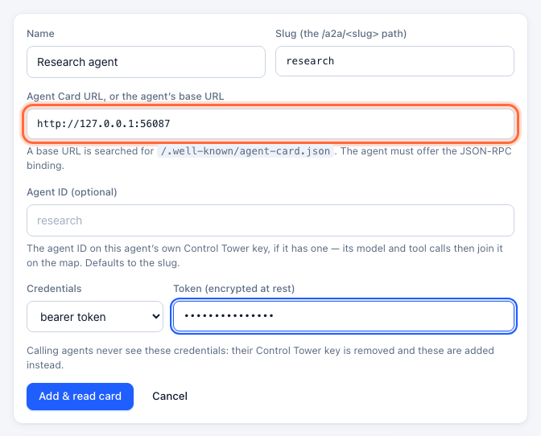
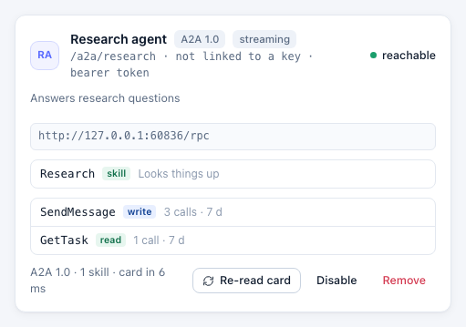
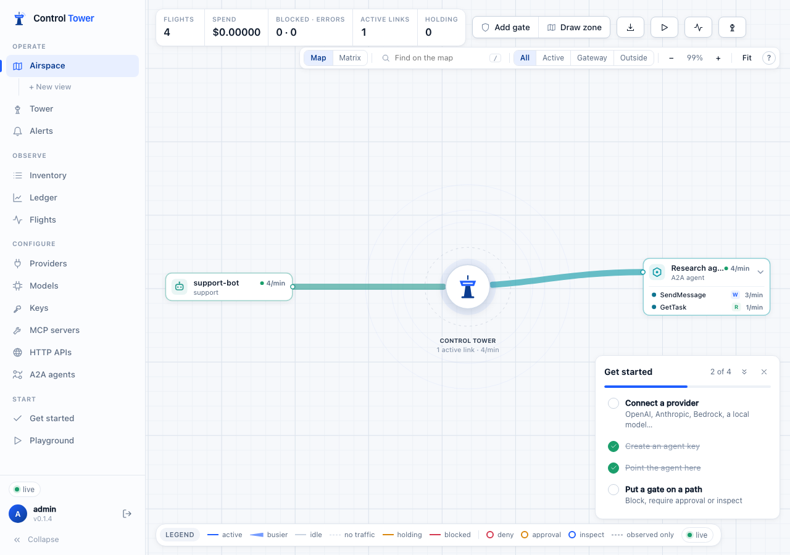

# A2A agents

[A2A (Agent2Agent)](https://a2a-protocol.org) is the open protocol agents use to talk to other agents: a remote agent publishes an **Agent Card** describing its skills and endpoint, and callers send it messages and follow its tasks over JSON-RPC. Control Tower stands in front of such an agent. Callers find it through a card Control Tower publishes, reach it with their own Control Tower key, and every message and task call is a flight: recorded, drawn on the Airspace, and open to gates, approvals and inspect gates like any tool call.

## Quick reference

| | |
|---|---|
| Register | **A2A agents → Add agent**, with the agent's Agent Card URL or base URL |
| The card callers use | `<control tower>/a2a/<slug>/.well-known/agent-card.json` (also `…/agent.json`) |
| The endpoint callers use | `POST <control tower>/a2a/<slug>` — JSON-RPC |
| Authentication | The caller's Control Tower key as `Authorization: Bearer ct_sk_…`; the agent's own credentials are added by Control Tower |
| Versions | A2A 1.0 (`SendMessage`, `GetTask`, …) and 0.3 (`message/send`, `tasks/get`, …), over the JSON-RPC binding |
| On the map | A destination station, **A2A agent**, with a row for each method called |
| In gates | Tools named `<slug>__<Method>` — `research__SendMessage`, `research__GetTask` |
| Delegation | The agent is sent a token (in `params.metadata` and the `x-ct-delegation` header) to pass on with its own calls — see [Agents calling agents](agent-to-agent.md) |

## Step 1: Register the agent

Under **A2A agents**, click **Add agent**. Give it a name and a slug (its path under `/a2a/`), and the URL of its Agent Card — or the agent's base URL, under which `/.well-known/agent-card.json` is looked for. If the agent asks callers for a token, add it under **Credentials**: it is encrypted at rest, and calling agents never see it.



Control Tower reads the card, finds the agent's JSON-RPC endpoint and lists its skills. **Agent ID** is the agent ID on the remote agent's own Control Tower key, if it has one, so that its own model and tool calls join it on the map; it defaults to the slug.

The API equivalent:

```bash
curl -s $CT/admin/api/a2a/agents -H "$ADMIN" -H 'content-type: application/json' \
  -d '{"name": "Research agent", "slug": "research", "url": "https://research.internal.example.com",
       "auth": {"type": "bearer", "token": "…"}}'
```

## Step 2: Point the calling agent at Control Tower

Give the calling agent the card at Control Tower instead of the agent's own, and its Control Tower key:

```text
https://tower.example.com/a2a/research/.well-known/agent-card.json
Authorization: Bearer ct_sk_…
```

The published card is the agent's own — name, description, skills, capabilities — with its interface pointing at `https://tower.example.com/a2a/research` and a bearer security scheme asking for a Control Tower key. Any A2A client that reads the card then sends everything through Control Tower. Fetching the card needs a key too, so an agent's description and skills aren't open to anyone who can reach Control Tower; A2A clients send headers for the card request the same way they do for calls.

Give clients the **full card URL**, not `…/a2a/research` as a base URL: A2A clients such as the official JavaScript SDK look for `/.well-known/agent-card.json` at the root of the host they're given, which here is Control Tower itself. With the official JavaScript SDK (`@a2a-js/sdk`):

```ts
import { ClientFactory, ClientFactoryOptions, DefaultAgentCardResolver, JsonRpcTransportFactory } from '@a2a-js/sdk/client';

// Every request — the card and the calls — carries the agent's Control Tower key.
const withKey: typeof fetch = (input, init) => {
  const headers = new Headers(init?.headers);
  headers.set('authorization', `Bearer ${process.env.CT_KEY}`);
  return fetch(input, { ...init, headers });
};
const factory = new ClientFactory(
  ClientFactoryOptions.createFrom(ClientFactoryOptions.default, {
    transports: [new JsonRpcTransportFactory({ fetchImpl: withKey })],
    cardResolver: new DefaultAgentCardResolver({ fetchImpl: withKey }),
  }),
);
const client = await factory.createFromUrl('https://tower.example.com/a2a/research/.well-known/agent-card.json', '');
```

For an agent on A2A 0.3, add `legacyCompat: { enabled: true }` to both the transport factory and the resolver.

A call, by hand:

```bash
curl https://tower.example.com/a2a/research \
  -H "Authorization: Bearer ct_sk_…" \
  -H "Content-Type: application/json" \
  -H "A2A-Version: 1.0" \
  -d '{"jsonrpc": "2.0", "id": 1, "method": "SendMessage",
       "params": {"message": {"messageId": "m1", "role": "ROLE_USER", "parts": [{"text": "What is the refund policy?"}]}}}'
```

`GET /a2a` with a key lists the A2A agents that key may reach, with their card URLs.

## Step 3: See it

The agent's card lists the methods agents have called it with:



On the **Airspace** the agent is a destination — **A2A agent** — with a row per method, and a line from every agent that calls it:



## Gates

Each method is a tool named `<slug>__<Method>`, by its A2A 1.0 name whichever version the caller speaks, and counted as a read or a write:

| Method (1.0 · 0.3) | Operation |
|---|---|
| `SendMessage` · `message/send` | write |
| `SendStreamingMessage` · `message/stream` | write, streamed |
| `GetTask` · `tasks/get`, `ListTasks` · `tasks/list` | read |
| `CancelTask` · `tasks/cancel` | write |
| `SubscribeToTask` · `tasks/resubscribe` | read, streamed |
| `…TaskPushNotificationConfig…` · `tasks/pushNotificationConfig/…` | create and delete write, get and list read |
| `GetExtendedAgentCard` · `agent/getAuthenticatedExtendedCard` | read |

So a gate on `research__SendMessage` controls who may give the research agent work, while `research__Get*` leaves them free to follow the tasks they started. A key's [`allowed_mcp`](keys.md) globs apply too: a key limited to `files__*` can't reach `research__*`, and doesn't see it in `GET /a2a`.

```yaml
gates:
  - name: Only people approve work for the payments agent
    match:
      tools: ["payments__SendMessage", "payments__SendStreamingMessage"]
    effect: require_approval
```

A denied call is a JSON-RPC error whose `code` is the HTTP status, with the reason in `data`, as the A2A specification describes:

```json
{"jsonrpc": "2.0", "id": 1, "error": {"code": 403, "message": "Blocked by Control Tower policy. …",
  "data": [{"@type": "type.googleapis.com/google.rpc.ErrorInfo", "reason": "POLICY_DENIED", "domain": "controltower",
            "metadata": {"flight_id": "…", "rule_id": "…"}}]}}
```

A call held for approval that times out answers `APPROVAL_REQUIRED` with a `ticket` in `metadata`; once a person approves it in the Tower, send the same call again with `params.metadata.ct_approval` (or the `x-ct-approval` header) set to the ticket.

**Inspect gates** read the message an agent sends (`params.message`) before it leaves, and the reply before the caller sees it. Streamed replies are relayed as they come and are not inspected.

## What is and isn't covered

- **JSON-RPC only.** An agent that offers only gRPC or HTTP+JSON can't be registered; the error says what it offers.
- **Push notifications** go from the agent straight to the webhook the caller gave it, not through Control Tower. Creating and listing push configurations do go through it and can be gated.
- **The agent's card signatures** are removed from the published card: it is no longer the card the agent signed.
- The card is read again every 10 minutes, and on **Re-read card**. An agent whose card can't be read is marked down and keeps its last good card.

## Troubleshooting

| Error | Cause | Fix |
|---|---|---|
| `401`, reason `INVALID_API_KEY` | No Control Tower key, or the agent's own token was sent | Send the Control Tower key as `Authorization: Bearer ct_sk_…` |
| `404`, reason `AGENT_NOT_FOUND` | Unknown slug, the agent is disabled, or its card was never read | Check **A2A agents**; click **Re-read card** |
| `-32601` Method not found | A method that isn't in A2A 1.0 or 0.3 | Check the method name and the `A2A-Version` header |
| `403`, reason `TOOL_NOT_ALLOWED` | The key's `allowed_mcp` doesn't include `<slug>__*` | Widen the key's `allowed_mcp` |
| "offers GRPC … but not JSON-RPC" when registering | The agent doesn't serve the JSON-RPC binding | Enable JSON-RPC on the agent |
| `502`, reason `INVALID_AGENT_RESPONSE` | The agent's endpoint didn't answer with JSON-RPC | Check the endpoint in its card and the credentials |

## Next steps

- [Agents calling agents](agent-to-agent.md) — delegation tokens and gates on whom a call is for
- [Airspace, gates & approvals](airspace.md)
- [HTTP APIs](http-apis.md) — for agents exposed as plain REST
