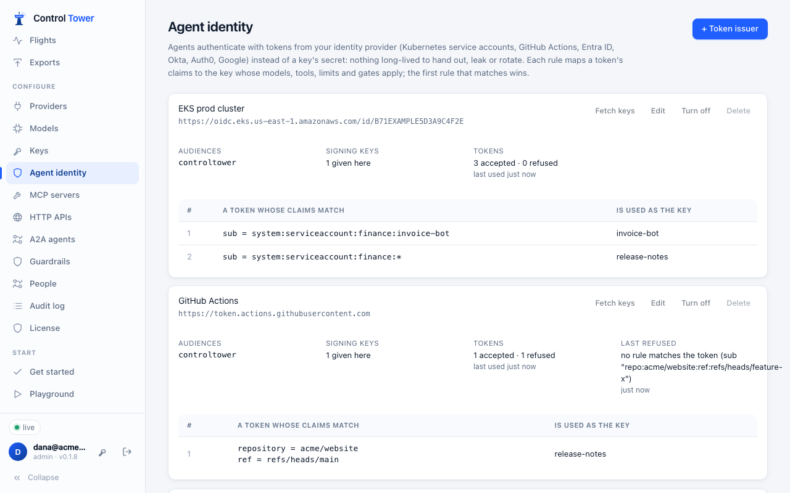
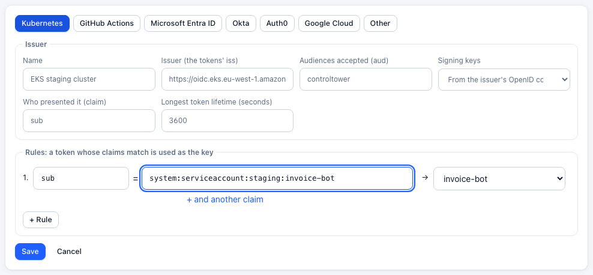
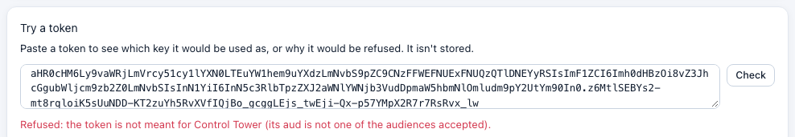
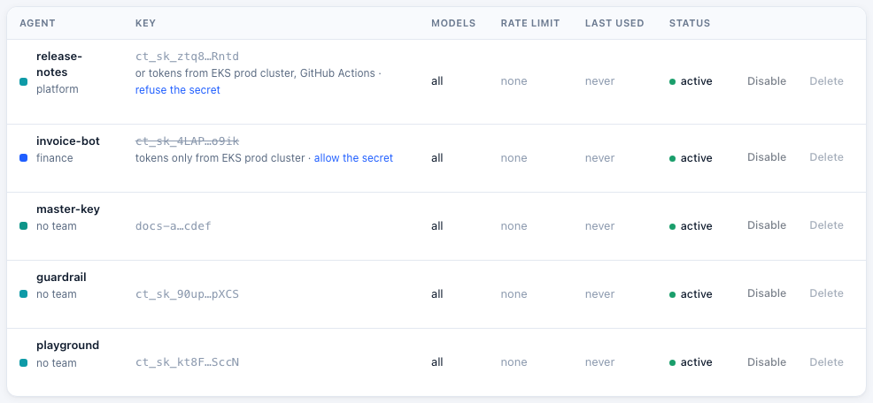

# Agent identity: tokens instead of keys

**Enterprise:** JWT authentication for agents needs a [Control Tower Enterprise](enterprise.md) license.

An agent can authenticate with a token from your identity provider instead of a [key](keys.md)'s secret: a Kubernetes service account token, a GitHub Actions OIDC token, or a client-credentials token from Microsoft Entra ID, Okta, Auth0 or Google. Nothing long-lived is handed out, so there's nothing to leak or rotate. The token names the workload, and your identity provider already controls who gets one.

You tell Control Tower which issuers to trust. Each issuer has **rules** that map a token's claims to a key. The first rule that matches wins, and the call is then made as that key, with its models, tools, limits, budgets and [gates](airspace.md). Each call also records who presented the token, for example `EKS prod cluster · system:serviceaccount:finance:invoice-bot`.



## What a token must be

A token is accepted only when all of these hold:

| Check | |
|---|---|
| **Signed by the issuer** | With one of the issuer's published keys, using an asymmetric algorithm (RS256/384/512, PS256/384/512, ES256/384/512, EdDSA). Unsigned tokens (`alg: none`) and shared-secret algorithms (HS256…) are refused |
| **From that issuer** | Its `iss` is exactly the issuer set up |
| **Meant for Control Tower** | Its `aud` includes one of the audiences you accept. Without this, a token your identity provider issued for another service could be replayed here, so an audience is required |
| **Current** | It has an `exp` and hasn't expired, and isn't before its `nbf`. Clocks may differ by up to 60 seconds |
| **Short-lived** | Its lifetime (`exp` − `iat`) is no longer than the issuer's limit (24 hours unless you set another) |
| **Matched by a rule** | Its claims match one of the issuer's rules, and the key that rule names exists and is enabled |

A token is checked once, then remembered until it expires, so a call costs a lookup, not a signature check. Changing an issuer or its rules applies at once: every token is checked again.

The signing keys come from the issuer's OpenID configuration (`<issuer>/.well-known/openid-configuration`, which must name the same issuer), from a JWKS URL, or can be pasted in for issuers Control Tower can't reach (air-gapped installs, a cluster's internal issuer). Fetched keys are refreshed every 10 minutes, and at once (at most every 30 seconds) when a token names a key not seen yet, so key rotation at the issuer just works. Only public keys are accepted: a JWKS containing a private key is refused.

## Set it up

1. Create a [key](keys.md) for each agent, with the models, tools, limits and budget it should have. Its secret doesn't need to leave Control Tower.
2. Open **Agent identity** and add a **token issuer**. Choose where tokens come from (Kubernetes, GitHub Actions, Microsoft Entra ID, Okta, Auth0, Google Cloud, or Other). Then fill in:
   - **Issuer:** the tokens' `iss`.
   - **Audiences accepted:** the `aud` your agents will ask for, for example `controltower`.
   - **Signing keys.**
   - **Rules:** which claims, matching what, make a token which key. `*` matches any characters. A claim that is a list (such as `groups` or `roles`) matches when any of its values does. Dots reach into nested claims (`kubernetes.io.namespace`).

   

3. **Fetch keys** checks that Control Tower can get the issuer's signing keys.
4. **Try a token**: paste one of your agent's tokens to see which key it would be used as, or exactly why it would be refused. It isn't stored.

   

5. Point the agent at Control Tower with the token where the key would go (see [sending the token](#sending-the-token)).

The issuer's card shows how many tokens were accepted and refused, and the reason for the last refusal. That makes a wrong audience or an unmatched rule easy to spot.

### Tokens only

Once an agent uses tokens, stop its key's secret from working: on **Keys**, **refuse the secret** (or `PATCH /admin/api/keys/:id {"tokens_only": true}`). A leaked secret is then useless. **Allow the secret** turns it back on.



If tokens can't be used at all (every issuer is turned off, or the license has ended), tokens-only keys take their secret again, so no agent is locked out.

## People or workloads

Most issuers are for workloads: a Kubernetes service account, a CI job, an app with client credentials. Those use no seats.

An issuer whose tokens are **people** is different. These are the people signing in on their computers with your identity provider directly ([Laptops](laptops.md)). Mark it under **Its tokens are people** (`people: true` in the API). Then:

- each person it names uses a [seat](enterprise.md) while they've been seen in the last 30 days;
- someone who also signs in with single sign-on counts once;
- when every seat is taken, a new person's token is refused ("over the license's N seats"), and everyone already counted carries on;
- the issuer's card shows how many people use a seat through it.

## Where tokens come from

### Kubernetes

Give the pod a projected service account token for Control Tower's audience:

```yaml
spec:
  serviceAccountName: invoice-bot
  containers:
    - name: agent
      volumeMounts: [{ name: ct-token, mountPath: /var/run/secrets/controltower }]
  volumes:
    - name: ct-token
      projected:
        sources:
          - serviceAccountToken: { path: token, audience: controltower, expirationSeconds: 3600 }
```

Kubernetes rotates the file before it expires; read it for each call (or when a call is refused). The token's `sub` is `system:serviceaccount:<namespace>:<name>`:

| Claim | Pattern | |
|---|---|---|
| `sub` | `system:serviceaccount:finance:invoice-bot` | one service account |
| `sub` | `system:serviceaccount:finance:*` | any in the namespace |

**Issuer:** EKS, GKE and AKS publish one (`https://oidc.eks.<region>.amazonaws.com/id/<id>`, `https://container.googleapis.com/v1/projects/<project>/locations/<location>/clusters/<cluster>`, the AKS OIDC issuer URL), and Control Tower finds its keys. For a cluster whose issuer isn't reachable, paste its keys from `kubectl get --raw /openid/v1/jwks`, with the issuer from `kubectl get --raw /.well-known/openid-configuration`.

### GitHub Actions

Request a token for Control Tower's audience in the workflow:

```yaml
permissions:
  id-token: write
steps:
  - run: |
      CT_TOKEN=$(curl -s -H "Authorization: bearer $ACTIONS_ID_TOKEN_REQUEST_TOKEN" \
        "$ACTIONS_ID_TOKEN_REQUEST_URL&audience=controltower" | jq -r .value)
      echo "::add-mask::$CT_TOKEN"
      echo "CT_TOKEN=$CT_TOKEN" >> "$GITHUB_ENV"
```

**Issuer:** `https://token.actions.githubusercontent.com`. Useful claims: `repository` (`acme/website`), `ref` (`refs/heads/main`), `environment`, `job_workflow_ref`, `repository_owner`. Match more than the repository: a rule on `repository` alone accepts any branch, including a pull request's.

### Microsoft Entra ID

Register an application for Control Tower that exposes an API (Application ID URI, e.g. `api://controltower`), with `"accessTokenAcceptedVersion": 2` in its manifest. Each agent is an application that gets a token for `api://controltower/.default` with the client-credentials flow, or through a managed identity.

- **Issuer:** `https://login.microsoftonline.com/<tenant-id>/v2.0`
- **Audience:** the application's client ID (v2 tokens carry the client ID as `aud`).
- **Rules:** on `azp` (the calling application's client ID), or on `roles` if you assign app roles.

### Okta

Use a custom authorization server with an audience such as `api://controltower`. Each agent is an API services application using the client-credentials flow.

- **Issuer:** `https://<your-org>.okta.com/oauth2/<authorization server id>`
- **Rules:** on `cid` (the client ID), or `scp` for a scope.

### Auth0

Create an API with identifier `https://controltower.acme.com`. Each agent is a machine-to-machine application.

- **Issuer:** `https://<tenant>.<region>.auth0.com/` (with the trailing slash).
- **Rules:** on `azp` (the client ID), or `sub` (`<client id>@clients`).

### Google Cloud

A workload with a service account gets an ID token from the metadata server, for the audience you choose:

```bash
curl -s -H "Metadata-Flavor: Google" \
  "http://metadata/computeMetadata/v1/instance/service-accounts/default/identity?audience=https://controltower.acme.com&format=full"
```

- **Issuer:** `https://accounts.google.com`
- **Rules:** on `email` (the service account; `format=full` puts it in the token), and set **Who presented it** to `email`.

## Sending the token

Wherever a key goes, a token can go instead:

- **Model APIs** (`/v1/…`, Anthropic's `/v1/messages`, …): `Authorization: Bearer <token>`, or `x-api-key`. In an SDK, use the token as the API key, for example `OpenAI(base_url=".../v1", api_key=token)`.
- **MCP** (`/mcp`): `Authorization: Bearer <token>`.
- **HTTP APIs** (`/http/<api>/…`): `x-ct-key: <token>`, because `Authorization` there belongs to the API.
- **A2A agents:** `Authorization: Bearer <token>`.

Tokens expire. Refresh them the way your platform does (Kubernetes rewrites the file; your identity provider's SDK renews client-credentials tokens), and pass the current one with each call or new client. A refused token gets `401`, as a wrong key would.

## What's recorded

- **Flights** show who presented the token under the agent (*token: EKS prod cluster · system:serviceaccount:finance:invoice-bot*), and search finds it.
- **[Exports](exports.md)** carry it as `principal`.
- **The [audit log](audit.md)** records changes to issuers and rules. Tokens pasted into **Try a token** are never recorded.

The value comes from the `sub` claim unless you choose another under **Who presented it** (for example `email`).

## Limits

- A token can't be revoked before it expires. To stop one sooner, turn the issuer off, change the rule, or disable the key. Keep lifetimes short: an hour or less is typical.
- Shared-secret (HS256) tokens aren't accepted. Use an issuer with published asymmetric keys.
- Without a license, or once one ends after its [grace period](enterprise.md#when-a-license-ends), tokens are refused and keys' secrets work again.

## API

Admins only.

| Method | Path | |
|---|---|---|
| GET | `/admin/api/token-issuers` | Issuers, with their rules (and each rule's key name), key status, and tokens accepted and refused |
| POST | `/admin/api/token-issuers` | `{name, issuer, audiences, rules, jwks_uri?, jwks?, principal_claim?, max_lifetime_s?, people?}` |
| PATCH | `/admin/api/token-issuers/:id` | Any of the above, and `enabled` |
| DELETE | `/admin/api/token-issuers/:id` | |
| POST | `/admin/api/token-issuers/:id/test` | Fetch the issuer's signing keys now |
| POST | `/admin/api/token-issuers/check` | `{token}`: `{ok: true, key, principal, expires_at}` or `{ok: false, reason}` |

A rule is `{"claims": {"sub": "system:serviceaccount:finance:*"}, "key_id": "…"}`. Every claim listed must match. A rule must name at least one claim, and not only `*`.

```bash
curl -X POST https://controltower.example.com/admin/api/token-issuers \
  -H "authorization: Bearer $CT_ADMIN_KEY" -H 'content-type: application/json' \
  -d '{"name": "GitHub Actions", "issuer": "https://token.actions.githubusercontent.com",
       "audiences": ["controltower"], "max_lifetime_s": 3600,
       "rules": [{"claims": {"repository": "acme/website", "ref": "refs/heads/main"}, "key_id": "01J…"}]}'
```

Keys take `tokens_only` (`true` or `false`) on `POST` and `PATCH /admin/api/keys`. `GET /admin/api/keys` lists `tokens_only` and `token_issuers`, the issuers with a rule naming each key.
