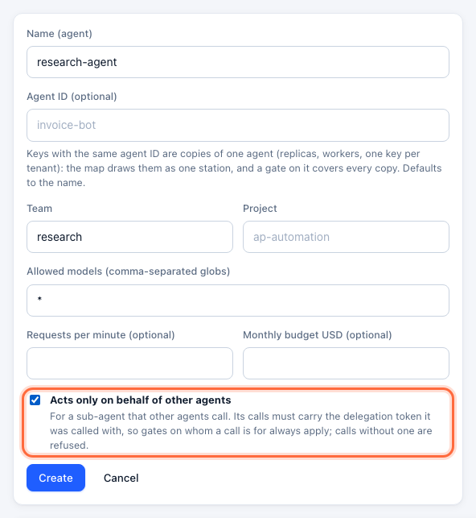
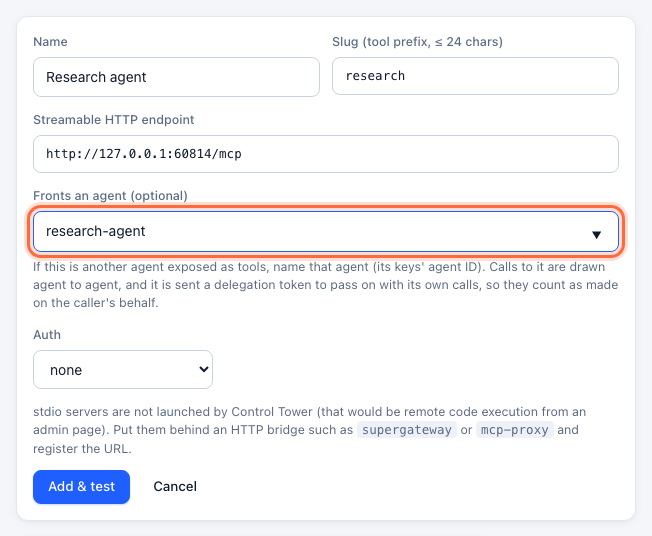
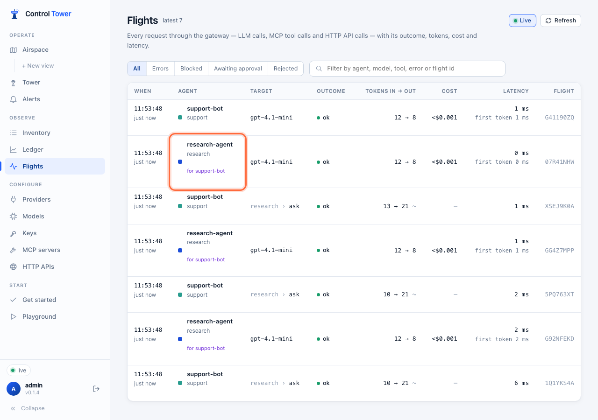
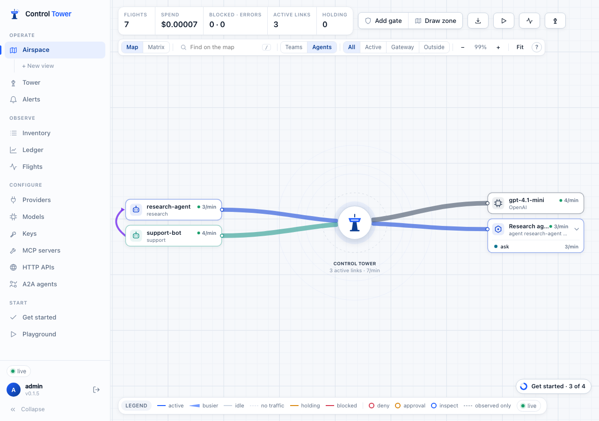
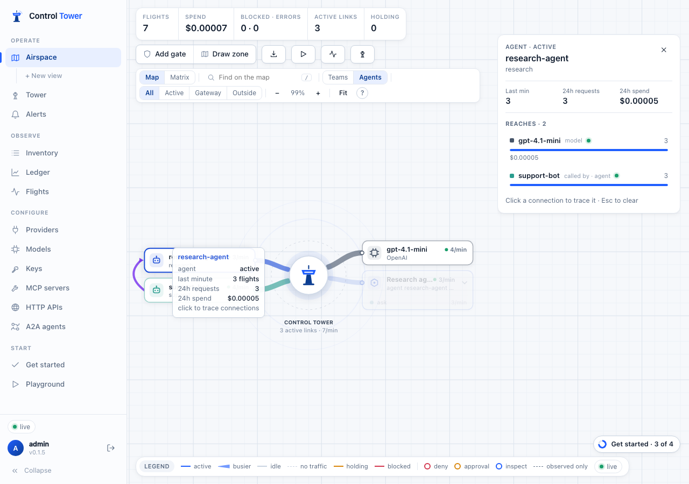

# Agents calling agents

Agents increasingly work through other agents: a support bot asks a research agent, a planner hands work to a coder. Control Tower follows these calls from one agent to the next, draws who acts for whom, and lets you put gates on **whom a call is made for** — so a low-privilege, public-facing agent can't get a high-privilege agent to do what it may not do itself.

## Quick reference

| | |
|---|---|
| An agent behind a tool | Register its MCP server or HTTP API with **Fronts an agent** set to that agent's ID |
| An agent that speaks A2A | Register it under [A2A agents](a2a.md): it is an agent by definition |
| The delegation token | Sent to that agent with each call: `_meta["controltower/delegation"]` (MCP), `params.metadata["controltower/delegation"]` (A2A) and the `x-ct-delegation` header |
| What the called agent does | Sends the same token back as `x-ct-delegation` on its own calls to Control Tower |
| Keys that only act for others | **Acts only on behalf of other agents** on the key: calls without a valid token are refused |
| Gates on whom a call is for | `match.on_behalf_of: [agent:<agent id>, team:<name>]` — anywhere up the chain |
| Where it shows | Flights (*for support-bot*), a purple arc between the two agents on the Airspace, the trace panel (*called by*) |

## An agent behind a tool

Most agent-to-agent calls today are one agent calling another through a tool: the second agent is an MCP server (or an HTTP API) whose tools do their own work — and make their own model and tool calls.

### Step 1: Give the called agent a key that only acts for others

Create a key for the agent being called — here `research-agent` — and tick **Acts only on behalf of other agents**. Every call it makes must then carry the delegation token it was called with, so a gate on whom a call is for can't be escaped by leaving the token off. In the API this is `"delegated_only": true` on `POST /admin/api/keys` or `PATCH /admin/api/keys/:id`.



### Step 2: Register its server as fronting that agent

Under **MCP servers → Add server** (or **HTTP APIs**), register the agent's endpoint and set **Fronts an agent** to its agent ID:



Calls to it now go agent to agent: each carries a delegation token saying which agent called — and, further up, on whose behalf. The API equivalent is `agent_id` on `POST /admin/api/mcp/servers` or `/admin/api/http/apis`.

### Step 3: Pass the token on

The called agent reads the token from the call it received and sends it back with its own calls to Control Tower, as the `x-ct-delegation` header. An MCP server built with the official TypeScript SDK:

```ts
server.registerTool('ask', { inputSchema: { question: z.string() } }, async ({ question }, extra) => {
  // Control Tower puts the token in the call's _meta, and in the x-ct-delegation header.
  const token = (extra._meta?.['controltower/delegation'] as string | undefined) ?? (extra.requestInfo?.headers['x-ct-delegation'] as string | undefined);
  const openai = new OpenAI({ baseURL: 'http://localhost:4000/v1', apiKey: process.env.RESEARCH_AGENT_KEY, defaultHeaders: token ? { 'x-ct-delegation': token } : {} });
  const r = await openai.chat.completions.create({ model: 'gpt-4.1-mini', messages: [{ role: 'user', content: question }] });
  return { content: [{ type: 'text', text: r.choices[0]!.message.content ?? '' }] };
});
```

An agent behind an HTTP API, in Python:

```python
@app.post("/ask")
def ask(req: Request, body: Question):
    token = req.headers.get("x-ct-delegation")
    client = OpenAI(base_url="http://localhost:4000/v1", api_key=RESEARCH_AGENT_KEY,
                    default_headers={"x-ct-delegation": token} if token else None)
    ...
```

Pass it on every call the agent makes while handling that request — model calls, MCP tool calls (as a header, or `_meta["controltower/delegation"]`) and HTTP API calls. When the agent in turn calls a third agent through Control Tower, that one gets a new token for the longer chain.

### Step 4: See it

The called agent's calls are in **Flights** with whom they were made for:



- Click an agent in the purple *for …* chain to show only the calls made for it, anywhere up the chain.
- A call that is part of a chain has a **trace** link: it shows the whole chain — the call that started it and every call it led to — indented in call order.
- A call refused with `delegation_required`, `delegation_loop` or `delegation_too_deep` is recorded as rejected, with the chain it carried.

In the API: `GET /admin/api/flights?for=<agent id>` and `GET /admin/api/flights?trace=<flight id>`; each flight has `parent_flight_id` (the call that led to it) and `has_children`. See [API reference](api.md#traffic-spend-and-the-map).

On the **Airspace** a purple arc beside the agents runs from the calling agent to the called one — thicker with more calls, bright while live. The calls themselves still go through the tower (to the agent's server on the right); the arc says who is acting for whom.



Tracing either agent lists the other as **calls** or **called by**:



## An agent over A2A

Agents that speak the [A2A protocol](a2a.md) are registered under **A2A agents** by their Agent Card. Set its **Agent ID** to the agent ID on its own Control Tower key. Each call gets a delegation token in the request's `params.metadata["controltower/delegation"]` and the `x-ct-delegation` header; the agent passes it on exactly as in step 3, and everything above — the arc on the map, *for …* in Flights, gates on whom a call is for — works the same.

```ts
// In an agent built with the official JavaScript SDK (@a2a-js/sdk): the token arrives with the request.
const executor: AgentExecutor = {
  async execute(ctx, bus) {
    const token = ctx.request.metadata?.['controltower/delegation'] as string | undefined;
    // …pass it on as the x-ct-delegation header on this agent's own calls to Control Tower
  },
  async cancelTask() {},
};
```

## Spend and budgets

What an agent spends while acting for another counts against **both**: its own key's budgets (key, team and project) and those of the agent that started the chain. If research-agent spends $2 answering support-bot, support-bot's budget — and the support team's — go down by $2 too, and support-bot's hard budget, once spent, stops the research agent's work for it (`429 budget_exceeded`).

- The [data-flow inventory](monitoring.md) shows, for each path, the agents its calls were made for, and for each agent what others spent on its behalf (*spent for it*).
- Metrics: `controltower_delegated_requests_total` and `controltower_delegated_spend_usd_total`, by `origin` (the agent that started the chain) and `agent`.

## Gates on whom a call is for

A gate can match calls made **on behalf of** an agent or a team, however many agents deep. In the gate editor, choose **Only when acting for**; in a policy file, `match.on_behalf_of`:

```yaml
gates:
  # Nothing done for the public-facing agents may touch finance tools — even through another agent.
  - name: No finance on behalf of support
    match:
      on_behalf_of: [team:support]
      servers: [ledger]
    effect: deny

  # A person approves before any agent spends money for the SDR bot.
  - name: Payments for the SDR bot need approval
    match:
      on_behalf_of: [agent:outbound-sdr]
      tools: ["payments__*"]
    effect: require_approval
```

Gates on the caller itself keep working as usual: *support-bot may not call research-agent* is a gate from support-bot to the research agent's server.

## How the token works

- It is signed with a key derived from Control Tower's master key and never stored, so it can't be forged or edited.
- It is issued to one agent: presented by any other agent it is ignored, and the flight carries a flagged event *delegation token ignored: <reason>* (a key that only acts for others is refused instead). An expired token is treated the same way.
- A call to an agent already earlier in the chain — A calls B, and B calls A back — is refused (`delegation_loop`): agents answer the agent that called them rather than calling it again. An agent calling its own server is not a loop.
- It expires after 15 minutes; a chain may be at most 8 agents deep (`delegation_too_deep`).
- It never appears in logs, events or Flights — only the chain of agent IDs does.

### Long tasks: renew the token

A task that runs longer than 15 minutes — a long A2A task or stream — renews its token before it expires. The agent it was issued to sends it, with its own key, and gets a fresh one for the same chain:

```bash
curl -s $CT/v1/delegation/renew -H "Authorization: Bearer $RESEARCH_AGENT_KEY" \
  -H "x-ct-delegation: $TOKEN"
# {"token": "ctd1.…", "expires_at": 1790360000000}
```

Renew whenever less than a few minutes are left, and use the new token from then on. Only a token that is still valid can be renewed, and only by the agent it was issued to; a delegation can be kept alive this way for up to 24 hours from its first token (`delegation_invalid` after that).

## Agents inside one app

When sub-agents run inside one process — LangGraph nodes, CrewAI crews, handoffs in the OpenAI Agents SDK — there is no network hop between them for Control Tower to see. Give each sub-agent its own key so each is its own station with its own gates and budget; when one of them calls another through a tool served by Control Tower, the rules above apply.

## Troubleshooting

| Error | Cause | Fix |
|---|---|---|
| `403 delegation_required` | A key that only acts for others made a call without a valid token | Pass on the `x-ct-delegation` header of the call it received; check it didn't expire (15 min) |
| `…issued to another agent` | The token was passed to a different agent than the one called | Each agent passes on only the token it received; the server must front the right agent ID |
| `403 delegation_loop` | The call goes to an agent already earlier in the chain | Return the answer to the calling agent instead of calling it back |
| `403 delegation_too_deep` | More than 8 agents in the chain | Shorten the chain |
| No arc on the map | The server isn't marked as fronting an agent, and no call carried a token | Set **Fronts an agent**, and pass the token on (step 3) |

## Next steps

- [Airspace, gates & approvals](airspace.md)
- [Policy as code](policy-as-code.md) — `on_behalf_of` in files
- [A2A agents](a2a.md)
- [MCP gateway](mcp.md)
