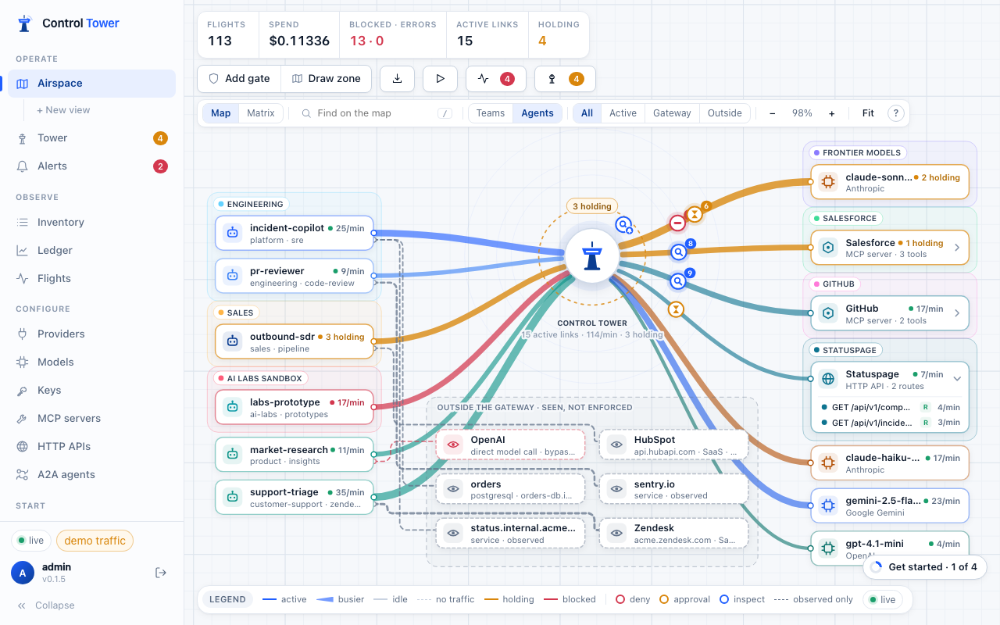
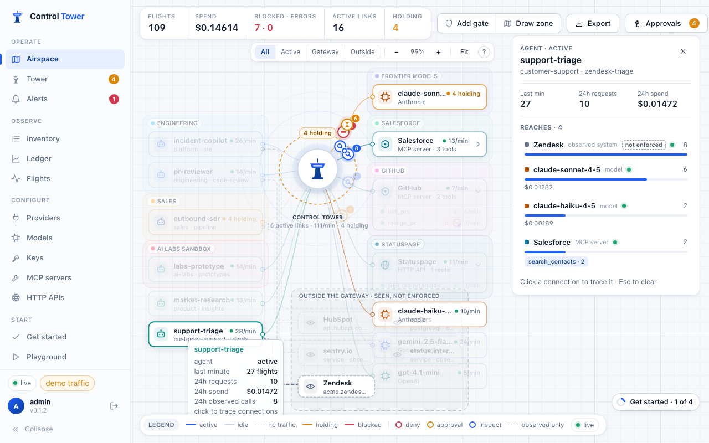
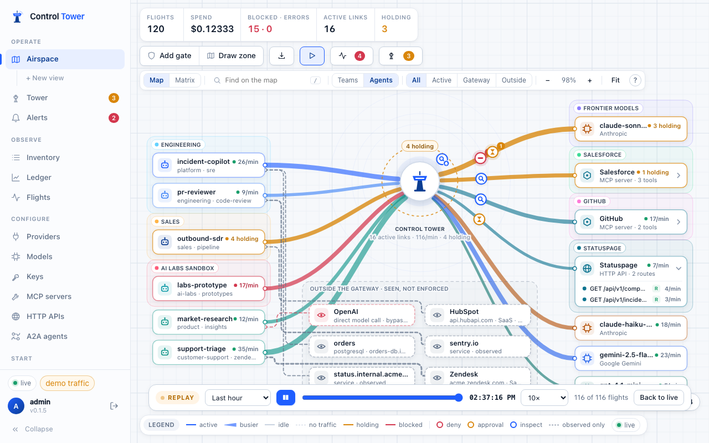
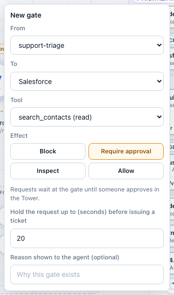
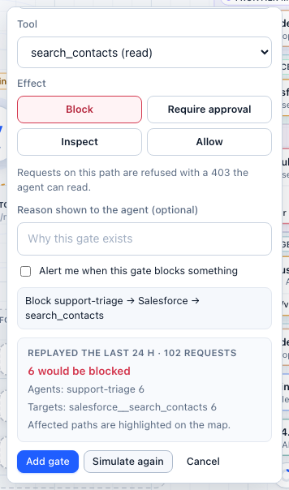
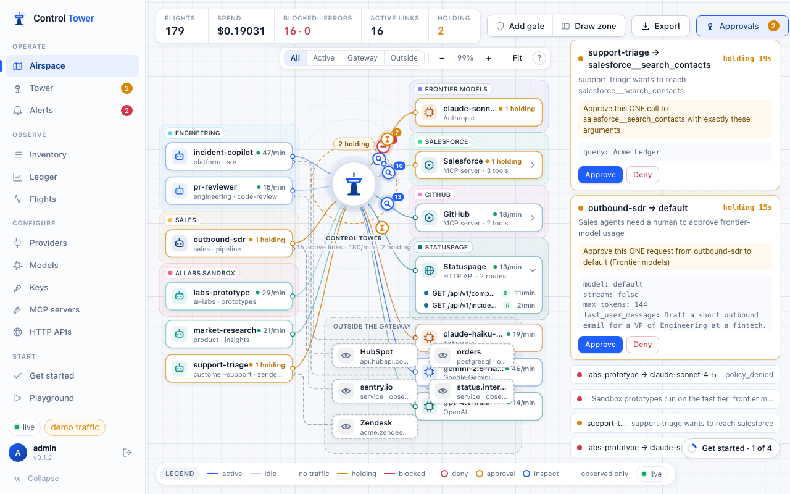
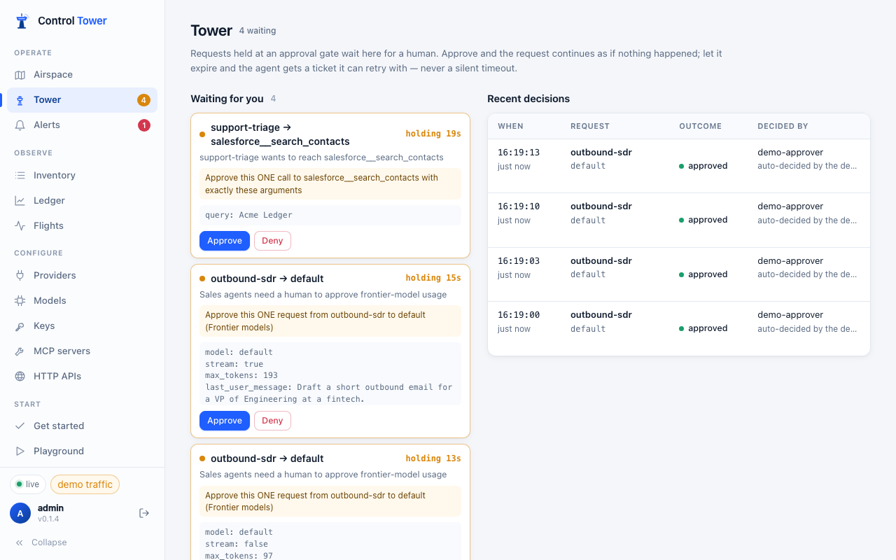
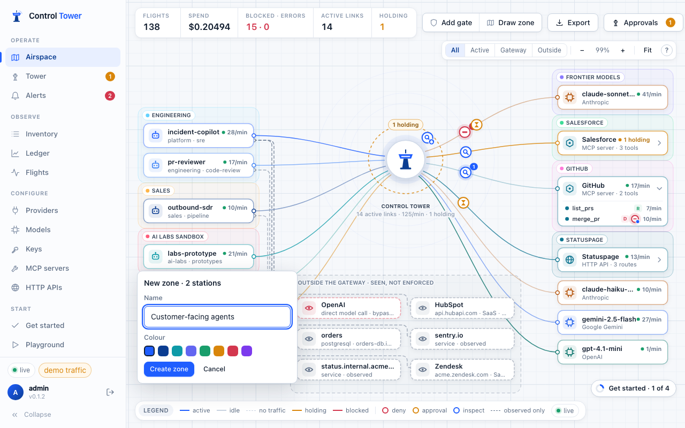
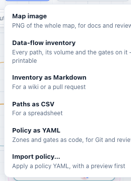

# The Airspace: map, gates and approvals

The Airspace is a live map of every agentic data flow: agents on the left, the tower (Control Tower) in the middle, and the models, MCP tool servers and HTTP APIs they reach on the right. It is also where you enforce policy — you draw rules on it.



## Reading the map

| On the map | Meaning |
|---|---|
| **Station** | An agent (one key, or every key sharing an [agent ID](keys.md#many-copies-of-one-agent), drawn once with a ×N count), a model, an MCP tool server with its tools, an HTTP API with its routes, or a system seen outside the gateway |
| **Line** | A path an agent uses. **Solid** = through the gateway, enforceable. **Dashed** = reported by the agent's SDK or OpenTelemetry, *seen but not enforced* |
| Line state | **active** (last minute) · **idle** (last 24 h) · **no traffic** · **holding** (waiting for approval) · **blocked** |
| Line thickness | Volume: calls in the last minute on a live line, calls in the last day on an idle (grey) one, relative to the busiest line on the map. Nothing moves — the busiest flows are simply the widest |
| **Zone** | A coloured region grouping stations — *Sales*, *AI Labs sandbox*, *Frontier models* |
| **Gate** | An icon on a path: red = deny, amber = approval, blue = inspect. The badge counts what it did recently |
| Top bar | Flights, spend, blocked · errors, active links and requests holding right now |

- **All / Active / Gateway / Outside** filters what's drawn.
- **Drag** stations to arrange the map; the arrangement is saved for everyone. Drag the canvas or scroll to pan, ⌘/Ctrl + scroll to zoom, **Fit** to see everything.
- **Hover** a line or tool for its requests, spend, errors and gates.

**Click a station** to trace it: everything it connects to is highlighted, with requests, spend and errors per connection.



A red dashed line from an agent straight to a model provider means that agent is calling the provider directly, skipping the gateway, its gates and its budgets. **Bring it inside** on that station shows how to route it through Control Tower. See [HTTP APIs and observed traffic](http-apis.md).

## Large fleets: teams, agents and search

With hundreds of agents the map starts at the **organization level**: one station per team (the key's **Team** label), with a count of its agents and a stack look. **Teams / Agents** in the map controls switches between that and one station per agent; the map picks Teams on its own once there are more agents than fit on screen, and remembers your choice.

- **Open a team** with the arrow on its card: its agents take its place under a header, and the map scrolls to them. Click the header to fold the team back.
- A team with a single agent is always drawn as that agent.
- **Copies of one agent** (keys sharing an [agent ID](keys.md#many-copies-of-one-agent)) are one station with a ×N count at every level.
- Gates and zones work at every level. A gate drawn on a team covers every key in that team, including keys added later; a gate drawn on a group covers every copy.

**Find** (or press <kbd>/</kbd>) searches teams, agents, single keys, models, tool servers and tools by name. Pick a result and the map opens the team it is folded into, centres it and traces its connections.

### Hide idle agents

Keys that were made for a test, or that nothing uses any more, still take a place on the map. **Agents** in the map controls picks which agents are drawn:

- **All** — every agent (the default).
- **Used today** — agents that made a call in the last 24 hours.
- **Active (15 min)** — agents that made a call in the last 15 minutes.

A call counts wherever it went: a model, a tool server, an HTTP API, another agent, or a system it only reported through `/v1/observe`. Hidden agents leave the layout, so the map closes up around what is really in use. The chip beside the menu counts them (*3 hidden · Show all*); click it to draw everyone again.

The filter is live: an idle agent that makes a call is drawn again straight away, and one that goes quiet leaves within a minute. Your choice is remembered in this browser. It only changes what the map draws: gates still apply to every agent, and the flight, spend and blocked counters, Flights and the Ledger still count them all.

## Matrix: every agent against every destination

**Map / Matrix** in the map controls turns the Airspace into a grid: a row per agent (or per team, at the organization level), a column per model, tool server and outside system, and a cell per connection. The map shows the shape of the traffic; the matrix shows every connection at once — at a thousand agents it is still one row each.

- **Calls / Spend / Blocked** shade the cells by the last day's volume. A green dot means the connection is live now.
- The corner marker says what can stop it: a solid square is a gate that can deny, hold or limit; a ring is inspection only; a red outline is nothing. The header counts the connections in use that no gate can stop, and **Ungated only** keeps just the agents with one.
- **Click a cell** to put a gate on exactly that agent → destination path, whether or not it has been used yet. **Click an agent** to go back to the map with it traced; **+** opens a team into its agents.
- Outside systems are striped: they are reported, not proxied, so they can't be gated.

The matrix follows the view you are in and the Teams / Agents choice.

## What needs attention

**Attention** in the toolbar lists what needs a person on the map you are looking at — the whole organization or a [view](#views-one-part-of-the-organization-at-a-time) — most urgent first, and dims everything else while it is open. The badge counts the items that matter most.

| Item | When |
|---|---|
| **Waiting for approval** | Calls held at a gate right now |
| **Blocked now** | Calls denied by a gate in the last minute |
| **Outside the gateway** | Agents calling a model provider directly: no gates or budgets apply (see [HTTP APIs and observed traffic](http-apis.md)) |
| **Failing** | A model or tool server with at least 5% of its calls failing in the last minute |
| **Destructive tools with no gate** | A delete, merge, payment or other destructive tool in use that no gate can deny, hold or inspect |
| **New connections** | An agent that reached a model or tool it had not used before, in the last day. Needs a day of history first, so a new install doesn't flag everything |
| **Unusual traffic** | A station at 30 calls a minute or more and over three times its usual rate. Needs an hour of history |

Pick an item to jump to it: its team opens if it is folded, and it is centred and traced; close the trace to come back to the list. **Busiest now** lists the stations with the most calls in the last minute.

## Views: one part of the organization at a time

A **view** is a named part of the organization, such as *Engineering* or *Marketing*: a set of teams with a map of its own. Create one with **+ New view** under Airspace in the sidebar: name it, pick a colour and tick its teams. Each view is then a link under Airspace, and everyone sees it.

In a view:

- The map shows only its teams' agents and the models, tool servers, tools and outside systems they reach. Until its agents have made any calls, every model and tool server is shown, so a first gate can be drawn.
- **Flights**, **Spend**, **Blocked · errors** and **Holding** count only its traffic, from the moment the view is opened; the approvals drawer lists only its requests.
- Live traffic from other teams is left out, and search finds only what is in the view.
- Teams / Agents, opening teams, gates and zones work as on the whole map. A view with a single team always shows its agents.

The header shows the view's name; **⋯** edits it and **×** returns to the whole organization. Each view has its own link (`#/airspace/<view id>`) to share. Views decide what the map shows, not who may see it.

## Flight Recorder: replay past traffic

**Replay** plays a past window — the last hour, 6 hours, 24 hours or 7 days — back on the map: every recorded call travels its path again, holds wait at their gates and blocked calls turn red, compressed 10× to 10,000×. Play, pause, change speed or drag the scrubber to any moment; quiet stretches are skipped. Live traffic waits while you watch and the map returns to it with **Back to live**.



It's the quickest way to see what an agent did overnight, or what a gate changed since it was added. Replay covers the flights still [retained](architecture.md#data-and-retention) (30 days by default); like the live map, it shows who called what and what happened, never request contents. API: `GET /admin/api/replay?from=&to=`.

## Put a gate on a path

**Add gate**, then drag from an agent to a model, a tool server or a single tool — or click any line or tool row. Right-clicking a station works too.



| Effect | What the agent gets |
|---|---|
| **Block** | `403 policy_denied` with the reason you give (for MCP, an error tool result the model can read) |
| **Require approval** | The request waits at the gate for a human, up to the hold time (default 20 s) |
| **Inspect** | Scans what passes for secrets, personal data or prompt injection — and masks, blocks or flags it |
| **Allow with limits** | Lets calls through within a rate — requests and tokens per minute, per agent on this path — and, for models, a cap on the reply’s length. Over the rate: `429 rate_limit_exceeded` naming the gate |
| **Allow** | An explicit exception above broader gates |

A gate can cover one agent, a whole zone, or every agent; one model, a zone of models, a tool server, one tool, a tool glob (`github__merge_*`), or an operation class — read, write or destructive (deletes, merges, payments; `admin` in the API). Gates are checked in priority order; the first access gate that matches decides, and every matching inspect gate runs as well.

Tick **Alert me** to be told when the gate fires; see [Alerts](alerts.md).

### How inspection works

Inspect gates run inside Control Tower, on the request before it leaves and on the reply before the agent reads it (a streamed model reply only after delivery, so there a match is flagged). By default no model is involved — they are pattern checks, fast and free:

| Look for | What it matches |
|---|---|
| **Secrets & credentials** | Known key formats — AWS, GitHub, Slack, Stripe, OpenAI, Anthropic, Google, npm and Control Tower keys — private keys, JSON Web Tokens, database connection strings with a password |
| **Personal data** | Email addresses, phone numbers, and card numbers, IBANs and US Social Security numbers that pass their checksums or rules |
| **Prompt injection** | Well-known phrasings: "ignore previous instructions", role overrides ("you are now…"), requests for the system prompt, fake chat-template markup, "send the credentials to…" |
| **Keywords** | Your own words, whole-word |

Secrets and personal data are caught reliably in the formats listed. The injection patterns only catch the obvious phrasings — a paraphrase, another language or encoded text gets past them.

**Also ask a model** (under **Prompt injection**) adds a model's judgement: the text — its start and end when it is long — goes to a model you pick, one Control Tower serves, with instructions to answer only whether it contains instructions aimed at an AI agent. It catches paraphrased, translated and disguised injections the patterns miss, at the cost of a model call per checked request (a second or two, and its price). The checks run through Control Tower under a system key, **guardrail**, so they appear in Flights and the Ledger with their cost. A *mask* gate withholds content a model flags (a verdict can't be masked word by word). If the model can't answer, the content goes through flagged — or is blocked, if you choose so. In a policy file:

```yaml
- name: Check tool results for injection
  match: { tools: ["*"] }
  effect: inspect
  config:
    detectors: [injection]
    model_check: { model: gpt-4.1-mini, on_error: allow }
    action: block
    direction: output
```

Even with a model, detection is a second line: the stronger control against injection is what the agent can do once instructions reach it — keep tools it doesn't need out of reach, and hold writes and deletes for approval.

### Simulate before you enforce

**Simulate on last 24 h** replays yesterday's recorded traffic through the current gates plus your draft and shows only what would change: how many requests would be blocked or held, from which agents, to which targets, and the spend involved. The affected paths are highlighted on the map.



On an existing gate, click its icon for **Impact in the last 24 h**, or change its effect and **Simulate this change**. Tool arguments and bodies are not stored, so argument conditions and inspect gates can't be replayed; the result says so.

## Approvals: the Tower

When a request hits an approval gate it **holds**: the agent's HTTP request stays open, the flight orbits the gate on the map, and a card appears in the **Approvals** drawer and on the **Tower** page.



The card shows exactly what would happen — the agent, the model or tool, and the **actual arguments** of the call — and a plain statement of the scope: *Approve this ONE call to salesforce__search_contacts with exactly these arguments*. Identical retries attach to the same card (*2 waiting*) instead of piling up.



- **Approve** within the hold time and the request simply continues; the agent never knows it waited.
- **Deny** and the agent gets a `403` with the reason.
- **Nobody answers** in time: the agent gets `403 approval_required` with a **ticket**. Once someone approves, the agent retries the same call with `x-ct-approval: <ticket>` and it goes through **once**. A retry with different arguments is refused and raised as a security event (`scope_mismatch`).
- Held alerts by [email](alerts.md#approving-by-email), in Slack or to a webhook link straight to the card. Approving is always an authenticated action in the console — a link click never approves anything.

### Approve the next N calls

When an agent will make the same kind of call again and again — a batch of refunds, a run of lookups — approving each one is noise. **Approve more…** on the card approves this call and lets the agent make the **next N calls** of the same kind without a card:

- **Next N calls** (1–1,000), **for** 10 minutes, 30 minutes or 1 hour — whichever runs out first.
- **Any arguments**, or **Only these** — the same arguments as the card (tool, HTTP and A2A calls). On a model gate the choice is not offered: a window covers requests to that model whatever their prompt.
- The card spells out what you are agreeing to before you click: *Approve this call, and let billing-agent make 5 more calls to payments__POST /v1/charges through this gate in the next 30 minutes — with any arguments.*

A window covers **one agent, one gate and one target** (the model, tool or HTTP route on the card) — and, for a call an agent makes [on another agent's behalf](agent-to-agent.md), only calls made for that same chain. Calls it covers go straight through and are recorded as approved by the person who opened the window. **Approved ahead** on the Tower page lists open windows with the calls and time left; **End now** closes one at once. Editing the gate closes its windows too, so a changed rule is never approved in advance.

In the API: `POST /admin/api/approvals/<id>/decide` with `{ "action": "approve", "window": { "uses": 5, "ttl_ms": 1800000, "any_args": true } }`; `GET /admin/api/approval-windows` lists open windows and `POST /admin/api/grants/<id>/revoke` ends one.

## Zones

Zones name groups of stations so gates can be written once for all of them: *every agent in AI Labs sandbox → anything in Code hosting: deny*.

**Draw zone**, then drag a lasso around the stations that belong together, name it and pick a colour.



A zone can also match by attribute — every key of a team or project, keys with a tag, or every model of a provider kind — so new agents join it automatically (set this through the API or a [policy file](policy-as-code.md)). Click a zone's label to rename it, add a gate from it, or delete it (with its gates).

## Policy as code

Everything drawn here can be exported as YAML for review and Git, and applied back with a preview. See [Policy as code](policy-as-code.md).



## What is enforced — and what isn't

Control Tower enforces traffic that goes through it: model calls to `/v1`, tool calls to `/mcp` and API calls to `/http`. A path drawn solid is one the gateway is actually on. An agent that changes its own base URL bypasses the gateway; a tool the agent can't see through `/mcp` needs no approval, which is why tool filtering is the stronger control. Traffic reported through `/v1/observe` or OpenTelemetry is *seen*, never enforced, and is drawn dashed. See the [threat model](threat-model.md).
