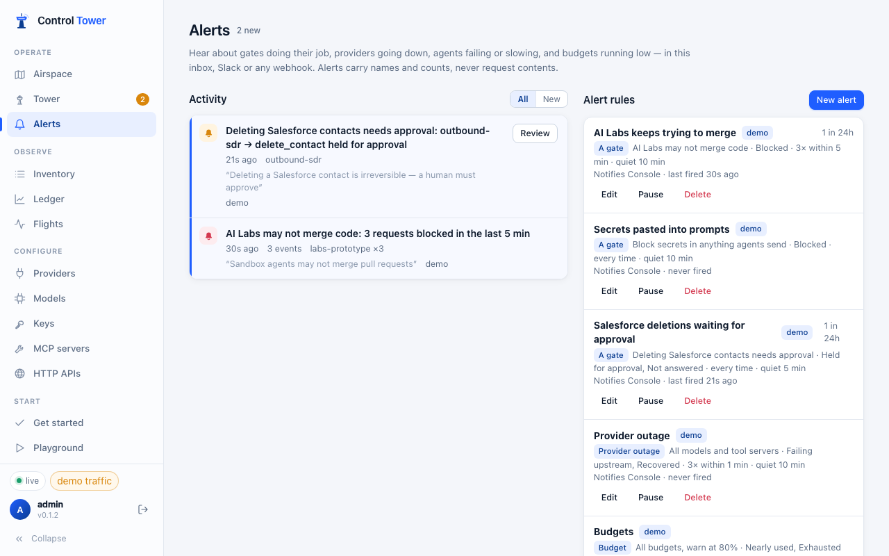

# Alerts

Hear about gates doing their job, providers going down, agents failing or slowing, and budgets running low — in the console, Slack, or any webhook. Alerts carry names and counts, never prompts, tool arguments or responses.



## Create an alert

Three ways:

- tick **Alert me** when adding a gate on the Airspace,
- click an existing gate → **Add alert**,
- **Alerts → New alert** for anything else.

| Kind | Fires on |
|---|---|
| **Gate** | `blocked`, `held`, `approved`, `rejected`, `unanswered` (hold or approval expired), `allowed`, `scope_mismatch` (an approval redeemed with different arguments — a security event), `masked` / `flagged` (inspect gates) |
| **Provider outage** | `outage`: repeated timeouts, network errors or 5xx for a model or MCP server within a window (rate limits and 4xx don't count) · `recovered`: the first success afterwards |
| **Failed requests** | Requests that still failed after fallbacks, optionally for chosen agents or models |
| **Slow requests** | Requests slower than a threshold (default 30 s) |
| **Budget** | A budget reaching a percentage (default 80%) and being used up — once per budget period |
| **Daily summary** | Requests, tokens, spend, blocked / held / masked counts, errors, top spenders and the slowest and most-failing models, at a chosen hour (UTC); skipped on quiet days |

**Condition**: every time, or *N times within M minutes*. After firing, a rule stays quiet for its cooldown and then sends one digest of what happened in the meantime — so a burst of 400 blocked calls is one message, not 400.

## Channels

- **Console** — always: the inbox, a badge in the navigation, and live toasts.
- **Slack** — an incoming-webhook URL (Mattermost and Rocket.Chat work too).
- **Webhook** — any URL; add a signing secret to verify deliveries.

Channel URLs and secrets are encrypted at rest and never returned by the API. Set `CT_PUBLIC_URL` so links in messages point at your console (detected on Render, Fly.io and Railway).

### Approving from Slack

A `held` alert about one request links straight to its approval card, with a **Review & approve** button in Slack and an `approval: {id, scope, url}` object in webhooks. The link only opens the card: approving is always an authenticated action in the console, so a link unfurler or a forwarded message can't approve anything.

### Webhook payload

```json
{
  "type": "controltower.alert",
  "kind": "gate",
  "title": "Deleting Salesforce contacts needs approval: outbound-sdr → delete_contact held for approval",
  "trigger": "held",
  "count": 1,
  "gate": { "id": "rule_…", "name": "Deleting Salesforce contacts needs approval", "effect": "require_approval" },
  "agents": [{ "name": "outbound-sdr", "count": 1 }],
  "destinations": ["salesforce__delete_contact"],
  "approval": { "id": "apr_…", "scope": "Approve this ONE call …", "url": "https://tower.example.com/#/tower/apr_…" },
  "console_url": "https://tower.example.com/#/alerts"
}
```

With a signing secret, each delivery carries `x-ct-signature: t=<unix seconds>,v1=<hex>`, where `v1 = HMAC-SHA256(secret, "<t>.<raw body>")`. Deliveries are retried twice on network errors, 408, 429 and 5xx.

## From a LiteLLM config

`general_settings.alerting: ["slack"]` with `SLACK_WEBHOOK_URL` in the environment creates a Slack channel, and `alert_types` become rules: `llm_exceptions` → failed requests, `llm_too_slow` / `llm_requests_hanging` → slow requests, `budget_alerts` → budgets, `cooldown_deployment` / `outage_alerts` → provider outages, `daily_reports` / `spend_reports` → daily summary. See [Config file](config-file.md#general_settings).
