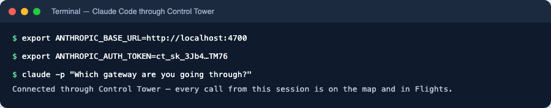
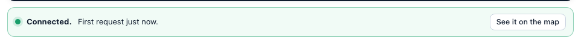
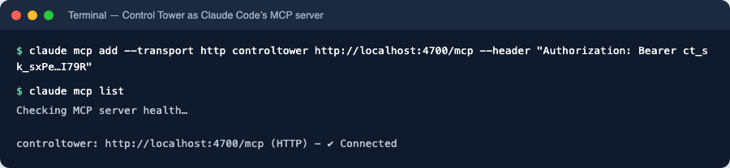

# Claude Code (CLI)

Point Claude Code at Control Tower and every request it makes — to Claude, or to any other model you route it to — goes through your gateway: it is attributed to its own key, counted in the Ledger, drawn on the Airspace and subject to your gates. Control Tower's `/mcp` endpoint also gives Claude Code the tools of every MCP server you have registered, behind the same key.

## Quick reference

| Setting | Value |
|---|---|
| Base URL | `http://<control-tower>:4000` — the bare origin, no `/v1` |
| Key | `ANTHROPIC_AUTH_TOKEN=ct_sk_…` (sent as `Authorization: Bearer`) |
| Model | Claude model names work as they are; `ANTHROPIC_MODEL` pins one |
| MCP endpoint | `http://<control-tower>:4000/mcp`, header `Authorization: Bearer ct_sk_…` |
| Where it shows up | **Flights**, the **Airspace** and the **Ledger**, under the key's name |

You need a Control Tower with at least one provider that serves Claude models (Anthropic, Bedrock or Vertex AI — see [Models & providers](providers-and-models.md)), and Claude Code installed (`claude --version`).

## Model setup

### Step 1: Create a key for Claude Code

In the console, open **Keys → Create key**. Name it after the agent — `claude-code`, or one key per developer such as `claude-code-dana` — and set its **Team** so its traffic groups with the rest of the team. Click **Create**.


The key (`ct_sk_…`) is shown **once**. Budgets, rate limits and which models it may use can be set here too ([Keys, budgets & rate limits](keys.md)).

### Step 2: Copy the settings

Under the new key, open the **Claude Code · Anthropic** tab of the **Connect** panel. It shows the exact settings with your address and key filled in.


### Step 3: Point Claude Code at Control Tower

Set the two variables in the shell you start Claude Code from, then start it:

```bash
export ANTHROPIC_BASE_URL=http://localhost:4000
export ANTHROPIC_AUTH_TOKEN=ct_sk_…
unset ANTHROPIC_API_KEY          # a direct Anthropic key would compete with the gateway key
claude
```

To make it permanent, put the two exports in your shell profile (`~/.zshrc`, `~/.bashrc`), or in Claude Code's own settings file, `~/.claude/settings.json`:

```json
{
  "env": {
    "ANTHROPIC_BASE_URL": "http://localhost:4000",
    "ANTHROPIC_AUTH_TOKEN": "ct_sk_…"
  }
}
```

Claude Code asks for Claude models by their usual names, and Control Tower resolves them to a connected provider — [adding them on first use](providers-and-models.md#models-are-added-on-first-use). To pin a model, set `ANTHROPIC_MODEL` to any name Control Tower serves, including an [alias](providers-and-models.md) with fallbacks.

> Requests to an Anthropic provider are forwarded as they are, so prompt caching, extended thinking and tool use keep working. For Claude on Bedrock or Vertex AI, and for GPT or Gemini models, they are translated.

### Step 4: Check it works

Send a prompt:

```bash
claude -p "Which gateway are you going through?"
```



The key's **Connect** panel turns green on the first request:



And the request is in **Flights**, under the key's name, with its model, tokens, cost and latency:


On the **Airspace**, `claude-code` now has a line to the model it used — see [Verify on the map](#verify-on-the-map).

## MCP setup

Control Tower serves every registered MCP server at one endpoint, `/mcp`, with tools named `<server>__<tool>`. A key sees only the tools it may use, and gates and approvals apply to each call.

### Step 1: Add Control Tower as an MCP server

```bash
claude mcp add --transport http controltower http://localhost:4000/mcp \
  --header "Authorization: Bearer ct_sk_…"
```

This saves the server for the current project only (local scope); add `--scope user` to use it in every project. Use the same key as for the model, so tool calls and model calls are one agent on the map. The **MCP clients** tab of the Connect panel has this command with your key filled in.

### Step 2: Check the connection

```bash
claude mcp list
```



In a Claude Code session, `/mcp` lists the tools. To connect to one tool server only, use its own endpoint, `http://localhost:4000/mcp/<slug>`, where tools keep their original names.

## Verify on the map


Click `claude-code` to trace everything it reaches. To control it, drag from it to a model or tool to [put a gate on that path](airspace.md#put-a-gate-on-a-path) — for example, require approval before it runs a destructive tool.

## Troubleshooting

| Symptom | Cause | Fix |
|---|---|---|
| `401 invalid_api_key` | The key is missing, mistyped or disabled | Check `ANTHROPIC_AUTH_TOKEN` in the shell Claude Code runs in; check the key under **Keys** |
| Requests don't appear in Flights | Claude Code is still talking to Anthropic directly | Make sure `ANTHROPIC_BASE_URL` is set in that shell (or in `settings.json`), and unset `ANTHROPIC_API_KEY` |
| `404 model_not_found` | No connected provider serves that model name | Connect a provider that does, or set `ANTHROPIC_MODEL` to a model Control Tower serves |
| `403 model_not_allowed` | The key's **Allowed models** exclude it | Widen the key's allowed models |
| `403 policy_denied` / a request waits | A gate blocked it or is holding it for approval | See the gate on the Airspace; approvals are in the **Tower** |
| `/mcp` shows the server but no tools | The key may not use those tools | Check the key's allowed tools (`allowed_mcp`) — tools it may not use are not listed |

More in [Troubleshooting](troubleshooting.md).

## Next steps

- [Keys, budgets & rate limits](keys.md) — a budget per developer or per team
- [Airspace, gates & approvals](airspace.md) — gate what Claude Code may do
- [MCP gateway](mcp.md) — register the tool servers Claude Code should reach
