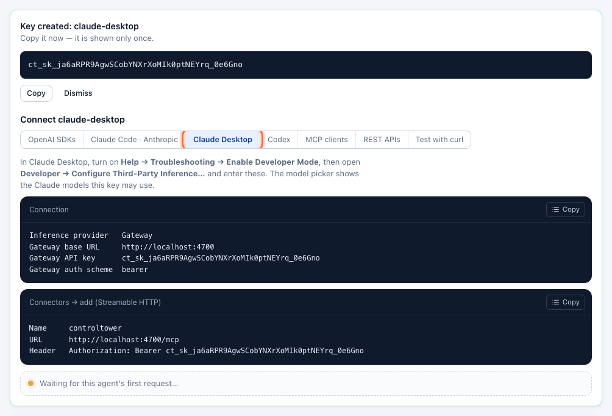

# Claude Desktop (GUI)

Claude Desktop can send its conversations through an inference gateway instead of straight to Anthropic. Pointed at Control Tower, every message is attributed to a key, counted in the Ledger, drawn on the Airspace and subject to your gates — and Control Tower's `/mcp` endpoint gives Claude Desktop the tools of your registered MCP servers as a connector.

## Quick reference

| Setting | Value |
|---|---|
| Where | **Developer → Configure Third-Party Inference…** (after **Help → Troubleshooting → Enable Developer Mode**) |
| Inference provider | **Gateway** |
| Gateway base URL | `http://<control-tower>:4000` — the bare origin, no `/v1` |
| Gateway API key | `ct_sk_…` |
| Gateway auth scheme | `bearer` (`x-api-key` works too) |
| Models shown | The Claude models the key may use (names containing `claude`) |
| MCP connector | Streamable HTTP, `http://<control-tower>:4000/mcp`, header `Authorization: Bearer ct_sk_…` |

You need a Control Tower with a provider that serves Claude models (Anthropic, Bedrock or Vertex AI — see [Models & providers](providers-and-models.md)).

## Model setup

### Step 1: Create a key for Claude Desktop

In the console, open **Keys → Create key**. Name it — `claude-desktop`, or one key per person such as `claude-desktop-dana` — set its **Team**, and click **Create**.

Limit it to Claude models and give it a budget if you like: set **Allowed models** to `claude-*` and a **Monthly budget** ([Keys, budgets & rate limits](keys.md)).

### Step 2: Copy the settings

Under the new key, open the **Claude Desktop** tab of the **Connect** panel. It lists every value the next steps ask for, with your address and key filled in.

### Step 3: Turn on Developer Mode

In Claude Desktop, choose **Help → Troubleshooting → Enable Developer Mode**. A **Developer** menu appears.

### Step 4: Enter the gateway

Choose **Developer → Configure Third-Party Inference…** and fill in the **Connection** section:

| Field | Value |
|---|---|
| Inference provider | **Gateway** |
| Gateway base URL | `http://localhost:4000` (your Control Tower's address) |
| Gateway API key | the key from step 1 |
| Gateway auth scheme | **bearer** |

Click **Apply Changes** and restart Claude Desktop.

> Claude Desktop reads the model list from Control Tower (`GET /v1/models`) and shows the Claude models among them — the ones this key may use. Models that are [added on first use](providers-and-models.md#models-are-added-on-first-use) appear once someone has used them; to have one listed from the start, add it under **Models**.

### Step 5: Check it works

Pick a model and send a message. The key's **Connect** panel turns green on the first request, and the message is in **Flights** under the key's name:

## MCP setup

### Step 1: Add Control Tower as a connector

In **Developer → Configure Third-Party Inference…**, open **Connectors** and add one:

| Field | Value |
|---|---|
| Name | `controltower` |
| Transport | **Streamable HTTP** |
| URL | `http://localhost:4000/mcp` |
| Header | `Authorization: Bearer ct_sk_…` |

Use the same key as for the model, so tool calls and messages are one agent on the map.

### Step 2: Test and apply

Test the connection: the tools listed are those of your registered MCP servers that this key may use, named `<server>__<tool>`. Apply, restart Claude Desktop, and the tools are available in conversations. To offer one tool server only, use its own endpoint, `http://localhost:4000/mcp/<slug>`.

## Verify on the map

`claude-desktop` appears on the Airspace with a line to each model and tool server it uses. Drag from it to a destination to [put a gate on that path](airspace.md#put-a-gate-on-a-path).

## Troubleshooting

| Symptom | Cause | Fix |
|---|---|---|
| The model list is empty | The key may not use any Claude model, or none has been used yet | Check the key's **Allowed models**; add the model under **Models** so it is listed from the start |
| `401` when applying | Wrong key, or the key is disabled | Copy the key again from the Connect panel (it is shown once — create a new one if lost) |
| Messages don't appear in Flights | Claude Desktop wasn't restarted, or the base URL points elsewhere | Restart it; the base URL is the bare origin, without `/v1` |
| A connector shows no tools | The key may not use those tools | Check the key's allowed tools (`allowed_mcp`) |

More in [Troubleshooting](troubleshooting.md).

## Next steps

- [Keys, budgets & rate limits](keys.md) — a budget per person or per team
- [Airspace, gates & approvals](airspace.md) — approvals before sensitive tools run
- [MCP gateway](mcp.md) — the tool servers behind the connector
