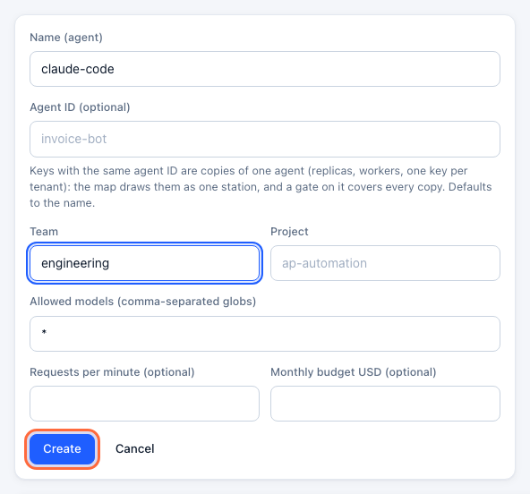
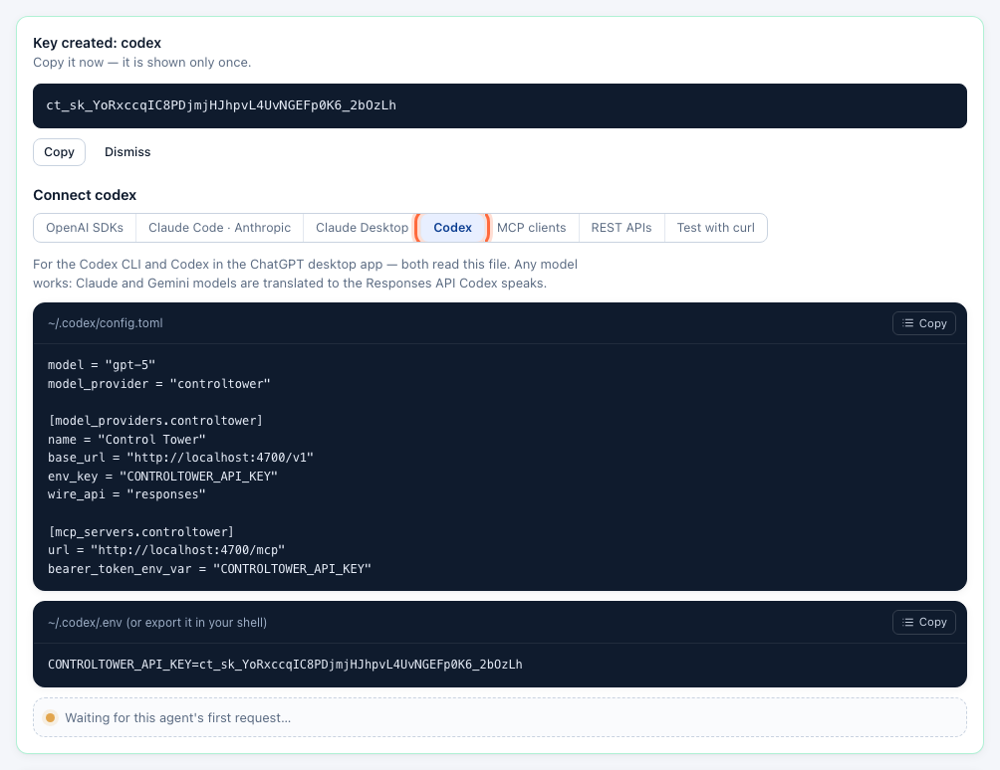
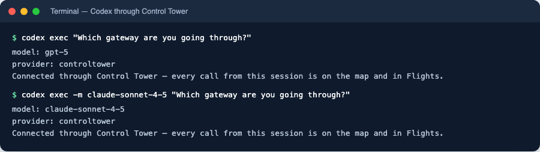
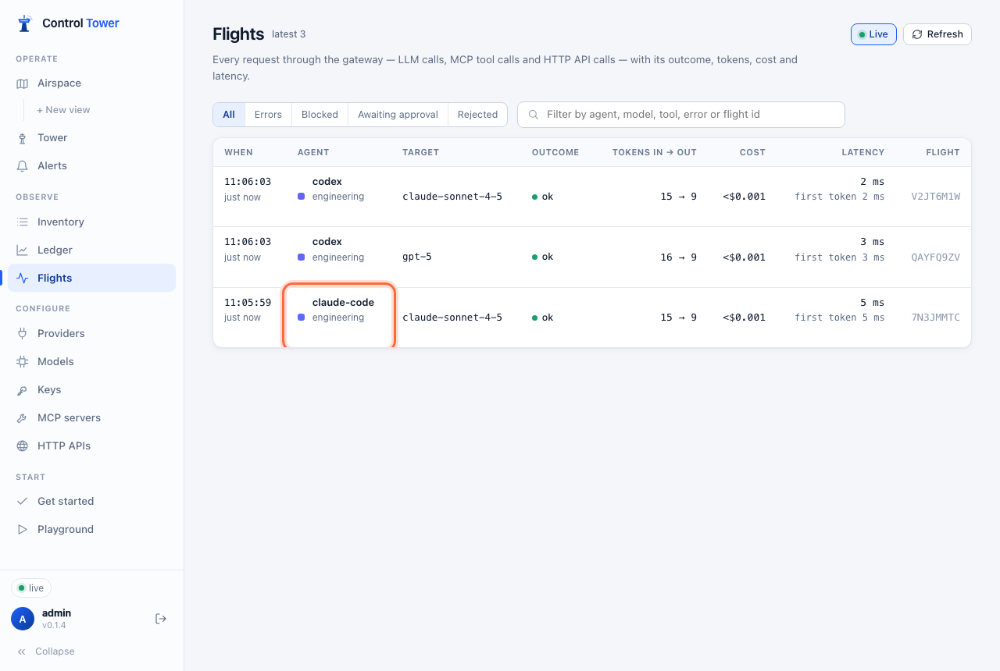
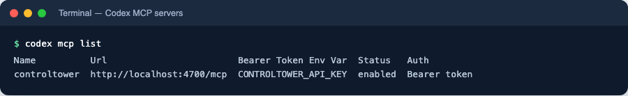
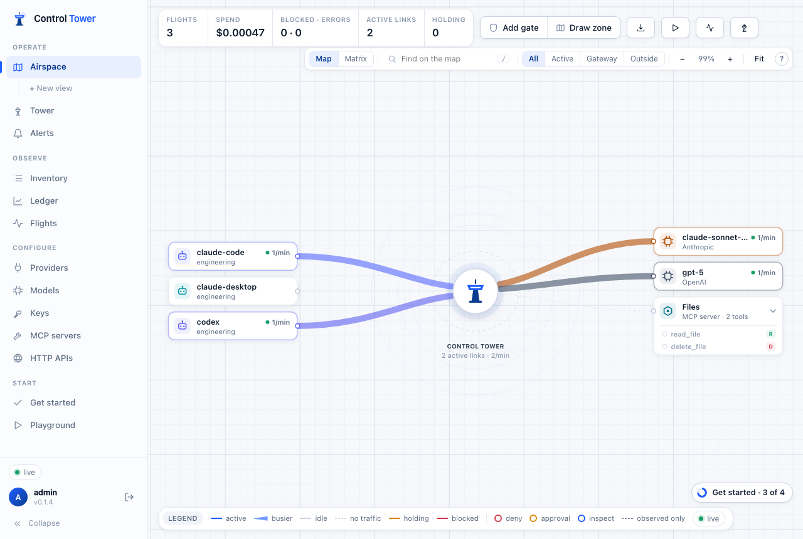

# Codex (CLI)

Add Control Tower to Codex as a model provider and every request Codex makes goes through your gateway: attributed to its own key, counted in the Ledger, drawn on the Airspace and subject to your gates. Codex speaks OpenAI's Responses API; Control Tower forwards it to OpenAI-compatible providers as it is and translates it for the rest, so Codex can run on Claude or Gemini models too. The same config file adds Control Tower's `/mcp` endpoint as an MCP server.

## Quick reference

| Setting | Value |
|---|---|
| Config file | `~/.codex/config.toml` |
| Base URL | `http://<control-tower>:4000/v1` — with `/v1` |
| Wire API | `wire_api = "responses"` |
| Key | an environment variable named by `env_key`, e.g. `CONTROLTOWER_API_KEY=ct_sk_…` (in your shell or `~/.codex/.env`) |
| Model | any model name Control Tower serves — GPT, Claude, Gemini, an alias |
| MCP endpoint | `http://<control-tower>:4000/mcp` with `bearer_token_env_var` |

Install Codex if you haven't: `npm i -g @openai/codex`.

## Model setup

### Step 1: Create a key for Codex

In the console, open **Keys → Create key**. Name it — `codex`, or one key per developer such as `codex-dana` — set its **Team**, and click **Create**.



### Step 2: Copy the settings

Under the new key, open the **Codex** tab of the **Connect** panel: the config file and the key line, with your address and key filled in.



### Step 3: Add Control Tower as a model provider

Put this in `~/.codex/config.toml` (merge it with what is there):

```toml
model = "gpt-5"
model_provider = "controltower"

[model_providers.controltower]
name = "Control Tower"
base_url = "http://localhost:4000/v1"
env_key = "CONTROLTOWER_API_KEY"
wire_api = "responses"
```

and give Codex the key, either in the shell that starts it or in `~/.codex/.env`:

```bash
export CONTROLTOWER_API_KEY=ct_sk_…
```

`model` can be any name Control Tower serves. Claude and Gemini models work too — Codex's Responses API calls are translated for them — and Codex prints a harmless warning that it has no built-in metadata for a model it doesn't know. Switch per run with `codex -m claude-sonnet-4-5`.

### Step 4: Check it works

```bash
codex exec "Which gateway are you going through?"
codex exec -m claude-sonnet-4-5 "Which gateway are you going through?"
```



The key's **Connect** panel turns green, and both requests are in **Flights** under the key's name, as `responses` calls:



Start an interactive session with `codex`.

## MCP setup

### Step 1: Add Control Tower as an MCP server

In the same `~/.codex/config.toml`:

```toml
[mcp_servers.controltower]
url = "http://localhost:4000/mcp"
bearer_token_env_var = "CONTROLTOWER_API_KEY"
```

It uses the same key as the model, so tool calls and model calls are one agent on the map. Tools are named `<server>__<tool>`; a key sees only the tools it may use. To add one tool server only, use its own endpoint, `http://localhost:4000/mcp/<slug>`.

### Step 2: Check the connection

```bash
codex mcp list
```



In a Codex session, `/mcp` lists the tools Control Tower offers this key.

## Verify on the map



`codex` has a line to each model it used. Drag from it to a model or tool to [put a gate on that path](airspace.md#put-a-gate-on-a-path).

## Troubleshooting

| Symptom | Cause | Fix |
|---|---|---|
| `Reconnecting… 1/5` then connection errors | Control Tower isn't reachable at `base_url` | Check the host and port, and that `base_url` ends in `/v1` |
| `401 invalid_api_key` | The key isn't in Codex's environment | Export `CONTROLTOWER_API_KEY` in the shell that starts Codex, or put it in `~/.codex/.env` |
| `404 model_not_found` | No connected provider serves that model name | Use a model Control Tower serves (**Models**), or connect the provider |
| Requests don't appear in Flights | Codex is using its default provider | Make sure `model_provider = "controltower"` is at the top level of the file, not inside a table |
| `400` mentioning `previous_response_id` | Server-side conversation state, which only OpenAI keeps | Codex sends the full conversation by default; don't turn on response storage for this provider |
| `codex mcp list` shows the server but a session has no tools | The key may not use those tools | Check the key's allowed tools (`allowed_mcp`) |

More in [Troubleshooting](troubleshooting.md).

## Next steps

- [Codex in the ChatGPT desktop app](client-codex-desktop.md) — the same file
- [Keys, budgets & rate limits](keys.md) — a budget per developer
- [Airspace, gates & approvals](airspace.md) — approval before Codex runs a destructive tool
