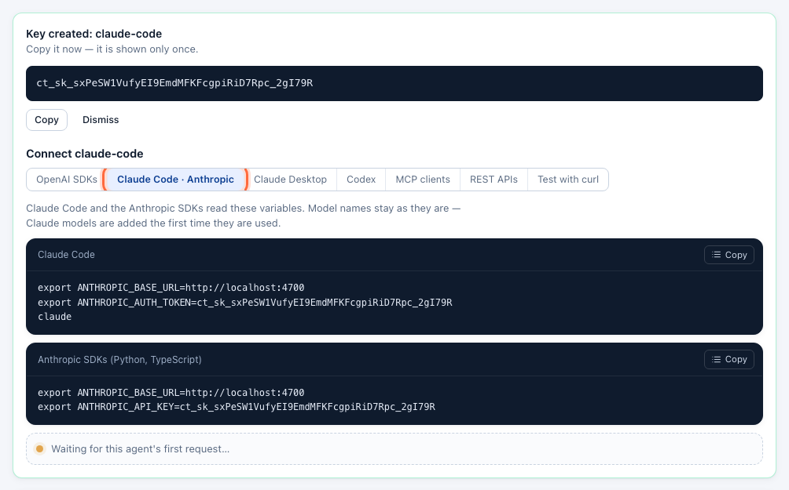
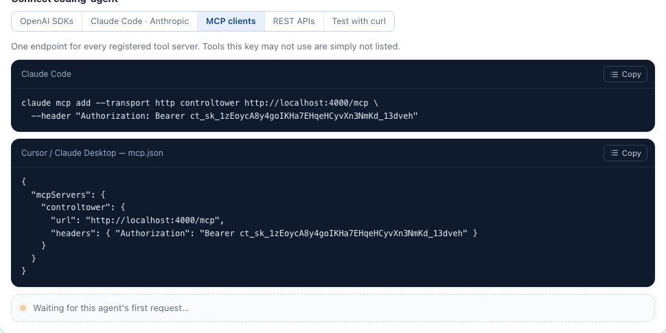

# Connect your agents

An agent needs two things: Control Tower's address and **its own key** (create one per agent under **Keys** — see [Keys, budgets and limits](keys.md)). The key's **Connect** panel shows every snippet below with your address and key filled in, and turns green on the agent's first request.

Step-by-step guides, with screenshots: [Claude Code (CLI)](client-claude-code.md) · [Claude Desktop (GUI)](client-claude-desktop.md) · [Codex in the ChatGPT desktop app](client-codex-desktop.md) · [Codex (CLI)](client-codex-cli.md).

Keep the model names you use today. Control Tower resolves them to a connected provider, [adding models on first use](providers-and-models.md#models-are-added-on-first-use).

| Client speaks | Point it at | Key goes in |
|---|---|---|
| OpenAI API (chat, embeddings, Responses) | `http://<host>:4000/v1` (or the bare origin) | `Authorization: Bearer` — `OPENAI_API_KEY` |
| Anthropic Messages API | `http://<host>:4000` | `x-api-key` — `ANTHROPIC_API_KEY`, or `Authorization: Bearer` — `ANTHROPIC_AUTH_TOKEN` |
| MCP (Streamable HTTP) | `http://<host>:4000/mcp` | `Authorization: Bearer` |
| Plain HTTP to a registered API | `http://<host>:4000/http/<slug>/…` | `x-ct-key` |

Azure's `api-key` header is accepted too, so clients configured for Azure OpenAI work unchanged.

## OpenAI SDKs (Python, Node) and most frameworks

No code changes — the SDKs read these variables:

```bash
export OPENAI_BASE_URL=http://localhost:4000/v1
export OPENAI_API_KEY=ct_sk_…
```

Or in code:

```python
from openai import OpenAI
client = OpenAI(base_url="http://localhost:4000/v1", api_key="ct_sk_…")
client.chat.completions.create(model="gpt-4.1-mini", messages=[{"role": "user", "content": "hello"}])
```

```ts
import OpenAI from 'openai';
const client = new OpenAI({ baseURL: 'http://localhost:4000/v1', apiKey: 'ct_sk_…' });
```

The same OpenAI client can call Claude or Gemini models: requests are translated for Anthropic, Gemini, Vertex AI and Bedrock.

## OpenAI Agents SDK and Codex (Responses API)

Both use OpenAI's Responses API. `/v1/responses` goes through the same pipeline — keys, limits, gates, approvals, inspection and cost. It is forwarded as it is to OpenAI, Azure OpenAI and OpenAI-compatible providers, and translated through Chat Completions for Claude, Gemini, Bedrock and Vertex AI models, so both can run on any model. The Agents SDK needs only the environment variables above:

```bash
export OPENAI_BASE_URL=http://localhost:4000/v1
export OPENAI_API_KEY=ct_sk_…
python my_agent.py
```

Codex is set up in `~/.codex/config.toml`: see [Codex (CLI)](client-codex-cli.md) and [Codex in the ChatGPT desktop app](client-codex-desktop.md).

```python
from agents import Agent, Runner
agent = Agent(name="support", instructions="Be brief.", model="gpt-4.1-mini")
print(Runner.run_sync(agent, "Summarise ticket 8812").final_output)
```

Translated Responses calls keep text and image input, function tools and their results, JSON-schema output and usage. Reasoning items, OpenAI's built-in tools (web and file search, computer use) and `previous_response_id` need a provider with the Responses API.

## Claude Code and the Anthropic SDKs

Step by step: [Claude Code (CLI)](client-claude-code.md) · [Claude Desktop (GUI)](client-claude-desktop.md).



```bash
export ANTHROPIC_BASE_URL=http://localhost:4000
export ANTHROPIC_AUTH_TOKEN=ct_sk_…      # Claude Code
claude
```

```bash
export ANTHROPIC_BASE_URL=http://localhost:4000
export ANTHROPIC_API_KEY=ct_sk_…         # Anthropic SDKs
```

Requests from Claude Code to an Anthropic provider are forwarded as they are, so prompt caching, extended thinking and tool use keep working; for Claude on Bedrock or Vertex AI they are translated. `/v1/messages/count_tokens` is forwarded to Anthropic for exact counts. An Anthropic-format request for a GPT or Gemini model is translated.

## LangChain, LlamaIndex and other frameworks

Anything that takes an OpenAI-compatible base URL works:

```python
from langchain_openai import ChatOpenAI
llm = ChatOpenAI(model="gpt-4.1-mini", base_url="http://localhost:4000/v1", api_key="ct_sk_…")
```

```ts
import { ChatOpenAI } from '@langchain/openai';
const llm = new ChatOpenAI({ model: 'gpt-4.1-mini', apiKey: 'ct_sk_…', configuration: { baseURL: 'http://localhost:4000/v1' } });
```

## MCP clients

Register tool servers under **MCP servers** (see [MCP tool servers](mcp.md)), then connect clients to one address with the agent's key. Tools from every server are listed as `server__tool`; `/mcp/<slug>` exposes a single server with its original tool names. Tools the key may not use are not listed at all.



**Claude Code**

```bash
claude mcp add --transport http controltower http://localhost:4000/mcp --header "Authorization: Bearer ct_sk_…"
```

**Cursor** (`~/.cursor/mcp.json`) and other clients that take a URL and headers:

```json
{
  "mcpServers": {
    "controltower": {
      "url": "http://localhost:4000/mcp",
      "headers": { "Authorization": "Bearer ct_sk_…" }
    }
  }
}
```

**OpenAI Agents SDK**

```python
from agents.mcp import MCPServerStreamableHttp
tools = MCPServerStreamableHttp(params={"url": "http://localhost:4000/mcp", "headers": {"Authorization": "Bearer ct_sk_…"}})
```

A tool call held for approval comes back as a tool result with `isError: true` explaining that a human must approve and how to retry, so the model can tell the user instead of failing silently.

## Plain HTTP APIs

For REST APIs without an MCP server, register them under **HTTP APIs** and call `/http/<slug>` with the agent's key; Control Tower adds the API's stored credentials. See [HTTP APIs](http-apis.md).

```bash
curl http://localhost:4000/http/statuspage/api/v1/components -H "x-ct-key: ct_sk_…"
```

## Test with curl

```bash
curl http://localhost:4000/v1/chat/completions \
  -H "Authorization: Bearer ct_sk_…" -H "Content-Type: application/json" \
  -d '{"model": "gpt-4.1-mini", "messages": [{"role": "user", "content": "hello"}]}'
```

Every response carries `x-ct-flight-id`: search for it under **Flights** to see what happened to the request.

## When a request is refused

Errors use the envelope of the API the client speaks (OpenAI or Anthropic), with a `code` an agent can act on:

| Status | `code` | Meaning |
|---|---|---|
| 401 | `invalid_api_key`, `key_disabled`, `key_expired` | Missing, unknown, blocked or expired key |
| 403 | `model_not_allowed` | The key's allowed models don't include it |
| 403 | `policy_denied` | A gate blocks this path |
| 403 | `approval_required` | Held for a human; retry with `x-ct-approval: <ticket>` after approval |
| 400 | `content_blocked` | An inspect gate found something it blocks |
| 404 | `model_not_found` | No connected provider serves that model name |
| 429 | `rate_limit_exceeded`, `too_many_parallel_requests`, `budget_exceeded` | The key's rate limit, parallel-request limit or budget |
| 502 / 504 | `provider_*` | The provider failed after fallbacks |
