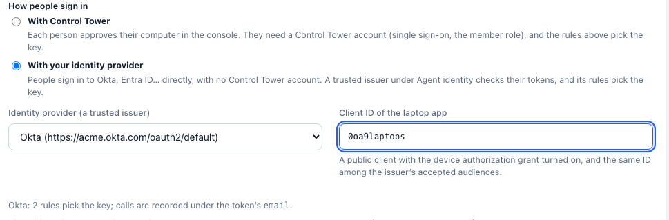

# Enforcing the gateway on every computer

**Enterprise:** this page builds on [Laptops](laptops.md), which needs a [Control Tower Enterprise](enterprise.md) license.

[Laptops](laptops.md) covers rolling Claude Code, Claude Desktop and Codex out and signing people in. This page covers making sure it holds:

- every one of those tools, on every managed computer, uses Control Tower and nothing else;
- people can't switch that off;
- you can check that it's so, and find the computers where it isn't.

Enforcement has four layers. Use all four: each covers what the one before it can't.

| Layer | What it stops | Where it's set |
|---|---|---|
| 1. The tools' managed settings | Claude Code, Claude Desktop and Codex using another provider, another endpoint or another MCP server | Your MDM (Jamf, Intune, Kandji, Group Policy) |
| 2. Sign-in | Calls nobody can be held to account for; keys copied between people | Control Tower, or your identity provider |
| 3. The network | Every other way to reach a model provider: other tools, browser apps, scripts | Your firewall, proxy or secure web gateway |
| 4. Checking | Computers the rollout missed, or that drifted | Your MDM, and Control Tower's records |

## 1. Managed settings: what each tool enforces

Each vendor reads a **managed** configuration that IT controls and the person can't override: a configuration profile on macOS, machine policy in the Windows registry, or a system file. The rollout files from **Laptops** write these. With **Lock down** on, they also refuse everything else.

### Claude Code

| Setting | Effect | Can the person get around it? |
|---|---|---|
| `env.ANTHROPIC_BASE_URL` = Control Tower | Every model call goes to Control Tower | No. A managed value wins over shell exports, `~/.claude/settings.json`, project settings and `--settings` |
| `allowedProviders: ["customEndpoint"]` (**Lock down**) | Claude Code refuses to start against any other destination, including Anthropic directly, and accepts `ANTHROPIC_BASE_URL` only with the managed value | No, on Claude Code 2.1.285 or later. Earlier versions ignore it: see `requiredMinimumVersion` below |
| `apiKeyHelper` = ct-auth | The credential comes from the person's sign-in | No. The managed helper is the only one read |
| `managed-mcp.json` (a file) | Claude Code loads exactly Control Tower's MCP endpoint. User, project and plugin MCP servers and `--mcp-config` are refused | No |
| `allowManagedMcpServersOnly` + `allowedMcpServers` (**Lock down**) | Only servers at Control Tower's address, wherever they're configured | No |

Add these yourself to the profile or `managed-settings.json` when you need them:

- **`requiredMinimumVersion`**: stops an older Claude Code, one that predates `allowedProviders`, from starting at all.
- **`CLAUDE_CODE_SKIP_FAST_MODE_NETWORK_ERRORS`** (in `env`): needed if you use fast mode and block `api.anthropic.com` at the network (layer 3), because fast mode's availability check goes there directly.
- **Don't set `forceLoginMethod` or `forceLoginOrgUUID`.** Either one blocks `apiKeyHelper`, and Claude Code then won't start.

**Where the settings are read from:**
- macOS: the configuration profile (preference domain `com.anthropic.claudecode`), re-checked every 30 minutes.
- Windows: `HKLM\SOFTWARE\Policies\ClaudeCode`, value `Settings`, re-checked every 30 minutes.
- Linux: `/etc/claude-code/managed-settings.json`, reloaded when it changes.
- `managed-mcp.json` sits in the same system folder: `/Library/Application Support/ClaudeCode/`, `C:\Program Files\ClaudeCode\` or `/etc/claude-code/`.

### Claude Desktop

| Setting | Effect | Can the person get around it? |
|---|---|---|
| `inferenceProvider: gateway` + `inferenceGatewayBaseUrl` | Chat, Cowork and Code sessions use Control Tower | No. When a managed source is present it wins, and settings made in the app are ignored |
| `inferenceCredentialHelper` = ct-auth | The credential comes from the person's sign-in | No |
| `managedMcpServers` | Control Tower's MCP endpoint is provided | Not with **Lock down**: see the next row |
| `isLocalDevMcpEnabled: false`, `isDesktopExtensionEnabled: false` (**Lock down**) | No user-added local MCP servers or desktop extensions | No |

Claude Desktop reads its configuration when it starts, and re-checks it every 10 minutes. For most changes it asks the person to restart, and requires the restart within 24 hours (`relaunchEnforcementHours`).

**Where the settings are read from:**
- macOS: preference domain `com.anthropic.claudefordesktop`.
- Windows: `HKLM\SOFTWARE\Policies\Claude`. When machine policy is present there, the user hive (`HKCU`) is ignored.
- Linux: `/etc/claude-desktop/managed-settings.json`.

### Codex (CLI, IDE extension, app)

| Setting | Effect | Can the person get around it? |
|---|---|---|
| `requirements.toml`: `model_provider = "controltower"` and its `[model_providers.controltower]` | Codex uses Control Tower's provider, overriding local and session configuration | No. A conflicting local value falls back to the required one, and Codex says so |
| `[model_providers.controltower.auth]` = ct-auth | The credential comes from the person's sign-in | No |
| `[mcp_servers.controltower.identity]` (**Lock down**) | Only an MCP server with that name and URL can be enabled | No |
| `managed_config.toml` (macOS: the profile's `config_toml_base64`; Linux: `/etc/codex/`) | Control Tower's MCP endpoint, set up | It's re-applied at each start. People can change it during a run; the requirement above still applies |
| Windows: each person's `~\.codex\config.toml` | Codex on Windows has no system-wide defaults file, so the install script adds Control Tower's MCP server to each profile's own file, only where it's missing (and to the Default profile, for people who sign in later) | They can edit their own file; with **Lock down**, `requirements.toml` still enables only Control Tower's server |

**Where the settings are read from:**
- macOS: preference domain `com.openai.codex`, keys `requirements_toml_base64` and `config_toml_base64`.
- Linux and macOS without a profile: `/etc/codex/requirements.toml`.
- Windows: `%ProgramData%\OpenAI\Codex\requirements.toml`.

### Tools that can't be enforced this way

- **Cursor:** its MDM policies have no gateway setting.
- **GitHub Copilot CLI:** [Laptops](laptops.md) points it at Control Tower with each person's sign-in, but only through environment variables (it has no managed settings for its model provider), which someone can unset in their own shell.
- **VS Code with GitHub Copilot Chat:** Control Tower's models can be added ([GitHub Copilot](client-copilot.md)), but GitHub-hosted models stay in the picker unless your Copilot policies turn them off.
- **Anything else** a person installs or writes.

For all of these, use the network (layer 3).

## 2. Sign-in: everyone as themselves

Calls are made as a key you choose, and recorded as the person. There are two ways to sign people in, chosen under **Laptops › Roll it out › How people sign in**.

| | With Control Tower | With your identity provider |
|---|---|---|
| What people do | Approve their computer once in Control Tower's console (after its single sign-on) | Sign in to Okta, Entra ID… once, with the device code the tool shows |
| Control Tower account needed | Yes: the **member** role, which sees only their teams | No |
| Seats | Each person signing in with single sign-on uses one | Each person seen in the last 30 days uses one, once the issuer is marked as people (**Laptops** offers to) |
| What picks the key | **Laptops** rules: tool × team → key | The trusted issuer's rules under [Agent identity](agent-identity.md): claims such as `groups` → key |
| Calls recorded as | The person's email | The token's email (or `preferred_username` for Entra ID) |
| Ending access | Signing out a computer, or removing the person, refuses their token at once | Disable the person at the identity provider: their tokens stop being renewed, and the last one expires within its lifetime (usually an hour) |
| Token | Control Tower's own (an hour), from a refresh token in the keychain | The identity provider's ID token, from its refresh token in the keychain |

### Signing in with your identity provider

1. **Register an app for laptops** at your identity provider. It's a public client: no secret, because it runs on people's computers.
   - **Okta:** a *Native* app with the **Device Authorization** and **Refresh Token** grants. Use your authorization server's issuer, for example `https://acme.okta.com/oauth2/default`, and add a `groups` claim to its ID tokens.
   - **Microsoft Entra ID:** an app registration with **Allow public client flows** turned on. The issuer is `https://login.microsoftonline.com/<tenant-id>/v2.0`. Add `groups` under **Token configuration** to put group IDs in the ID token.
   - **Others:** any OpenID Connect provider that offers the device authorization grant (RFC 8628) and refresh tokens.
2. **Trust it in Control Tower.** Under [Agent identity](agent-identity.md), add the issuer:
   - **Accepted audiences:** the app's client ID (an ID token's `aud`).
   - **Who presented it:** `email`, or `preferred_username` for Entra ID.
   - **Rules** from groups to keys: for example, `groups` matching `engineering` → `claude-code-engineering`.
   - The token lifetime limit (24 hours by default) is above the identity provider's.
   - **Its tokens are people:** on, so each person uses a seat (see [people or workloads](agent-identity.md#people-or-workloads)).
3. **Choose it** under **Laptops › Roll it out**: pick the issuer and enter the client ID. The rollout files then configure ct-auth with it (`idp_issuer=`, `idp_client_id=`).

   
4. **Try it:** `ct-auth login --client claude-code` opens the identity provider's device page, and `ct-auth status` shows who you are.

## 3. The network: close every other way out

Managed settings only govern the tools that read them. To make Control Tower the only way to a model provider, let only Control Tower reach the providers' APIs.

At your firewall, proxy or secure web gateway (Zscaler, Netskope, Palo Alto and the like), allow these hosts from Control Tower's outbound addresses only, and block them for everything else:

| Provider | Hosts |
|---|---|
| Anthropic | `api.anthropic.com` |
| OpenAI | `api.openai.com` |
| Google | `generativelanguage.googleapis.com`, `*-aiplatform.googleapis.com` |
| Azure OpenAI | `*.openai.azure.com`, `*.services.ai.azure.com` |
| AWS Bedrock | `bedrock-runtime.*.amazonaws.com` |
| Others you use | Mistral, Groq, Together, DeepSeek, xAI, OpenRouter… |

Keep `claude.ai`, `chatgpt.com` and the consumer apps' sign-in hosts open or closed according to your own policy: Claude Desktop and Codex configured for Control Tower don't need them for model calls.

Then whatever reaches a provider does so through Control Tower: your gates apply, and the call is on the map. Any attempt to go direct fails at the network.

## 4. Checking it holds

**On a computer:**
- **Claude Code:** `/status` lists the setting sources. "Managed settings" must be among them. If a session asks the person to log in, the credential (ct-auth) didn't reach it.
- **Codex:** the summary it prints at start shows the provider (`controltower`) and its address.
- **Claude Desktop:** on macOS, `/Library/Managed Preferences/<user>/com.anthropic.claudefordesktop.plist` exists (or `/Library/Managed Preferences/com.anthropic.claudefordesktop.plist` for a device-wide profile); on Windows, the values under `HKLM\SOFTWARE\Policies\Claude`.
- **The helper:** `ct-auth status --client claude-code` says who the computer is signed in as.

**Across the fleet, from your MDM:** report what each computer has. For example, as a Jamf extension attribute (macOS):

```bash
#!/bin/sh
# Control Tower rollout: ct-auth installed, Claude Code's managed MCP file and profile present.
ok=""
[ -x /usr/local/bin/ct-auth ] && ok="ct-auth"
[ -f "/Library/Application Support/ClaudeCode/managed-mcp.json" ] && ok="$ok mcp"
[ -f /Library/Managed\ Preferences/com.anthropic.claudecode.plist ] && ok="$ok profile"
echo "<result>${ok:-none}</result>"
```

Build a smart group (or an Intune compliance policy) on it. Computers missing any part get the policy again.

**In Control Tower:**
- **Laptops** lists every signed-in computer, with its person, tool, key and when it was last used (signing in with Control Tower).
- The Ledger's **Spend by person**, and Flights filtered by person, show who is using the tools through the gateway (either way of signing in).
- **Agent identity** shows how many identity-provider tokens were accepted and refused, and why the last one was refused.
- **Finding gaps:** compare the people in your engineering group, or your MDM's computer list, with **Spend by person** over the last week. Someone who has the tools but never appears either doesn't use them, or reaches a provider another way. Layer 3 closes that.

## What this doesn't cover

- **Personal and unmanaged computers.** MDM only reaches managed ones. The network layer still applies on your network or VPN, but not on someone's home network without your VPN or secure web gateway.
- **A person with administrator rights** on their computer can remove a profile or edit system files. Remove local administrator rights, or rely on the network layer, for people where that matters.
- **Tokens already issued** stay valid until they expire. With Control Tower sign-in, signing out applies at once; with an identity provider, within the token's lifetime.

See also [what is enforced](threat-model.md), and [Laptops](laptops.md) for the rollout itself.
