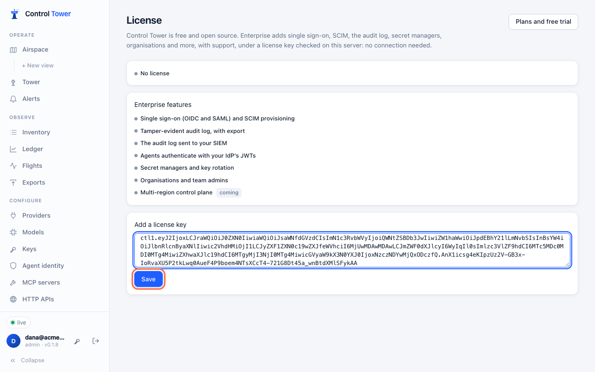
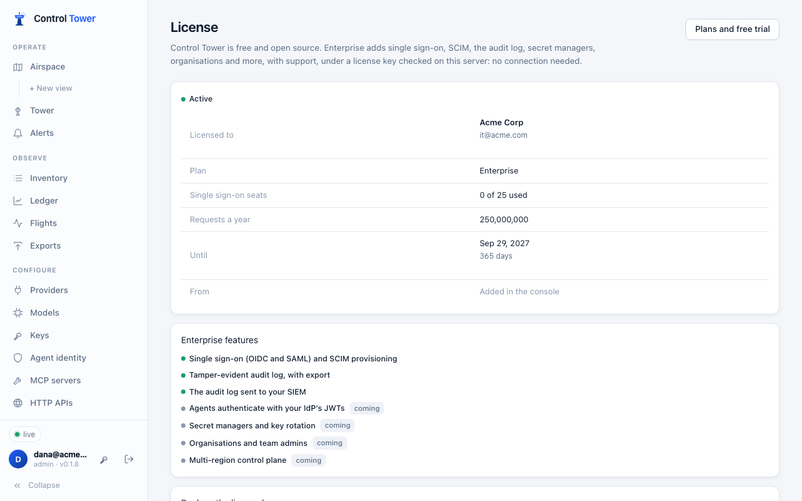
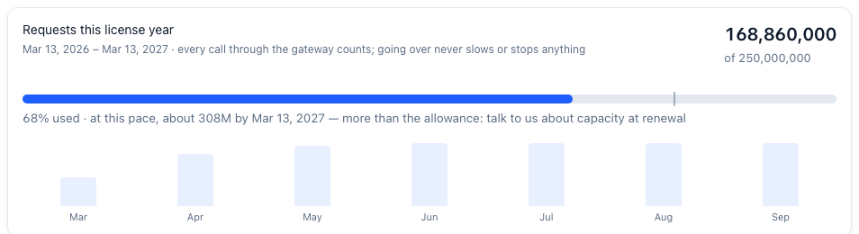
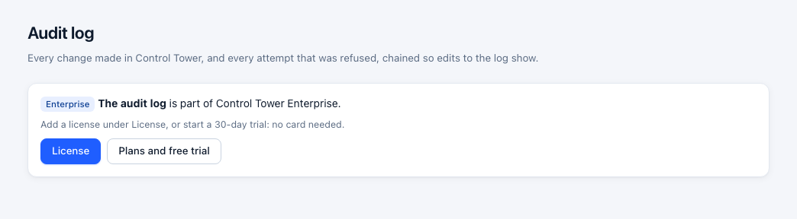

# Enterprise

Control Tower is free and open source, and everything else in these docs works without a license. **Control Tower Enterprise** adds identity, compliance and scale features for companies, with support, and needs a license key.

## What's included

| Feature | Status |
|---|---|
| [Single sign-on](sso.md) over OIDC and SAML 2.0, with roles from your identity provider's groups | Available |
| [Audit log](audit.md): every change and refused attempt, hash-chained, exportable | Available |
| [SCIM provisioning](scim.md): your identity provider adds, changes, deactivates and removes people, and its groups set roles | Available |
| [Audit log to your SIEM](siem.md): Splunk, Datadog, OpenTelemetry, S3 or a webhook, in order, with nothing lost while the SIEM is down | Available |
| [Agent identity](agent-identity.md): agents authenticate with tokens from your identity provider (Kubernetes, GitHub Actions, Entra ID, Okta, Auth0, Google) instead of keys' secrets | Available |
| [Secret managers](secret-managers.md) (AWS, Google, Azure, Vault) and [key rotation](key-rotation.md): credentials read by reference and followed when they rotate; agents' keys rotated on a schedule into your secret manager | Available |
| [Organisations and team admins](teams.md): each team manages its own agents' keys, budgets, people and held calls, and members see only their teams, everywhere in the console | Available |
| [Multi-region control plane](multi-region.md): configure every region from one control plane; regions serve through its outages, keep their calls to themselves, and share limits and budgets | In progress: configuration, outages, one console and global limits and budgets available; a tested cross-cloud deployment next |
| Self-hosted, air-gap available | Available: licenses are checked on your server, with no connection needed |
| 24/7 support with SLAs, dedicated support and onboarding | See [support](https://github.com/joshmaster2165/controltower/blob/main/SUPPORT.md) |
| Annual request capacity and volume discounts | In the license. Usage against it is shown; traffic is never stopped |

Features marked *Coming* are part of Enterprise when they ship; a license covers them without a new key.

## Licensing

A license key starts with `ctl1.` and says whom it is for, the plan, the seats, the requests a year included, the features, and the end date. It is signed by the licensor, and Control Tower checks the signature on your server against a public key built into each release. That check needs no connection, so it works air-gapped. A changed key, or one signed by anyone else, is refused.

Add the key in the console under **License**, or set `CT_LICENSE_KEY` on the server (it then can't be changed in the console).

 Every instance sharing a database reads a key added in the console. With `CT_LICENSE_KEY`, set it on each instance.

**Seats** are the people who sign in with single sign-on or are provisioned by SCIM. Someone who already signs in that way never counts twice. When all seats are taken, new people are refused at sign-in with a clear message; people already signed in aren't affected. People with passwords don't use seats.

**Requests a year:** see [below](#requests-a-year). Going over is a conversation at renewal; it never slows or stops traffic.

## Requests a year

A license includes a number of requests a year, and **License** shows how many have been used this license year. The count covers every call through the gateway, allowed or not: model calls, tool calls, HTTP APIs and agents calling agents. It is summed across every instance sharing the database.

- **The license year** runs from when your subscription began (a trial: from when it started), then from that date each year. For a key without that date, it runs from when this install first saw it.
- **At this pace** projects the year from the months so far, once a week has passed, so you can see early if you'll need more.
- **At 80%, and again at 100%,** a line at the top of the console says so. The [audit log](audit.md) records it once each year as `license.usage`, and the server logs it.
- **Going over never slows, refuses or stops anything.** It's a conversation at renewal, where more requests a year cost less each ([pricing](https://website-production-77c1.up.railway.app/pricing.html)).

**What's sent:** when Control Tower renews a subscription's key (daily, from the license service), it sends this license year's request count and dates with the key. Nothing else goes: no names, models, prompts or anything about the calls. With `CT_LICENSE_SERVER=off` (air-gapped), nothing is sent, and the count stays in the console. People who see only their [teams](teams.md) don't see the count.

## When a license ends

| When | What happens |
|---|---|
| 30 days before the end date | A banner in the console says when it ends |
| After the end date | A **14-day grace period**: everything keeps working, with a banner, while it renews |
| After the grace period | Enterprise features stop. Single sign-on is no longer offered, and **passwords work again** even if you'd turned them off, so nobody is locked out. The audit log stops recording, and you can read it again once a license is added. Gateway traffic, gates, approvals and everything open source carry on as before |

Adding a renewed key brings everything back, with the audit log's history and single sign-on settings as they were.

Without a license, each Enterprise feature says so where it would be:

## Buying and trying

- **Free trial:** 30 days, 5 seats, no card.
- **Enterprise:** a yearly subscription per deployment. The base plan includes 5 single sign-on seats and 100 million requests a year. Add seats as you grow: seats 6–25 and seats 26–100 each have their own price, and the per-seat price drops for the larger block. Monthly billing is available at a higher rate.
- **More than 100 seats, or over a billion requests a year:** contact sales for volume pricing.

Plans, checkout and trial keys are at the **[license service](https://license-production-9780.up.railway.app)** (also linked from **License** in the console). The key is shown as soon as payment completes. Once a day, a server that can reach the license service picks up a renewed key by itself: after each renewal, and when seats change. Air-gapped servers set `CT_LICENSE_SERVER=off`, and their key keeps working until its end date.

## API

| Method | Path | |
|---|---|---|
| GET | `/admin/api/license` | The license in force: `status` (`none`, `valid`, `expiring`, `grace`, `expired`, `invalid`), who it's for, seats and seats used, requests a year, features, end date. Never the key itself |
| PUT | `/admin/api/license` | `{key}`: add or replace the key (admins). Refused with a reason if it isn't valid |
| DELETE | `/admin/api/license` | Remove the key added in the console |

Enterprise routes without a license answer `402` with `{"error": {"code": "enterprise_required", "feature": "sso", …}}`.
