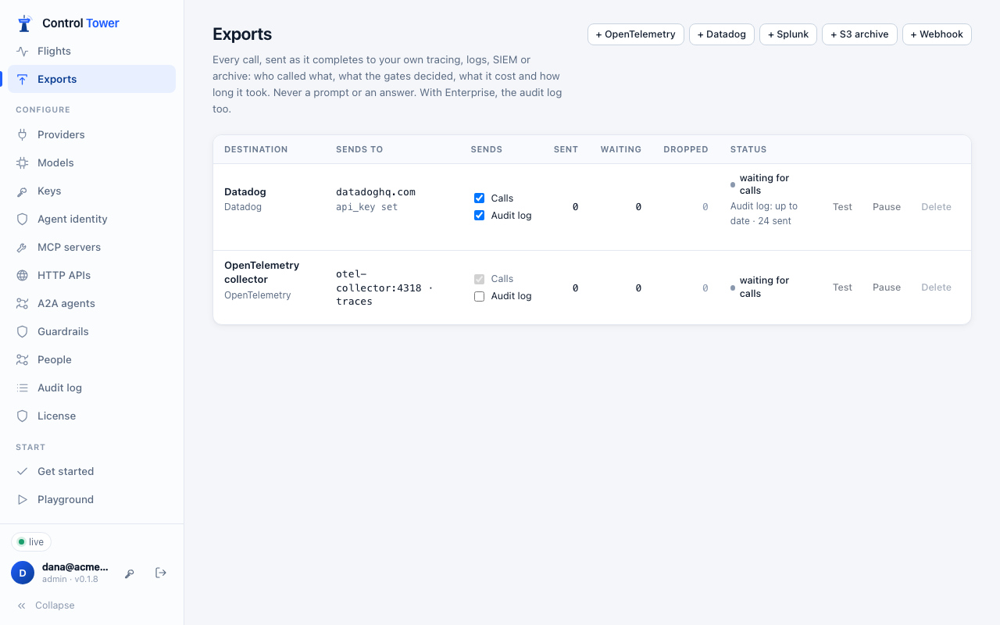

# Exporting flights

**Exports** sends every call, as it completes, to your own tools: OpenTelemetry tracing, Datadog, Splunk, an S3 bucket, or any webhook. It sends what the call was, not what it said. Each record has:
- who made the call (key, agent, team, project, and the agents it acted for);
- where it went (model, provider, tool);
- what the gates decided, and any approval;
- tokens, cost, timings, errors, tags and the customer;
- who presented the token, when the agent used [one from your identity provider](agent-identity.md) (`principal`).

Control Tower never records prompts or answers, so no destination ever receives one.



## What to send

Each destination receives **calls** (the records on this page), **the audit log**, or both. The audit log is every change made in Control Tower and every refused attempt, sent in order and without gaps, for your SIEM. It needs [Enterprise](enterprise.md): see [Audit log to your SIEM](siem.md).

## Destinations

| Destination | What it receives | Settings |
|---|---|---|
| **OpenTelemetry** | OTLP/HTTP JSON sent to `<endpoint>/v1/traces` as spans, or to `/v1/logs` as log records. Attributes follow the GenAI semantic conventions (`gen_ai.operation.name`, `gen_ai.request.model`, `gen_ai.usage.input_tokens`, …), and anything else is under `controltower.*` | Endpoint (e.g. `http://otel-collector:4318`), traces or logs, and an optional `Authorization` header |
| **Datadog** | Log intake v2, one log per call. `status` is the log level, and the call's own status is `flight_status` | API key, site (`datadoghq.com`, `datadoghq.eu`, `us5.datadoghq.com`, …), service, tags |
| **Splunk** | HTTP Event Collector events, source type `controltower:flight` | HEC URL, token, index, source type |
| **S3 archive** | Gzipped JSON Lines files at `<prefix>YYYY/MM/DD/HH/<time>-<id>.jsonl.gz`, SigV4-signed | Bucket, region, prefix, access key. For S3-compatible stores (Cloudflare R2, MinIO, …), set their endpoint |
| **Webhook** | `{"type": "controltower.flights", "records": [...]}`, signed with `x-ct-signature: t=…,v1=…` like [alert webhooks](alerts.md#webhook-payload) | URL and an optional signing secret |

**Send a test record** delivers an example record before you save. **Test** sends one to a saved destination. API keys, tokens, secret keys and header values are stored encrypted, and are never shown again.

### Spans in your agents' traces

An agent instrumented with OpenTelemetry sends a W3C `traceparent` header with its requests. Control Tower's span for that call then joins the agent's trace as a child of the span that made the call, so the model or tool call, the gate that held it and its cost all appear where your traces already are. Calls without a `traceparent` get a trace of their own.

## A record

```json
{
  "type": "controltower.flight",
  "id": "01K5…",
  "started_at": "2026-09-28T17:14:03.120Z",
  "duration_ms": 842,
  "status": "ok",
  "kind": "chat",
  "agent": { "key_name": "support-bot", "agent_id": "support-bot", "team": "support" },
  "customer": "acme",
  "tags": ["ticket-triage"],
  "target": { "model_requested": "smart", "provider_kind": "openai", "upstream_model": "gpt-4.1" },
  "decision": { "effect": "allow" },
  "usage": { "input": 812, "output": 96, "cache_read": 0, "cache_write": 0, "source": "provider" },
  "cost_usd": 0.002392,
  "latency": { "ttfb_ms": 610, "ttft_ms": 612, "gateway_overhead_ms": 1 },
  "trace": { "trace_id": "4bf92f35…", "parent_span_id": "00f067aa…" }
}
```

A blocked call carries the gate's `decision` (`deny`, with its `rule_id` and reason). A held call carries its `approval` (`approved`, `denied`, `expired` or `ticketed`, and who decided). Inspect gates that flagged or masked something appear under `findings`, as detector and action, never the content.

## Delivery

- **Batching:** records go out in batches of up to 500, every two seconds.
- **Retries:** a batch that fails is retried twice (after 2 s, then 10 s), then dropped and counted.
- **Queue limit:** a destination that is down keeps up to 20,000 records waiting, dropping the oldest after that.
- **Status:** **Exports** shows, for each destination, what was sent, what is waiting, what was dropped, and the last error.
- **Pausing and stopping:** **Pause** stops sending to a destination; nothing is kept for it while paused. On shutdown, what is waiting is sent within a few seconds.
- **Several instances:** with [several instances](scaling.md), each sends the calls it served.

The audit log is delivered differently: from the log itself, so nothing waits in memory, nothing is dropped while a SIEM is down, and a restart loses nothing. See [delivery of the audit log](siem.md#delivery).

## API

Admins only.

| Method | Path | |
|---|---|---|
| GET | `/admin/api/exports` | Destinations, with their settings (secrets only as `secrets_set`), what they send, and delivery state |
| POST | `/admin/api/exports` | `{name, kind, config, send_flights, send_audit, audit_from}`. `send_flights` is `true` unless set; `send_audit` and `audit_from` are for [the audit log](siem.md#api) |
| PATCH | `/admin/api/exports/:id` | Any of `name`, `enabled`, `config` (secrets left out keep their stored values), `send_flights`, `send_audit` |
| DELETE | `/admin/api/exports/:id` | |
| POST | `/admin/api/exports/test` | `{id}` for a saved destination, or `{kind, config}` for settings not saved yet; `"stream": "audit"` sends an example audit event instead of a call. Answers `{ok}` or `{ok: false, error}` |
| POST | `/admin/api/exports/:id/flush` | Send what is waiting now |

What `config` holds for each kind:

| `kind` | `config` |
|---|---|
| `otlp` | `endpoint` (required, e.g. `http://otel-collector:4318`), `signal` (`traces` or `logs`, default `traces`), `headers` |
| `datadog` | `api_key` (required), `site` (`datadoghq.com`), `service` (`controltower`), `ddtags`, `endpoint` (to send through a proxy) |
| `splunk` | `url` (required: the HEC base URL), `token` (required), `index`, `sourcetype` (`controltower:flight`), `audit_index` (for the audit log; default `index`) |
| `s3` | `bucket`, `access_key_id`, `secret_access_key` (required), `region` (`us-east-1`), `prefix` (`controltower/`), `session_token`, `endpoint` (S3-compatible stores) |
| `webhook` | `url` (required), `secret`, `headers` |

`api_key`, `token`, `secret_access_key`, `session_token`, `secret` and `headers` are secrets: stored encrypted and never returned.
