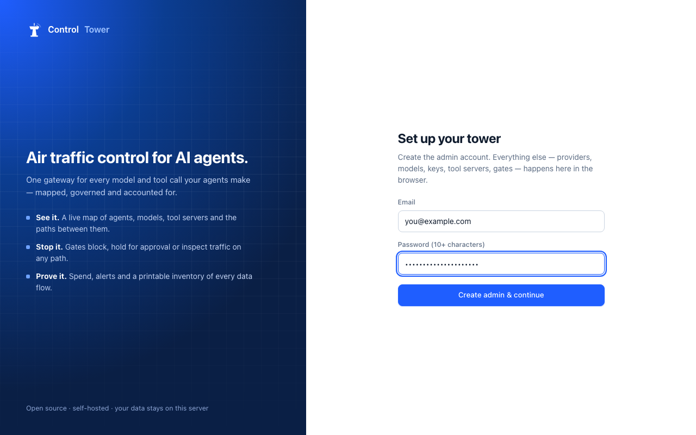
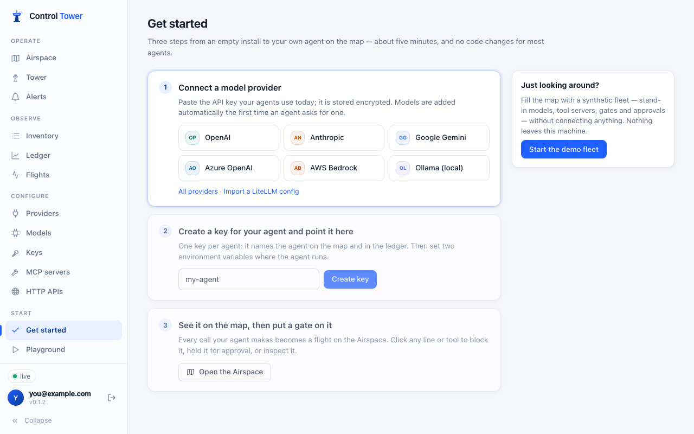
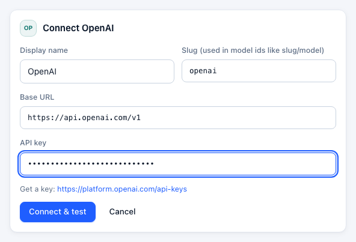
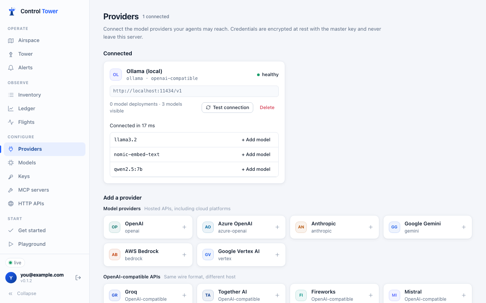
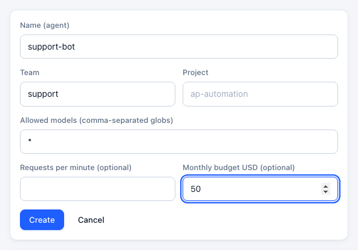
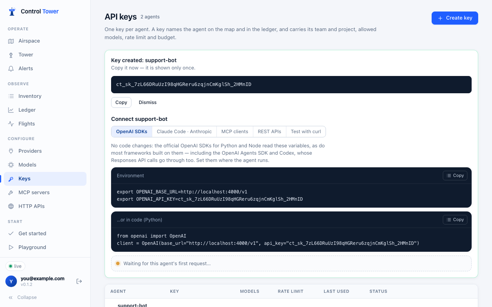
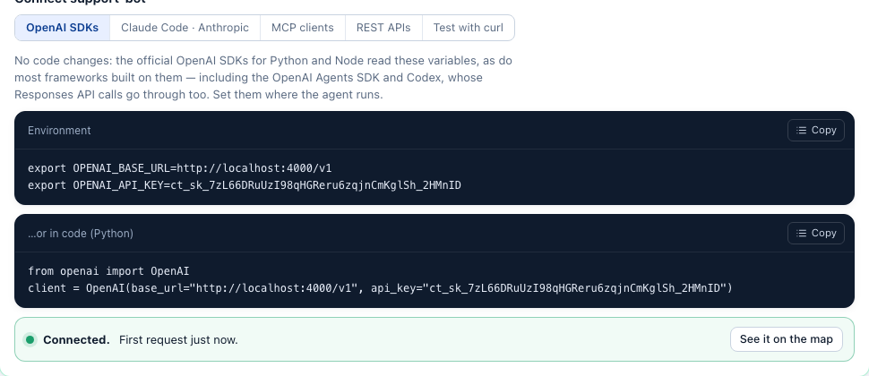
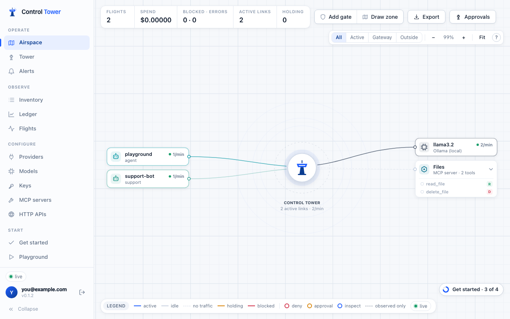
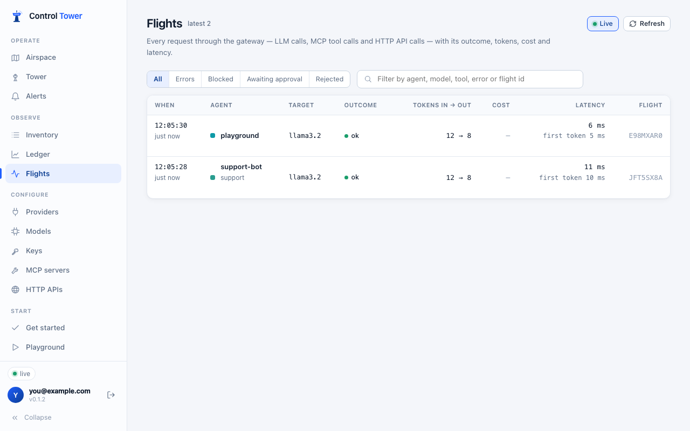
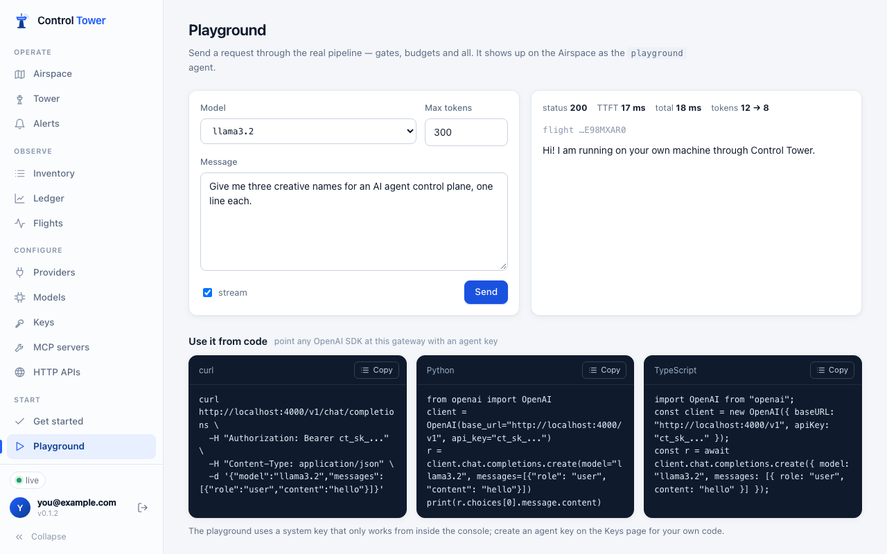

# Getting started

From an empty machine to your own agent on the map in about five minutes. You need Docker (or Node 24, see [Install](install.md)) and an API key for a model provider — or a local model server such as Ollama.

> **Coming from LiteLLM?** Your `config.yaml` and `LITELLM_MASTER_KEY` work as they are: `docker run … ghcr.io/joshmaster2165/controltower --config /app/config.yaml`. See [Migrating from LiteLLM](migrating-from-litellm.md).

## 1. Start Control Tower

```bash
docker run -p 4000:4000 -v controltower-data:/data ghcr.io/joshmaster2165/controltower
```

The terminal prints where to open the console, the two environment variables agents need, and the file to back up:

```text
  Control Tower 0.1.2 is running

     Open        http://localhost:4000  → create your admin account
     Models      OPENAI_BASE_URL=http://localhost:4000/v1       (OpenAI SDKs)
                 ANTHROPIC_BASE_URL=http://localhost:4000      (Claude Code, Anthropic SDKs)
     Tools       http://localhost:4000/mcp    ·    REST APIs: http://localhost:4000/http/<name>
     Data        /data
     Back up     /data/master.key — stored credentials are unreadable without it
```

Everything lives in the `controltower-data` volume: a SQLite database and `master.key`, which encrypts the provider credentials you enter. Back that file up.

## 2. Create the admin account

Open <http://localhost:4000>. On a new install you choose the admin email and password (10+ characters).



> Setting up without a browser (CI, a platform deploy)? Set `CT_ADMIN_KEY` (or `LITELLM_MASTER_KEY`) and the account is created for you: sign in as `admin` with that key. See [Configuration](configuration.md#admin-key).

## 3. Follow *Get started*

A new install opens on three steps. Each one ticks itself off from real data.



Just looking around? **Start the demo fleet** fills the map with stand-in models, tool servers, gates and approvals without connecting anything, and **Stop demo and clear it** removes all of it. See [Demo mode](demo.md).

## 4. Connect a model provider

Pick a provider and paste the API key your agents use today. It is encrypted with the master key and never leaves the server. **Connect & test** checks it right away.



Providers include OpenAI, Azure OpenAI, Anthropic, Google Gemini, Vertex AI, AWS Bedrock, Groq, Together, Fireworks, Mistral, DeepSeek, xAI, OpenRouter, and local servers — Ollama, vLLM, LM Studio or any OpenAI-compatible URL. Here, a local Ollama:



You don't have to add models one by one: **the first time an agent asks for a model a connected provider serves, Control Tower adds it and prices it.** Use **+ Add model** or the **Models** page when you want to rename one, group several behind an alias, or override a price. See [Providers and models](providers-and-models.md).

## 5. Create a key for your agent

One key per agent. The key names the agent on the map and in the Ledger, and carries its team, project, allowed models, rate limit and budget.



The key is shown once. Below it, the **Connect** panel has copy-paste setup for OpenAI SDKs, Claude Code and Anthropic SDKs, MCP clients, REST APIs and curl — with the key filled in — and waits for the agent's first request.



## 6. Point your agent at Control Tower

For most agents that is two environment variables and no code changes:

```bash
export OPENAI_BASE_URL=http://localhost:4000/v1
export OPENAI_API_KEY=ct_sk_…
```

Keep using the model names you use today. When the first request arrives, the panel turns green:



Claude Code, the OpenAI Agents SDK, LangChain, MCP clients and plain HTTP clients are covered in [Connect your agents](connect-agents.md).

## 7. See it on the map

Every call is now a flight on the **Airspace**: which agent reached which model or tool, how often, and what it cost.



Each call is also in **Flights**, with its outcome, tokens, cost and latency:



The **Playground** sends a request through the same pipeline from the browser, and gives you curl, Python and TypeScript for it:



## Next

- [Put a gate on a path](airspace.md): block it, hold calls for a human, or inspect what passes.
- [Register MCP tool servers](mcp.md), so tool calls are mapped and gated too.
- [Budgets, rate limits and allowed models](keys.md) per agent.
- [Alerts](alerts.md) in the console, Slack or a webhook.
