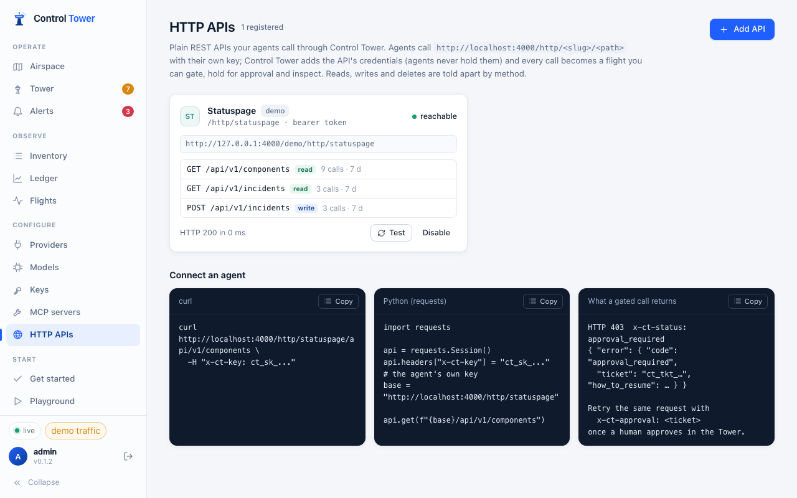

# HTTP APIs and observed traffic

Agents don't only call models and MCP servers. They call status pages, internal services and SaaS APIs directly. Control Tower can route those calls through the gateway (**HTTP APIs**), or at least put them on the map (**observed traffic**).

## HTTP APIs: route plain REST calls through the gateway

Register an API under **HTTP APIs → Add API**: a name, a slug, its base URL and its credentials (stored encrypted). Then point the agent at `/http/<slug>` instead of the API's own host.



```bash
curl http://localhost:4000/http/statuspage/api/v1/components -H "x-ct-key: $CT_KEY"
```

```python
import requests
api = requests.Session()
api.headers["x-ct-key"] = "ct_sk_…"          # the agent's own Control Tower key
base = "http://localhost:4000/http/statuspage"
api.get(f"{base}/api/v1/components")
```

- The agent sends only **its own Control Tower key** (`x-ct-key`, or `Authorization: Bearer ct_sk_…`). Control Tower removes it, adds the API's stored credentials and forwards the request, so the agent never holds the API's secret.
- Every call is a flight named by route — `statuspage › POST /api/v1/incidents`, with record ids folded (`GET /v2/users/:id`) — and every route is a row under the API on the map.
- **Gates** work as for MCP tools: match an API, a route glob (`statuspage__DELETE *`) or an operation: `GET`/`HEAD` are *read*, `POST`/`PUT`/`PATCH` *write*, `DELETE` *destructive*. Approvals, inspect gates on request and response bodies, rate limits, alerts and the inventory all apply.
- A held call answers `403` with `x-ct-status: approval_required` and a ticket; retry the same request with `x-ct-approval: <ticket>` once a human approves.
- Only paths under the registered base URL can be reached: dot segments and encoded dots are refused before anything is sent. Bodies up to 10 MB each way; streaming responses are buffered.

## Observed traffic: see what doesn't go through the gateway

Report calls agents make directly, and they appear on the map as **dashed lines from the agent straight to the system** — not through the tower — and in the inventory under *Seen, not enforced*. A model provider called directly (OpenAI, Anthropic, Bedrock…) is drawn **red**: that traffic skips the gateway, its gates and its budgets.

Report with the agent's own key:

```bash
curl -X POST http://localhost:4000/v1/observe \
  -H "Authorization: Bearer $CT_KEY" -H "Content-Type: application/json" \
  -d '{"events": [{"target": "https://api.stripe.com/v1/refunds", "operation": "write"},
                  {"target": "postgresql://orders-db:5432/orders", "kind": "database", "count": 12}]}'
```

Or point any OpenTelemetry SDK at Control Tower. Outbound spans (`CLIENT` / `PRODUCER`) become observed calls, using the standard HTTP, database, messaging, RPC and GenAI attributes:

```bash
OTEL_EXPORTER_OTLP_TRACES_ENDPOINT=http://localhost:4000/v1/traces
OTEL_EXPORTER_OTLP_TRACES_PROTOCOL=http/json
OTEL_EXPORTER_OTLP_TRACES_HEADERS="Authorization=Bearer ct_sk_…"
```

Only a target name is kept: URLs lose their path and query, connection strings lose their credentials (`postgresql://app:pw@db/orders` → `postgresql://db/orders`), and no payload is stored. OTLP over protobuf isn't accepted yet — use `http/json`.

### Bring it inside

Click an observed system on the map for **Bring it inside**: for a model provider it opens the provider form, for a SaaS or HTTP system it pre-fills **HTTP APIs** with its name and host. Once calls go through `/http/<slug>`, revoke the agent's direct credentials so the direct path closes.
