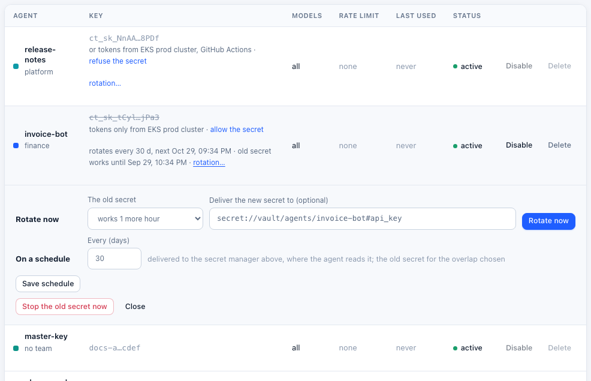

# Key rotation

Two kinds of keys rotate:
- **Agents' keys** (`ct_sk_…`) get a new secret while the old one keeps working for an overlap, now or on a schedule. On a schedule, the new secret is written into your [secret manager](secret-managers.md) for the agent to read. **Enterprise.**
- **The master key**, which encrypts every credential Control Tower stores, can be replaced with one command. **In every edition.**

Provider keys (OpenAI, Anthropic, …) rotate at the provider. Keep them in a [secret manager](secret-managers.md#reading-and-rotation) and Control Tower picks up the new one on its own.

## An agent's key

**Enterprise:** needs a [Control Tower Enterprise](enterprise.md) license.

### Now, with an overlap

On **Keys**, open **rotation…** under a key.

**Rotate now** gives the key a new secret, shown once. Choose how long **the old secret** keeps working: it can stop at once, or keep working for 10 minutes, an hour, a day or 7 days. Agents switch to the new secret during that time without a failed call.

The key keeps its name, permissions, limits, budget, gates and history; only its secret changes.



**Stop the old secret now** ends the overlap early, for a key you believe has leaked.

### On a schedule, delivered to your secret manager

Set **Every (days)** and **Deliver the new secret to**, a [secret reference](secret-managers.md) such as `secret://vault/agents/invoice-bot#api_key`, then **Save schedule**. When the key is due, Control Tower:

1. makes a new secret;
2. **writes it to the secret manager first**. If the manager refuses, nothing changes: the key keeps its secret, the error shows on the key and in the [audit log](audit.md), and it's tried again every 5 minutes;
3. saves it, keeping the old secret for the overlap;
4. records the rotation in the audit log (by *Control Tower*, `keys.rotate`).

The agent reads its key from the secret manager, the way it reads any other secret. Nobody handles the secret, and none lives longer than the schedule. For example:
- a Vault Agent or the External Secrets Operator syncs the secret into the pod as a file or environment variable;
- the AWS, Google or Azure SDK reads it at start, then re-reads it when a call is refused.

Keep the overlap longer than the time it takes your agents to pick up the new secret.

With several instances, only one rotates a given key. It holds a claim on the key while it rotates, and the claim lapses after a minute if that instance stops.

**Rotate now** also delivers to the key's secret reference when it has one. The new secret is then written there and not shown.

### Or no secret at all

Agents that can present a token from your identity provider need no key secret to rotate: see [Agent identity](agent-identity.md).

## The master key

The master key encrypts every credential Control Tower stores: provider keys, tool server tokens, export and alert settings, and secret managers' own credentials. To replace it:

1. **Stop every instance.** The command refuses while an instance is still running on the database (add `--force` if one crashed and can't be stopped).
2. Run the command with the same data directory or database as the server:

   ```bash
   # The master key is in the data directory (the default): a new one is generated there.
   docker run --rm -v ct-data:/data ghcr.io/joshmaster2165/controltower --rotate-master-key

   # The master key comes from CT_MASTER_KEY: give the new one too.
   docker run --rm -e CT_DATABASE_URL -e CT_MASTER_KEY -e CT_NEW_MASTER_KEY="$(openssl rand -base64 32)" \
     ghcr.io/joshmaster2165/controltower --rotate-master-key
   ```

   Every stored credential is decrypted with the old key and encrypted with the new one, in one transaction: it all changes, or nothing does.
3. **Start the instances with the new key.**
   - In the data directory: `master.key` now holds the new key, and `master.key.previous` the old one. Back up the new one, then delete the old.
   - From the environment: set `CT_MASTER_KEY` to the new value on every instance. With [Helm](kubernetes.md), update `secrets.masterKey` (or the `CT_MASTER_KEY` in your `secrets.existingSecret`).

An instance started with the old key refuses to start, saying the database uses another key.

**What doesn't carry over:** anything sealed with the old key but not stored is invalidated. That means [delegation tokens](agent-to-agent.md) already issued to agents (they ask for new ones), and single sign-on attempts in progress (people sign in again). Agents' keys, sessions and passwords are stored as hashes, not encrypted, so they are unaffected.

## API

Admins only; Enterprise.

| Method | Path | |
|---|---|---|
| POST | `/admin/api/keys/:id/rotate` | `{overlap_s, deliver_to}`, both optional. `overlap_s` defaults to the key's own or 3600, from 0 to 604800. `deliver_to` defaults to the key's own; `null` means don't deliver. Answers `{key}` (or `{delivered_to}`), `prefix`, `last4`, `old_valid_until` |
| PUT | `/admin/api/keys/:id/rotation` | `{every_days: 1–365 \| null, overlap_s, deliver_to}`. A schedule needs `deliver_to` |
| POST | `/admin/api/keys/:id/rotate/end-overlap` | Stop the old secret now |

`GET /admin/api/keys` lists `rotation` (`every_days`, `overlap_s`, `deliver_to`, `last_rotated_at`, `next_at`, `error`) and `old_secret_valid_until` for each key.
