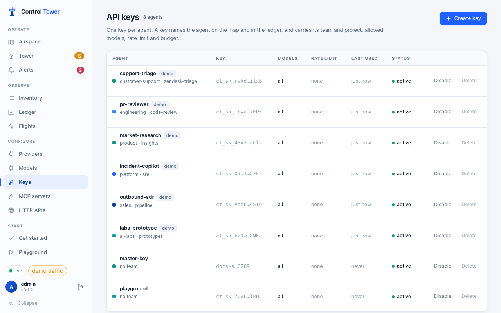
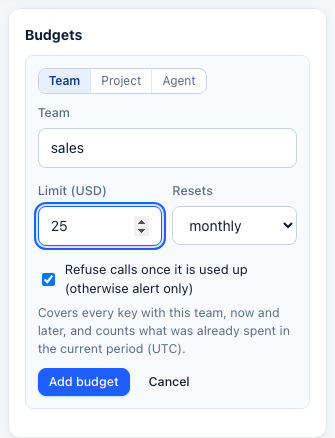
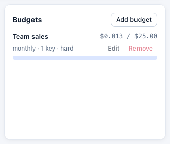

# Keys, budgets and limits

Every agent gets its own key. The key is how Control Tower knows *who* is calling: it names the agent on the map, in Flights and in the Ledger, and it carries what that agent may do.



## Create a key

**Keys → Create key**:


| Field | What it does |
|---|---|
| **Name (agent)** | The agent's name on the map and in every report |
| **Team**, **Project** | Labels for grouping spend, for zones (a zone can match every key of a team) and for alerts |
| **Allowed models** | Comma-separated globs, e.g. `gpt-4.1*, claude-*-haiku*`. Empty means any model. Other models get `403 model_not_allowed` |
| **Requests per minute** | Rate limit; over it, `429 rate_limit_exceeded` |
| **Monthly budget (USD)** | Hard budget; once spent, `429 budget_exceeded` until the next period |

The key (`ct_sk_` + 32 characters + a checksum) is shown **once**. Only its hash is stored. The format is fixed so secret scanners can recognise a leaked key.

Under the key, the **Connect** panel shows setup for each kind of client with the key filled in, and confirms the agent's first request — see [Connect your agents](connect-agents.md).

## More controls (API)

The console covers the common fields; the API has the rest. `POST /admin/api/keys` (or `PATCH /admin/api/keys/:id`) accepts:

```json
{
  "name": "support-bot",
  "team": "support",
  "project": "zendesk-triage",
  "tags": ["customer-facing"],
  "allowed_models": ["gpt-4.1*", "claude-haiku-*"],
  "allowed_mcp": ["salesforce__search_*", "zendesk__*"],
  "limits": { "rpm": 120, "tpm": 200000, "maxParallel": 4 },
  "budget": { "limit_usd": 50, "period": "monthly", "hard": true },
  "expires_at": 1798761600000
}
```

- **`allowed_mcp`** — globs over namespaced tools (`server__tool`). Tools outside them are not even listed to the agent.
- **`limits`** — requests per minute, tokens per minute (charged up front from an estimate, then corrected), and concurrent requests.
- **`budget`** — `daily`, `weekly`, `monthly` or `total`. A soft budget (`hard: false`) alerts instead of refusing. Budget alerts fire at a percentage and when exhausted; see [Alerts](alerts.md).
- **`expires_at`** — epoch milliseconds; afterwards `401 key_expired`.

The same controls are available through LiteLLM's key API, which also accepts an existing key value so agents keep working after a move:

```bash
curl -X POST http://localhost:4000/key/generate \
  -H "Authorization: Bearer $CT_ADMIN_KEY" -H "Content-Type: application/json" \
  -d '{"key_alias": "support-bot", "models": ["gpt-4.1-mini"], "max_budget": 50, "budget_duration": "30d", "rpm_limit": 120}'
```

`/key/info`, `/key/update`, `/key/list`, `/key/block`, `/key/unblock`, `/key/regenerate` and `/key/delete` work as in LiteLLM. See [Migrating from LiteLLM](migrating-from-litellm.md#keys).

## Team and project budgets

A key budget caps one agent. To cap a whole team or project — every key labelled with it, including keys created later — add a budget on the **Ledger**:



- **Resets** daily, weekly (Monday) or monthly, in UTC, or never.
- A new budget counts what the team or project **already spent in the current period**, so a monthly budget set on the 20th includes the 1st to the 20th.
- **Hard** budgets refuse calls with `429 budget_exceeded` once used up; **soft** ones only alert.
- Every call is checked against every budget that covers it — the key's, its team's and its project's — so the tightest one applies.



API: `GET /admin/api/budgets`, `PUT /admin/api/budgets/<key|team|project>/<id>` with `{"limit_usd": 500, "period": "monthly", "hard": true}`, and `DELETE` on the same path.

## Disable, rotate, delete

- **Disable** stops a key immediately (`401 key_disabled`) and keeps its history; **Enable** restores it.
- **Delete** removes it; agents using it get `401` at once.
- To rotate, create a new key for the agent, switch the agent over, then delete the old one — or `POST /key/regenerate` to issue a new secret for the same key record.

A blocked or expired key is refused everywhere: model calls, MCP, HTTP APIs, model listing and token counting.

## Where spend shows up

Per-key requests, tokens, spend, blocked and errors are in the [Ledger](monitoring.md#ledger); per-call detail is in [Flights](monitoring.md#flights). Budgets are checked before each call against what has been spent plus what is in flight, so parallel requests can't overshoot a hard budget by more than the requests already running.
