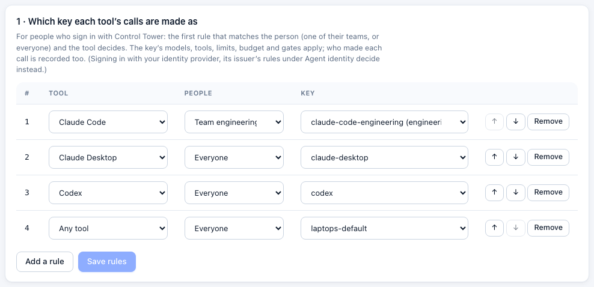
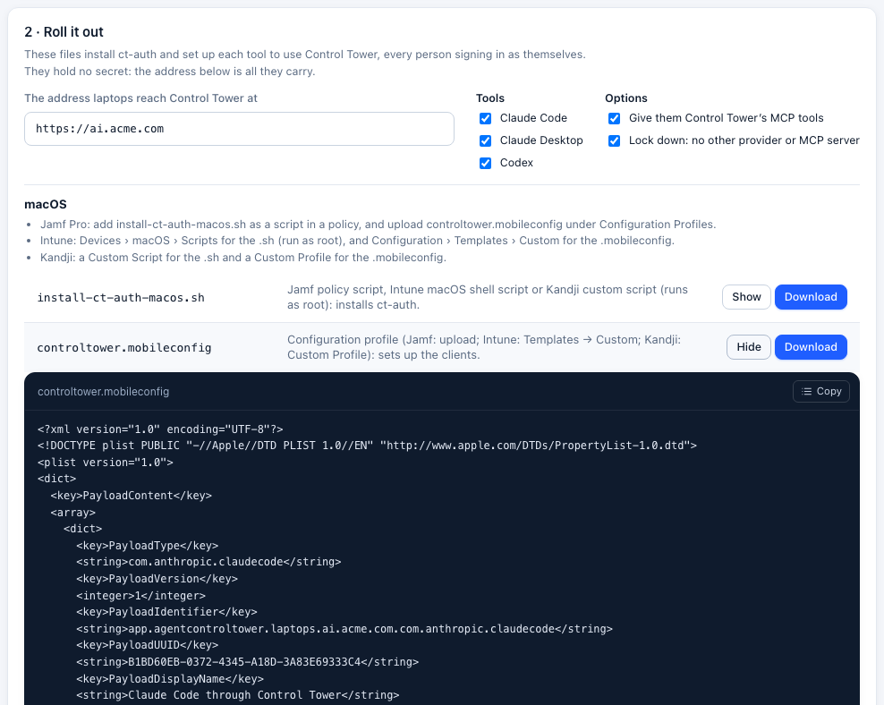
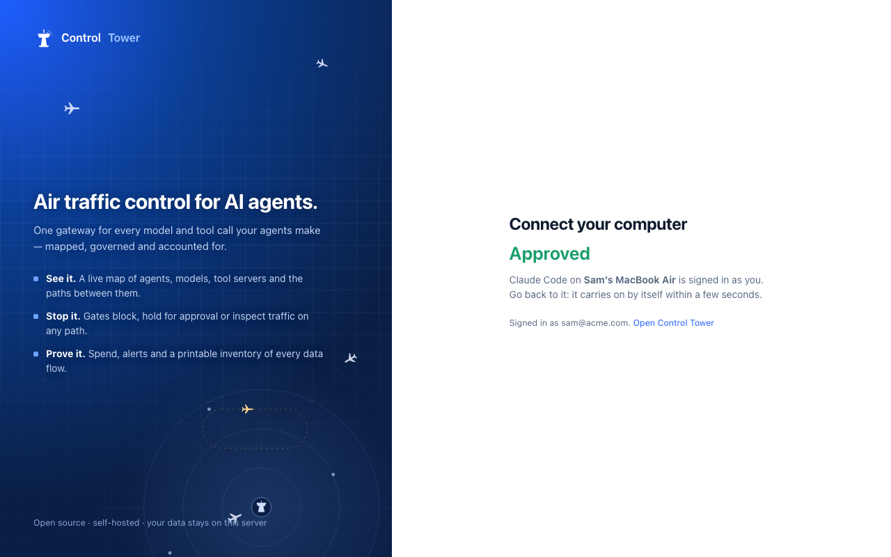
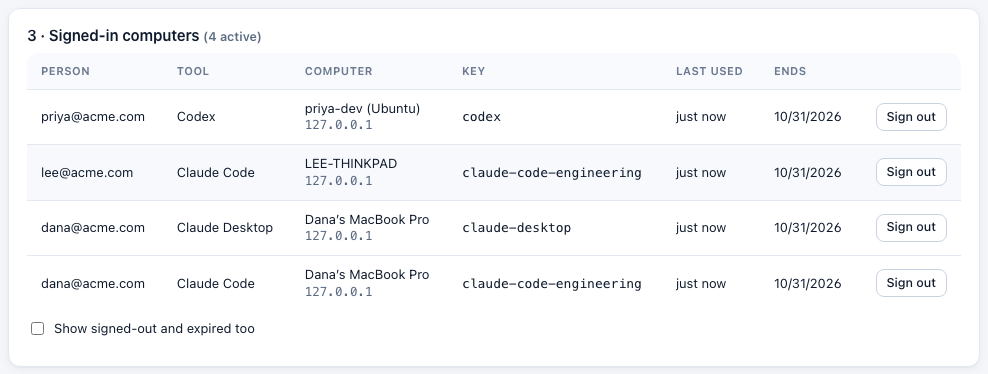
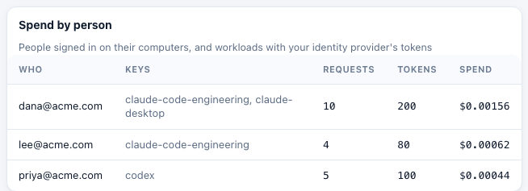

# Laptops: Claude Code, Claude Desktop and Codex, rolled out by MDM

**Enterprise:** laptop sign-in needs a [Control Tower Enterprise](enterprise.md) license.

Put Control Tower in front of the AI tools on your people's computers. IT rolls it out with Jamf, Intune, Kandji or Group Policy. Each person signs in once, through your single sign-on, and from then on:

- every model call and MCP tool call from **Claude Code**, **Claude Desktop** and **Codex** goes through your gateway;
- the call is made as a key you choose, so that key's models, tools, limits, budget and [gates](airspace.md) apply;
- each call is recorded as that person's in Flights, exports and the Ledger (**Spend by person**).

No shared key is handed out: nothing secret is in the files you deploy. People get short-lived tokens, and you can sign out any computer at once.

People sign in one of two ways: **with Control Tower** (they approve their computer in its console), or **with your identity provider** directly (Okta, Entra ID…), so they need no Control Tower account. To make sure every computer uses Control Tower and nothing else, and to check that it does, see [Enforcing the gateway on every computer](enforcement.md). For the rollout from both sides (the team running Control Tower, and an employee opening Claude for the first time), see [Rolling it out](rollout.md).



## How it works

1. IT deploys a small helper, **ct-auth**, plus each tool's managed settings. The settings point the tool at Control Tower and tell it to ask ct-auth for its credential.
2. The first time someone uses the tool, ct-auth opens their browser at Control Tower's **Connect your computer** page. They sign in as usual (single sign-on, or a password), check the code, and approve.

   

3. ct-auth keeps a **refresh token** in the computer's keychain (macOS), or in a file only the person can read (Linux), or encrypted for them with DPAPI (Windows). It hands the tool an **access token** that lasts an hour.
4. Each new access token is checked first: the sign-in hasn't been revoked, the person is still active, and a rule still covers them. Tokens are signed, so the gateway checks them without a database lookup.

The sign-in is the standard OAuth device flow (RFC 8628), like `gh auth login`. It works with any identity provider Control Tower's [single sign-on](sso.md) supports, OIDC or SAML, with no app registration for the laptops.

Or skip Control Tower's sign-in: with **your identity provider** chosen under **Laptops › Roll it out**, ct-auth runs the same device flow against Okta or Entra ID itself and hands the tools its ID tokens, which Control Tower checks through a trusted issuer under [Agent identity](agent-identity.md). Its rules (from groups to keys) pick the key, and people need no Control Tower account. Setting it up: [Signing in with your identity provider](enforcement.md#signing-in-with-your-identity-provider).

## Set it up

### 1. Keys and rules

Create a key for each tool, or one for everything. Give each key the models it may use, its MCP tools, a budget and rate limits, as for any agent ([Keys](keys.md)). Give the keys an **agent ID** such as `claude-code`, and the Airspace draws everyone's Claude Code as one station.

Then open **Laptops** and add rules. A rule says which key a tool's calls are made as, for one team or for everyone. The first rule that matches the person and the tool decides. For example:

| Tool | People | Key |
|---|---|---|
| Claude Code | Team engineering | `claude-code-engineering` |
| Claude Desktop | Everyone | `claude-desktop` |
| Codex | Everyone | `codex` |
| Any tool | Everyone | `laptops-default` |

Rules apply at each computer's next token, so within the hour. Someone no rule covers can't approve a sign-in: the page tells them why.

People need to be able to sign in to the console to approve their computer. With single sign-on, map the group that should have the tools to the **member** role ([single sign-on](sso.md)). Members see only their teams' agents. Each person who signs in through single sign-on uses a [seat](enterprise.md), as for any other sign-in.

### 2. The address laptops use

Laptops must reach Control Tower over **https**. Set `CT_PUBLIC_URL` to that address (for example `https://ai.example.com`) so the links ct-auth shows point there.

### 3. Try it on your own computer

```bash
curl -fsSL https://ai.example.com/device/ct-auth.sh -o ct-auth && chmod +x ct-auth
./ct-auth login --url https://ai.example.com --client claude-code
```

Then point Claude Code at it by hand: `ANTHROPIC_BASE_URL=https://ai.example.com`, and `"apiKeyHelper": "/path/to/ct-auth token --client claude-code --url https://ai.example.com"` in `~/.claude/settings.json`.

### 4. Download the rollout files

Under **Laptops › Roll it out**, enter the address and choose the tools. Two options:

- **Give them Control Tower's MCP tools.** Each tool gets Control Tower's `/mcp` endpoint, behind the same sign-in: the [MCP servers](mcp.md) you've registered, filtered for the key.
- **Lock down.** Stops each tool from using any other provider or MCP server (details [below](#what-each-tool-enforces)).



| Platform | File | How to deploy it |
|---|---|---|
| macOS | `install-ct-auth-macos.sh` | **Jamf Pro:** a script in a policy. **Intune:** Devices › macOS › Scripts (runs as root). **Kandji:** a Custom Script. Installs ct-auth, its configuration and Claude Code's `managed-mcp.json` |
| macOS | `controltower.mobileconfig` | **Jamf Pro:** Configuration Profiles › Upload. **Intune:** Configuration › Templates › Custom. **Kandji:** a Custom Profile. Sets up Claude Code (`com.anthropic.claudecode`), Claude Desktop (`com.anthropic.claudefordesktop`) and Codex (`com.openai.codex`) |
| Windows | `install-controltower-windows.ps1` | **Intune:** Devices › Windows › Scripts. Run it as SYSTEM (not the signed-in user), in 64-bit PowerShell. Installs ct-auth to `C:\Program Files\ControlTower` and writes each tool's policy |
| Windows | `controltower-windows.reg` | **Group Policy** (registry preferences): Claude Code's and Claude Desktop's policy only. Install ct-auth separately |
| Linux | `install-controltower-linux.sh` | Run as root from your configuration management. Installs ct-auth and every tool's system settings under `/etc` |
| Any | `claude-code/…`, `claude-desktop/…`, `codex/…`, `ct-auth`, `ct-auth.ps1` | The same settings as separate files, for your own packaging |

Downloading again gives the same profile identifiers, so MDM replaces a profile rather than adding a second one.

**Claude Desktop needs a Claude model listed.** It shows the Claude models Control Tower lists for the person's key (`GET /v1/models`), and doesn't start without one: it says "Configuration can't be used: Gateway returned no usable models". Models [added on first use](providers-and-models.md#models-are-added-on-first-use) aren't listed until someone has used them, so add the Claude models you want under **Models** first. **Laptops** warns when a key Claude Desktop would use lists none.

### 5. What people see

The first time someone starts a tool, their browser opens at **Connect your computer**. They sign in, check the code, and approve:



Claude Code and Codex wait for the approval and carry on. Claude Desktop runs ct-auth when it starts a session, and does the same.

## What each tool enforces

| Tool | Through Control Tower | Its own sign-in | Other MCP servers |
|---|---|---|---|
| **Claude Code** | Managed `ANTHROPIC_BASE_URL`, which a shell variable can't override. With **Lock down**, `allowedProviders: ["customEndpoint"]` refuses any other destination (Claude Code 2.1.285 or later; earlier versions ignore it) | `apiKeyHelper` runs ct-auth | `managed-mcp.json` gives exactly Control Tower's endpoint. With **Lock down**, `allowManagedMcpServersOnly` too |
| **Claude Desktop** | `inferenceProvider: gateway` with Control Tower's address: a managed source wins over local settings | `inferenceCredentialHelper` runs ct-auth | `managedMcpServers` gives Control Tower's endpoint. With **Lock down**, user-added local servers and desktop extensions are turned off |
| **Codex** (CLI, IDE extension, app) | `requirements.toml` enforces `model_provider = "controltower"`: users can't switch provider | `auth.command` runs ct-auth | `managed_config.toml` adds Control Tower's endpoint. With **Lock down**, `requirements.toml` allows only that one |
| **Cursor** | Not possible: Cursor's MDM policies have no setting for a gateway | — | Cursor's team dashboard has an MCP allowlist |
| **VS Code + GitHub Copilot** | Not possible: Copilot's own models can't be sent through a gateway | — | VS Code's MCP policies (`ChatAllowedMcpServers`) |

Managed settings stop someone using these tools any other way. They don't stop someone installing another tool, or calling a provider's API directly from their own code. That needs network controls: allow `api.anthropic.com` and `api.openai.com` only from Control Tower, at your proxy or firewall. See [what is enforced](threat-model.md).

### Claude Desktop with your identity provider directly

Claude Desktop can also sign people in to your identity provider itself (`inferenceGatewayOidc`), without ct-auth. Register Claude Desktop as an app at your identity provider, then trust that issuer under [Agent identity](agent-identity.md), with a rule mapping your people to a key. Calls are recorded under the token's `email` (set **Who presented it** to `email`). The difference is revocation: a token from your identity provider can't be ended before it expires, while signing out a computer here applies at once.

## Day to day

**Signed-in computers.** **Laptops** lists every signed-in computer: whose it is, the tool, the computer's name and address, the key, and when it was last used. **Sign out** ends a sign-in at once: its access token stops working, and the computer has to sign in again.



People see their own computers on **Connect your computer**, and can sign them out there. On the computer, `ct-auth logout` does the same.

**People who leave.** Removing someone from Control Tower signs out their computers at once. So does deactivating them at your identity provider, through [SCIM](scim.md), or moving them out of every group that gives a role.

**How long sign-ins last.** By default a computer signs in again after 90 days, or after 30 days unused. Change this under **Laptops**. Access tokens last an hour; `CT_DEVICE_TOKEN_TTL_S` sets another lifetime (5 minutes to a day).

**Spend by person.** The [Ledger](monitoring.md#ledger) splits a shared key's spend between the people who used it:



## ct-auth

| Command | |
|---|---|
| `ct-auth login --client <tool>` | Sign in: opens the browser, waits for the approval |
| `ct-auth token --client <tool>` | Print a current access token, refreshing it when needed. Signs in first if needed, unless no one is there to approve (see below) |
| `ct-auth header --client <tool>` | Print `{"Authorization": "Bearer …"}`, for MCP clients. Never waits for a sign-in |
| `ct-auth status --client <tool>` | Who this computer is signed in as, and the key |
| `ct-auth logout --client <tool>` | Sign out here, and end the sign-in in Control Tower |

- **`--client`:** `claude-code`, `claude-desktop`, `codex` or `other`. Each tool signs in separately, so one can be signed out without the others.
- **Signing in with your identity provider:** `idp_issuer=` and `idp_client_id=` in the configuration file (or `CT_IDP_ISSUER` and `CT_IDP_CLIENT_ID`). Optional: `idp_scope=` (default `openid email profile offline_access`), and `idp_token=access_token` to send the access token instead of the ID token. `logout` revokes the refresh token at the identity provider when it offers revocation.
- **The address:** `--url`, else `CT_URL`, else the installed configuration file:
  - macOS: `/Library/Application Support/ControlTower/ct-auth.conf`
  - Linux: `/etc/controltower/ct-auth.conf`
  - Windows: `%ProgramData%\ControlTower\ct-auth.conf`

  The file holds one line, `url=https://…`. Tools run their helpers with a bare environment (Codex passes only `HOME`, `PATH`, `USER` and `TMPDIR`), so a rollout relies on the file.
- **Where tokens are kept:**
  - macOS: the login keychain (`Control Tower (<host>)`). Values are written through `security`'s own prompt, so they never appear on a command line.
  - Linux: `~/.config/controltower`, readable only by the person.
  - Windows: `%LOCALAPPDATA%\ControlTower`, encrypted for the person with DPAPI.
- **Nobody there to approve.** When Claude Desktop runs ct-auth in the background (`CLAUDE_HELPER_CONTEXT` other than `interactive`), or with `CT_AUTH_NONINTERACTIVE=1`, ct-auth doesn't open a browser. It says how to sign in, and exits.
- **Offline.** If Control Tower can't be reached, a token that hasn't expired yet is still printed.

ct-auth is a POSIX shell script (macOS and Linux, needing only `curl`) and a PowerShell script (Windows PowerShell 5.1 or PowerShell 7). Read it before you deploy it: **Laptops** shows every file in full.

## API

The endpoints ct-auth calls:

| Method | Path | |
|---|---|---|
| POST | `/device/code` | `client`, `device_name` (form or JSON): starts a sign-in. Answers `device_code`, `user_code`, `verification_uri`, `verification_uri_complete`, `expires_in` (600), `interval` (5) |
| POST | `/device/token` | `grant_type=urn:ietf:params:oauth:grant-type:device_code` with `device_code`, or `grant_type=refresh_token` with `refresh_token`. Answers `access_token`, `token_type`, `expires_in`, `key_name`, `person`, and once `refresh_token`. Errors follow RFC 8628: `authorization_pending`, `slow_down`, `access_denied`, `expired_token`, `invalid_grant` |
| POST | `/device/revoke` | `token` (a refresh token): signs that computer out |
| GET | `/device/ct-auth.sh`, `/device/ct-auth.ps1` | The helper |

The console's endpoints:

| Method | Path | |
|---|---|---|
| GET | `/admin/api/me/devices/pending?code=` | A sign-in waiting for the person: the tool, the computer, where it came from, and the key (or why none) |
| POST | `/admin/api/me/devices/approve` | `{user_code, approve}`: the person approves or refuses |
| GET | `/admin/api/me/devices` | The person's own computers |
| DELETE | `/admin/api/me/devices/:id` | The person signs one out |
| GET | `/admin/api/devices` | Admins: every computer, the rules, the settings |
| DELETE | `/admin/api/devices/:id` | Admins: sign a computer out |
| PUT | `/admin/api/devices/rules` | Admins: `{rules: [{client, team_id, key_id}]}`, in order |
| PUT | `/admin/api/devices/settings` | Admins: `{session_days, idle_days}` |
| GET | `/admin/api/devices/rollout?url=&clients=&mcp=&lockdown=` | Admins: the rollout files |
| GET | `/admin/api/ledger/people?window=` | Spend by person |

The audit log records approvals (`devices.approve`), sign-ins (`devices.sign_in`), sign-outs (`devices.revoke`, `devices.sign_out`) and rule changes.

## Limits

- Laptops sign in to the control plane (or any instance sharing its database). In a [multi-region](multi-region.md) deployment, point them at the control plane.
- A refresh token is a long-lived credential on the computer, protected as described above. Signing out, or removing the person, ends it at once.
- Without a license, or once one ends after its [grace period](enterprise.md#when-a-license-ends), laptop tokens are refused and the tools stop working until a license is added. Gateway traffic with keys carries on.
