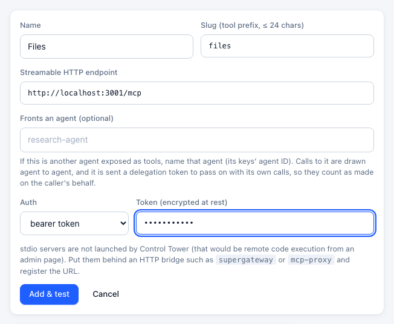
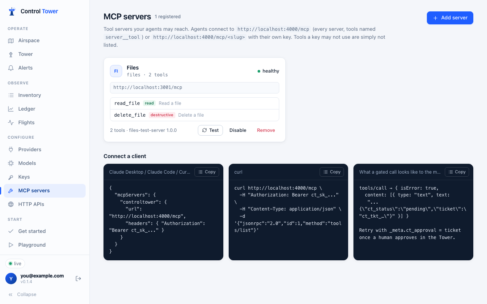

# MCP tool servers

Tool calls are where agents act — create a ticket, merge a pull request, delete a contact. Register your MCP servers with Control Tower and every tool call is mapped, gated, held for approval or inspected like a model call.

## Register a server

**MCP servers → Add server**: a name, a slug (the tool prefix), the server's Streamable HTTP endpoint, and its credentials if it needs them (stored encrypted; agents never see them).

Control Tower connects, lists the tools and classifies each one: **read** (from `readOnlyHint` or a name like `get_`, `list_`, `search_`), **write**, or **destructive** (from `destructiveHint` or a name like `delete_`, `merge_`, `transfer_`). Gates can target those classes.

Servers are health-checked, and their tool lists are refreshed so new tools appear on the map. The transport is Streamable HTTP. For a stdio-only server, run it behind a small bridge such as [`supergateway`](https://github.com/supercorp-ai/supergateway) and register the bridge's URL — Control Tower does not start local commands.

## Connect clients

Agents connect to **one** address with their own key:

- `http://<host>:4000/mcp` — every server, tools named `server__tool` (`github__merge_pr`).
- `http://<host>:4000/mcp/<slug>` — one server, original tool names.

Client setup for Claude Code, Cursor and the OpenAI Agents SDK is in [Connect your agents](connect-agents.md#mcp-clients).

## Who sees which tools

`tools/list` is filtered per key before the agent sees anything:

1. the key's `allowed_mcp` globs (e.g. `salesforce__search_*`),
2. then gates that block a tool for this agent regardless of arguments.

A tool an agent can't see is one it can't call and doesn't need approval for — this is the strongest control Control Tower has, stronger than blocking calls after the fact. Gates that depend on arguments leave the tool visible and decide at call time.

## Gates on tools

Everything in [the Airspace](airspace.md) applies: drag from an agent to a server or a single tool row to block it, require approval or inspect it. On a tool call:

- **Blocked** — the agent gets a tool result with `isError: true` and the reason, so the model can explain it instead of retrying blindly.
- **Held** — the call waits for a human; the card shows the tool's actual arguments. Unanswered, the result carries a ticket to retry with once approved.
- **Inspected** — arguments and results are scanned. Scanning tool **results** is where indirect prompt injection and data leaks are caught before the model reads them: mask an email address in a CRM record, block instructions hidden in a web page.

## In the config file

`mcp_servers` entries in a [config file](config-file.md) (URL, `auth_type`, `auth_value`, `static_headers`) become MCP servers, both with **Import config** and with `--config`. See [Config file](config-file.md#mcp_servers).
