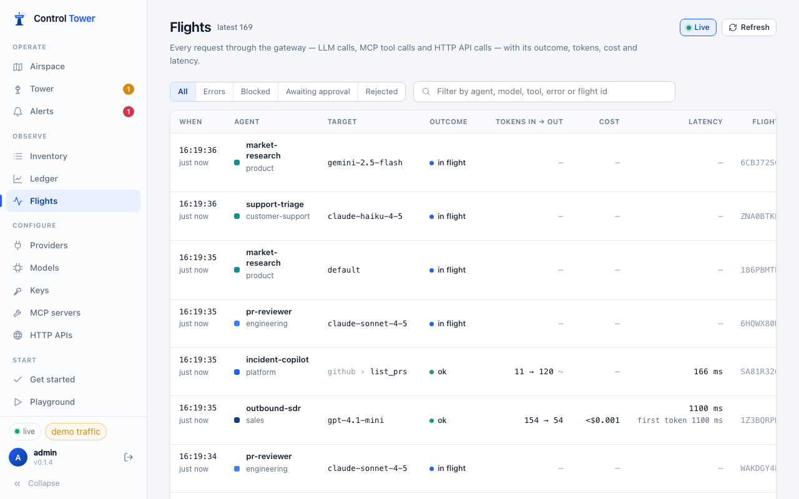
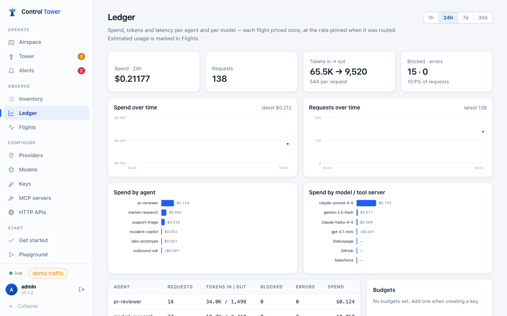
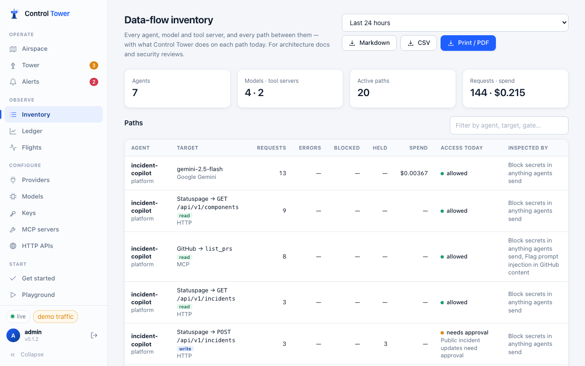

# Monitoring: Flights, Ledger, Inventory, metrics

## Flights

Every request through the gateway — model calls, MCP tool calls and HTTP API calls — with its agent, target, outcome, tokens, cost and latency. Filter by errors, blocked, awaiting approval or rejected, or search by agent, model, tool, error or flight id. Every gateway response carries `x-ct-flight-id`, so an agent's log line leads straight to its flight.



Prompts and responses are **not** stored: a flight records who, what, when, the outcome and the numbers.

## Ledger

Spend, requests, tokens and errors over time, per agent and per model or tool server, for the last hour, day, week or month. Each flight is priced once, at the rate in force when it was routed; usage the provider didn't report is estimated and marked as such.



The **Budgets** card shows every agent, team and project budget against its spend, and is where team and project budgets are added — see [Keys, budgets and limits](keys.md#team-and-project-budgets).

## Data-flow inventory

**Inventory** lists every agent, model and tool server, and every agent → model / tool path seen in the last 24 hours, 7 days or 30 days — with requests, errors, blocked, held and spend, and, for each path, what Control Tower does about it today: the access decision and the gate behind it, the inspect gates that scan it, and whether the agent's key even allows it. Paths seen outside the gateway are listed separately as *seen, not enforced*.



Print it (or save as PDF) for a security review, or download it as Markdown for a wiki or pull request, or CSV for a spreadsheet: `GET /admin/api/export/dataflow?format=md|csv&hours=24`. **Airspace → Export → Map image** saves the whole map as a PNG for architecture documents.

## Prometheus metrics

`GET /metrics` serves the Prometheus text format. It names agents and shows spend, so it is never anonymous: set `CT_METRICS_TOKEN` and scrape with that bearer token (a signed-in admin or the admin key can also open it).

```yaml
scrape_configs:
  - job_name: controltower
    authorization: { credentials: <CT_METRICS_TOKEN> }
    static_configs: [{ targets: ['controltower:4000'] }]
```

| Metric | |
|---|---|
| `controltower_requests_total{agent,team,kind,model,provider,status}` | Requests |
| `controltower_tokens_total{agent,model,type}` | Tokens by type |
| `controltower_spend_usd_total{agent,team,model}` | Spend |
| `controltower_upstream_failures_total{model,code}`, `controltower_fallbacks_total{model}` | Provider health |
| `controltower_gate_decisions_total{gate,decision}`, `controltower_approvals_total{outcome}` | Enforcement |
| `controltower_request_duration_seconds`, `controltower_time_to_first_token_seconds`, `controltower_gateway_overhead_seconds` | Latency histograms |
| requests in flight, held requests, event backlog, `controltower_deployment_state`, `controltower_mcp_server_up`, budget limit / spent / remaining, build info, uptime | Gauges |

Labels are bounded: a model name the gateway doesn't know is reported as `other`, so clients can't create series at will.

## Health checks

`/healthz` and `/health/liveliness` for liveness, `/readyz` and `/health/readiness` for readiness, and `/health` (admin or agent key) to check every connected provider. See [Install](install.md#any-container-platform).

## Load testing

`pnpm load:fleet` (from a checkout) drives a fleet of agents against a running server and measures the gateway and the Airspace under that load. Point it at a server started in demo mode, so the models, MCP servers and HTTP API it calls are the built-in stand-ins and nothing leaves the machine:

```bash
CT_DEMO=1 CT_ADMIN_KEY=… pnpm start
pnpm load:fleet --admin-key "$CT_ADMIN_KEY" --agents 1500 --rps 300 --duration 60
```

It creates `--agents` keys (named `load-*`, replaced on each run) across `--types` agent types (60) and `--teams` teams (12), a few big agents with many copies and a long tail of small ones. It then sends `--rps` requests a second — chat, MCP tool calls and HTTP API calls — and halfway through opens the Airspace in a headless browser. The report in `load-report/` has:

| | |
|---|---|
| Traffic | Achieved rate, statuses, client latency, and gateway overhead from `/metrics` |
| Map | Time to first draw, topology size, stations drawn, frame rate, live-update rate and bandwidth, memory |

A screenshot of the map under load is saved next to it. `--no-browser` skips the map.

