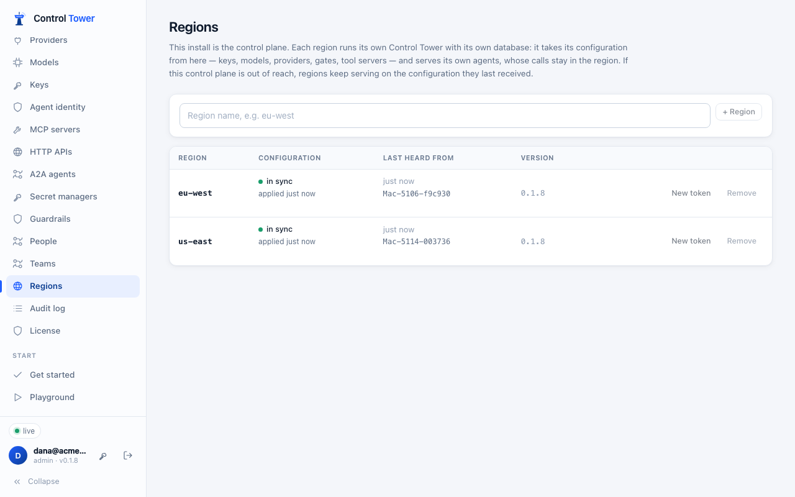
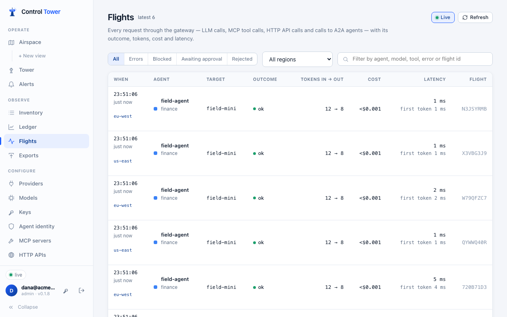
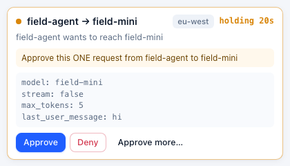

# Multi-region

**Enterprise:** several regions need a [Control Tower Enterprise](enterprise.md) license on the control plane.

**Status:** in progress. Available now:
- one control plane configures every region;
- regions keep serving through a control-plane outage;
- calls stay in their region;
- one console shows every region's calls, spend, map and held calls.

Still to come: budgets, rate limits and the yearly request count shared across regions. [What that means today](#what-isnt-there-yet).

Run Control Tower close to your agents, in as many regions as you need, and configure it in one place:

- **The control plane** is the Control Tower you already run. It holds the configuration, the console, the audit log, the license and single sign-on. It can serve agents too.
- **Each region** is a Control Tower with its own database and Redis. It takes its configuration from the control plane and serves the agents near it. **Their calls stay in the region**: the flights, events, spend and held calls.

Your load balancer or DNS sends each agent to its region.



## What a region takes from the control plane

Everything agents are served with:
- keys (hashes only; built-in keys stay each install's own);
- providers and their credentials;
- models and aliases;
- gates and zones;
- tool servers, HTTP APIs and A2A agents;
- guardrail services;
- exports;
- token issuers and secret managers;
- alert rules and channels;
- customers;
- budget limits;
- the license.

What a region measures itself stays its own: health checks, delivery counters, and spend so far.

**Credentials** are re-encrypted for each region's own master key before they leave the control plane, so a region's configuration is useless to anyone without that key. Credentials kept in a [secret manager](secret-managers.md) are read by the region itself, with its own access (for example, the cloud role it runs with).

**Every snapshot is signed** with the region's token, and a region refuses one that isn't. A region can't change configuration: its admin API refuses changes (`409 managed_by_control_plane`), and its console says where to go.

## Set it up

1. On the control plane, set `CT_PUBLIC_URL` to the URL regions reach it at.
2. Open **Regions** and add one (for example `eu-west`). You're shown, once, what its servers start with:

   ```
   CT_ROLE=region
   CT_REGION=eu-west
   CT_CONTROL_PLANE_URL=https://controltower.acme.com
   CT_REGION_TOKEN=ctr_…
   CT_MASTER_KEY=…
   ```

   Keep them in your secret store.

3. Start the region's servers with those settings, plus their own `CT_DATABASE_URL` and `CT_REDIS_URL` (a region can run [several instances](scaling.md), like any install) and `CT_ADMIN_KEY` for its own console. With [Helm](kubernetes.md), put the region's name and URL in the chart's `env`, and the token and master key in a Secret of your own, passed with `envFrom`.
4. **Regions** shows each region's state:
   - **in sync**: it has the current configuration;
   - **catching up**: a change hasn't reached it yet;
   - **not heard from**: nothing for a minute.

   It also shows which server last checked in, its version, and any error it reported.

**New token** replaces a region's token; the old one stops at once, so restart the region's servers with the new one. **Remove** stops the control plane answering that region.

Models are added on the control plane. A region doesn't add a model the first time an agent names it, because its configuration is the control plane's.

## One console for every region

The control plane's console shows every region's traffic as well as its own:

| Page | Across regions |
|---|---|
| **Flights** | Every region's calls, newest first, each marked with its region. The **region** menu shows one region, or the control plane's own calls. Opening a call shows its events, from the region that holds it |
| **Tower** | Calls held in any region, each marked with its region. Deciding one here decides it in its region, as you (it's recorded there as decided by your name, and in the control plane's [audit log](audit.md)). The region's own console can decide it too |
| **Airspace** | Every region's traffic on one map, live, including held and blocked calls as they happen |
| **Ledger** | Spend, tokens, calls and latency added up across regions |
| **Keys** | *Last used* counts use in any region. [Retiring idle keys](keys.md#agents-that-come-and-go) waits until every region has answered, so a key used only in a region is never retired |
| **Flight Recorder** | Replays every region's calls |





**How it works:**
- **Nothing is stored on the control plane.** When a page asks, each region answers from its own database, and the answer is shown, not kept. Live traffic works the same way: each region sends its live frames every second, and they pass straight to the consoles watching.
- **Regions connect out.** Each region keeps a request open to the control plane (a long poll) and answers the console's questions over it. A region behind a firewall or NAT needs no inbound access.
- **Teams:** someone who sees only their [teams](teams.md) sees only their teams' calls from every region, because each region applies their scope.
- **A region that doesn't answer is named, not silently missing.** A page shows what it has, and says which region it couldn't include. A region that has stopped is skipped at once; one that's slow is given up on after 6 seconds.

## When the control plane is out of reach

A region keeps serving on the configuration it last received: keys, gates, limits and approvals all work as they did. It keeps that configuration in its own database, so it serves even after a restart during the outage.

Changes made on the control plane meanwhile arrive when it's reachable again. Regions check every 5 seconds (`CT_CONFIG_POLL_S`). The region's console says it can't reach the control plane, and why.

A region that has never received any configuration serves nothing until it does.

## What isn't there yet

Each of these is the next step, not a design choice. Until then:

- **Budgets and rate limits are counted per region.** A key's budget applies in each region separately. The yearly request count on **License** counts the control plane's own calls.
- **Only in each region's own console:**
  - the details panel of an agent-to-agent link on the map;
  - spend by customer and by tag;
  - the alert inbox;
  - the data-flow inventory export.
- **The audit log** is the control plane's: changes are made there, and decisions made from its console are recorded there. A region records nothing of its own.

## Environment

| Variable | On | |
|---|---|---|
| `CT_ROLE=region` | regions | This install is a region |
| `CT_REGION` | regions | Its name, as added on the control plane |
| `CT_CONTROL_PLANE_URL` | regions | The control plane's URL |
| `CT_REGION_TOKEN` | regions | How it signs in to the control plane |
| `CT_MASTER_KEY` | regions | The region's own master key, from the control plane (not the control plane's) |
| `CT_CONFIG_POLL_S` | regions | How often it checks for changes (default 5) |
| `CT_PUBLIC_URL` | control plane | The URL regions reach it at |

## API

On the control plane, for admins:

| Method | Path | |
|---|---|---|
| GET | `/admin/api/regions` | Regions with `status` (`waiting`, `in_sync`, `behind`, `unreachable`), `last_seen`, `instance`, `version`, `applied_at`, `error` |
| POST | `/admin/api/regions` | `{name}`: answers `env`, the settings the region starts with (shown once) |
| POST | `/admin/api/regions/:id/token` | A new token (the old one stops at once) |
| DELETE | `/admin/api/regions/:id` | |

Regions call `GET /cp/v1/config` with their token. It answers `304` when nothing changed, or a signed snapshot. They also hold `GET /cp/v1/link/next` open for the console's questions, answer on `POST /cp/v1/link/res`, and send live frames to `POST /cp/v1/link/live`.

The console's own APIs (`/admin/api/flights`, `…/approvals`, `…/ledger/summary`, `…/topology`, `…/replay`, `…/events/recent`, `…/keys`) include regions. Each answer has `regions: {<name>: "ok" | "unreachable" | "error"}`, and each flight and approval has its `region` (`null` for the control plane's own). `GET /admin/api/flights?region=<name>` (or `here`) shows one. On a region, `GET /admin/api/status` includes `region`: its name, its control plane, the configuration applied and when, the last contact, and any error.
