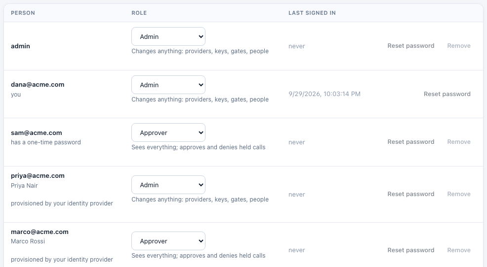
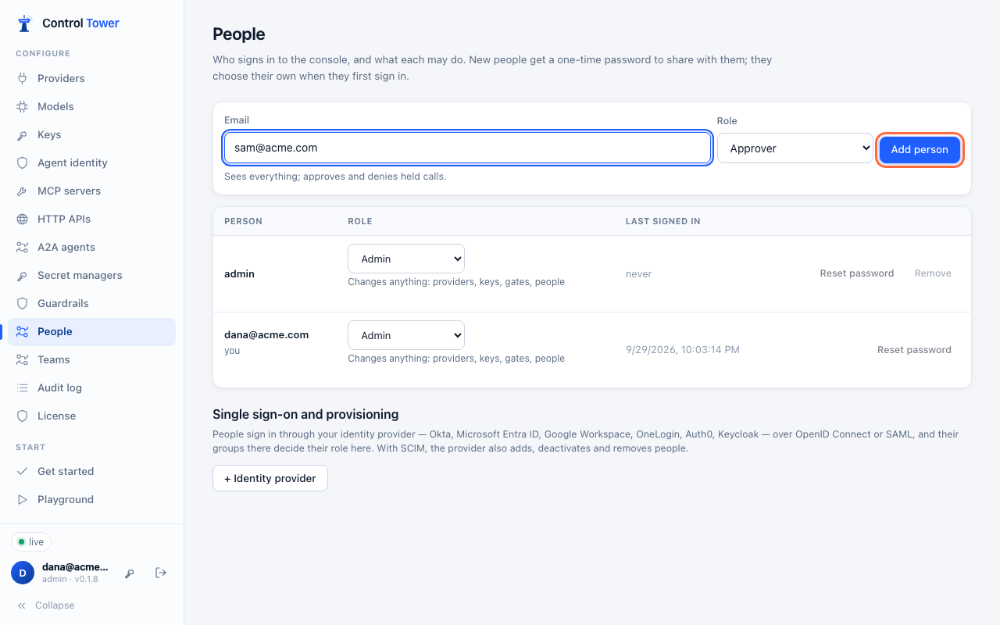
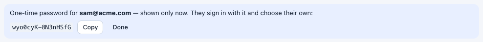

# People and roles

Everyone who signs in to the console has a role:

| Role | Can |
|---|---|
| **Admin** | Change anything: providers, models, keys, gates, zones, alerts, exports, guardrails, and people |
| **Approver** | See everything, and approve or deny held calls in the Tower (and from Slack or email links). Ending an [approval window](airspace.md#approve-the-next-n-calls) early is for admins |
| **Viewer** | See everything: the map, Flights, the Ledger, the Tower, every setting. Change nothing |
| **Member** | See only their [teams](teams.md): their agents, calls, held calls, spend and map. What they may change there, their team memberships decide (Enterprise) |

With [Enterprise](enterprise.md), [team and organisation memberships](teams.md) add rights to anyone: team admins manage their team's keys, budgets and people, and team members decide its held calls.

The person who sets up Control Tower is its first admin. The server enforces roles: an approver or viewer who tries to change something gets `403 forbidden`. Their console says what they can do, and hides the buttons for what they can't. Both can still change their own password.

The [admin key](configuration.md#admin-key) always acts as an admin.

Every change anyone makes, and every attempt their role refuses, is recorded in the [audit log](audit.md). Only admins can read it.

## Single sign-on

People can also sign in through your identity provider, with their role set by their groups there, and passwords can be turned off. See [Single sign-on](sso.md).



## Adding people

**People** (admins only) → enter an email and a role → **Add person**. Control Tower shows a **one-time password**, only once. Share it with them however you share secrets.





When they sign in with it, the only thing they can do is choose their own password (10 characters or more). After that, the one-time password no longer works.

- **Change a role** in the list. It takes effect at once: the person's current sessions end, and they sign in again with the new role.
- **Reset password** gives the person a new one-time password and ends their sessions. Use it when someone forgets theirs.
- **Remove** takes their access away. You can't remove yourself, and someone always stays an admin: the last admin can't be removed or made an approver or viewer.

## Your own password

The key button next to your name in the sidebar changes your password. Your other sessions end; the one you're using stays signed in.

## If the only admin loses their password

If `CT_ADMIN_KEY` is set, use it to give the admin a new one-time password:

```bash
curl -s -H "Authorization: Bearer $CT_ADMIN_KEY" https://controltower.example.com/admin/api/users
```

```bash
curl -s -X PATCH -H "Authorization: Bearer $CT_ADMIN_KEY" -H "content-type: application/json" -d '{"reset_password": true}' https://controltower.example.com/admin/api/users/<id>
```

With `CT_ADMIN_KEY` set, you can also sign in as `admin` with the key itself.

## API

| Method | Path | |
|---|---|---|
| GET, POST | `/admin/api/users` | List people (admins only); add one (`{email, role}`). The answer includes the one-time `password`, once |
| PATCH, DELETE | `/admin/api/users/:id` | Change the role (`{role}`) or reset the password (`{reset_password: true}`), which returns a new one-time `password`; remove |
| POST | `/admin/api/me/password` | Change your own: `{current, password}` |

`GET /admin/api/me` includes your `role`.
