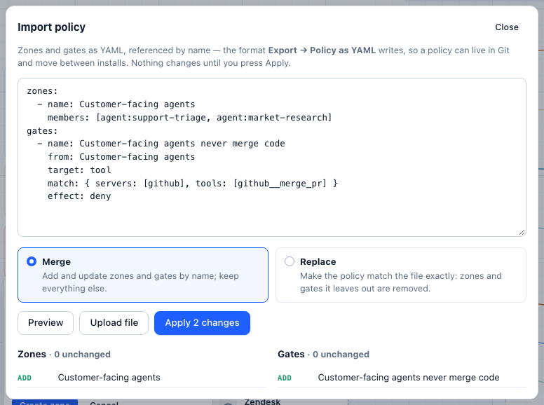

# Policy as code

Zones and gates are drawn on the map — and they are also a YAML file you can review in a pull request, keep in Git, and apply to another install.

- **Airspace → Export → Policy as YAML** downloads the current policy.
- **Airspace → Export → Import policy…** applies a file, after showing exactly what it adds, changes and removes.



## The format

```yaml
version: 1
zones:
  - name: AI Labs sandbox
    color: "#d3374e"
    members: [agent:labs-prototype]
  - name: Support
    match: { teams: [support] }          # every key of the team, now and later
  - name: Code hosting
    members: [mcp:github]
gates:
  - name: AI Labs may not merge code
    from: AI Labs sandbox
    to: Code hosting
    target: tool
    match: { tools: [github__merge_pr] }
    effect: deny
    config: { reason: Merges need a human from the platform team }
  - name: Contact deletes need a human
    target: tool
    match: { servers: [salesforce], operations: [admin] }   # destructive: delete_contact
    effect: require_approval
    config: { hold_ms: 20000 }
  - name: No secrets to any model
    target: model
    effect: inspect
    config: { detectors: [secrets], action: block, direction: input }
```

**Zones**

| Field | |
|---|---|
| `name` | Unique; gates refer to zones by name |
| `members` | `agent:<key name>`, `group:<agent id>` (every key with that agent ID), `team:<team>` (every key in the team), `model:<model name or provider/model>`, `provider:<slug>`, `mcp:<slug>`, `http:<slug>`, `tool:<server__tool>` |
| `match` | `teams`, `projects`, `tags` (keys) and `provider_kinds` (models): stations join automatically |
| `color` | Optional |

**Gates**

| Field | |
|---|---|
| `name` | Unique; used to update the gate on the next import |
| `from`, `to` | Zone names. Leave out for "any agent" / "anything" |
| `target` | `model`, `tool` or `any` (default) |
| `match.agents` | Key names |
| `match.groups` | Agent IDs: every key carrying one, including keys added later |
| `match.teams` | Teams: every key labelled with one, including keys added later |
| `match.on_behalf_of` | Calls made on behalf of `agent:<agent id>` or `team:<name>`, anywhere up a chain of [agents calling agents](agent-to-agent.md) |
| `match.deployments` | Model names (specific deployments) |
| `match.servers` | MCP server or HTTP API slugs |
| `match.models`, `match.tools` | Globs: `gpt-4*`, `github__merge_*`, `statuspage__DELETE *` |
| `match.operations` | `read`, `write`, `admin` (destructive: deletes, merges, payments, HTTP `DELETE`), `unknown` |
| `match.args` | Argument conditions: `{path, op: eq \| neq \| glob \| in \| gt \| lt \| exists, value}` |
| `effect` | `allow`, `deny`, `require_approval`, `allow_with_limits`, `inspect` |
| `config` | `reason`, `hold_ms`, `bind_fields` (approvals); `detectors`, `keywords`, `patterns`, `action`, `direction` (inspect) |
| `priority` | Lower runs first (default 100) |
| `enabled` | `false` keeps the gate but switches it off |

## Merge or replace

- **Merge** adds zones and gates that are new and updates those with the same name. Everything else stays.
- **Replace** makes the policy match the file exactly: zones and gates the file leaves out are removed (with their alerts).

A reference that doesn't resolve — an agent that doesn't exist, a zone the file doesn't define, an unknown detector — stops the import with a list of what to fix, and nothing changes. Demo zones and gates are never exported, changed or removed.

## At startup (GitOps)

Keep the policy in Git and apply it every time the server starts:

```bash
controltower --config config.yaml --policy policy.yaml
docker run … -v $(pwd)/policy.yaml:/app/policy.yaml ghcr.io/joshmaster2165/controltower --policy /app/policy.yaml
```

- By default the file is **merged**: its zones and gates are added or updated by name, and everything else is left alone.
- With `CT_POLICY_MODE=replace` the policy is made to match the file exactly — a gate deleted from the file is deleted on the next start.
- A file with errors stops startup and lists them, so a broken policy is never half-applied.
- The policy is applied after `--config`, so it can name the models and agents the config creates.

## From CI

```bash
# export
curl -s http://localhost:4000/admin/api/policy/export -H "Authorization: Bearer $CT_ADMIN_KEY" > policy.yaml

# preview, then apply
jq -Rs '{yaml: ., mode: "replace"}' policy.yaml | curl -s -X POST http://localhost:4000/admin/api/policy/import \
  -H "Authorization: Bearer $CT_ADMIN_KEY" -H "Content-Type: application/json" -d @-
jq -Rs '{yaml: ., mode: "replace", apply: true}' policy.yaml | curl -s -X POST http://localhost:4000/admin/api/policy/import \
  -H "Authorization: Bearer $CT_ADMIN_KEY" -H "Content-Type: application/json" -d @-
```

The preview returns `{errors, warnings, zones: {create, update, unchanged, remove}, gates: {…}}`; applying a file with errors returns `400`. `GET /admin/api/policy/export?format=json` returns the same document as JSON (which is also valid YAML to import).
