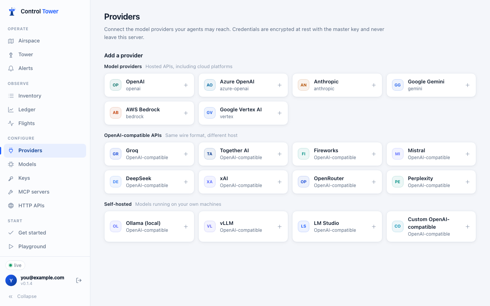
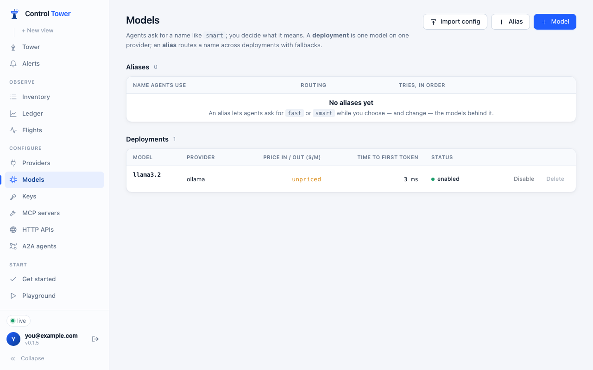
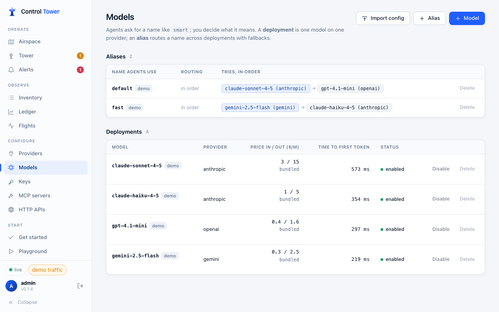
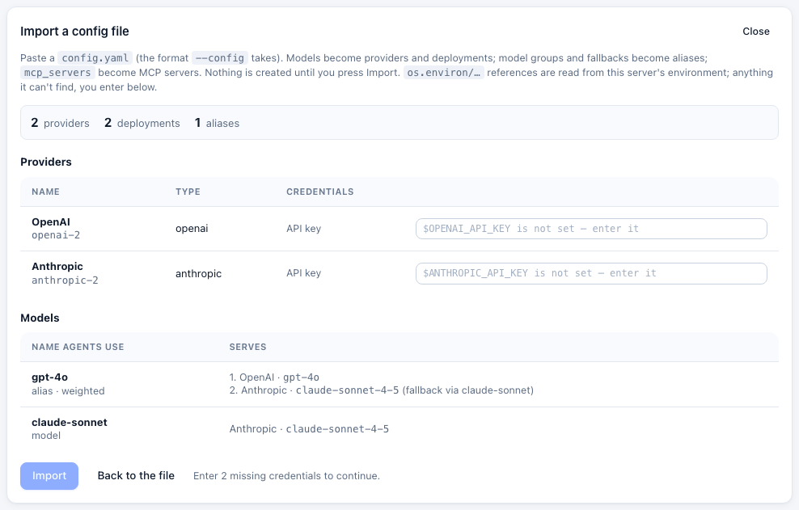

# Providers and models

A **provider** is an account at a model API: its endpoint and credentials. A **deployment** is one model on one provider. An **alias** is a name agents ask for that routes across deployments, with fallbacks. Agents only ever send a model name.

## Connect a provider

**Providers** lists the catalogue: OpenAI, Azure OpenAI, Anthropic, Google Gemini, Google Vertex AI and AWS Bedrock; OpenAI-compatible APIs (Groq, Together, Fireworks, Mistral, DeepSeek, xAI, OpenRouter, Perplexity); and local servers (Ollama, vLLM, LM Studio, or any OpenAI-compatible URL). Other OpenAI-compatible APIs — Cerebras, DeepInfra, NVIDIA NIM, SambaNova — connect as **Custom OpenAI-compatible** with their base URL, or by name in a [config file](config-file.md).

Pick one, paste its credentials and press **Connect & test**. Credentials are encrypted at rest with the master key (AES-256-GCM, bound to the row) and are never returned by the API or written to logs or events. The base URL is editable for proxies, regional endpoints and local servers.

| Provider | Credentials |
|---|---|
| OpenAI, Anthropic, Gemini, OpenAI-compatible | API key |
| Azure OpenAI | API key and resource URL (`https://<resource>.openai.azure.com`); the API version is editable |
| AWS Bedrock | Access key ID, secret access key and region (SigV4); an endpoint override for VPC endpoints |
| Google Vertex AI | Service-account JSON, project and location |
| Ollama, LM Studio, vLLM | Base URL only (an API key where the server needs one) |

A connected provider shows its health and the models it offers:

## Models are added on first use

You don't have to register every model. When a request names a model that no deployment or alias covers, Control Tower looks for a connected provider that serves it — by the provider's own model list, or by the price table — adds a deployment, prices it, and serves the request.

- `gpt-4.1-mini`, `claude-sonnet-4-5`, `llama3.2` … resolve to whichever connected provider offers them.
- `<provider-slug>/<model>` pins a provider: `openai/gpt-4.1-mini`, `groq/llama-3.3-70b-versatile`.
- A key's allowed-models globs are matched against the name the agent sends. A key limited to `gpt-4.1*` can ask for `gpt-4.1-mini` but not `openai/gpt-4.1-mini`; use `*gpt-4.1*` to allow both.
- A name nobody serves fails with `404 model_not_found` and says which provider to connect.
- Stand-in demo providers never adopt models, so demo traffic can't reach real providers.
- `CT_AUTO_MODELS=0` turns this off: every model must then be added under **Models**.

## Deployments

**Models → + Model** (or **+ Add model** on a provider) adds a deployment explicitly. Use it to:

- **rename** a model — the *public name* is what agents ask for (`vertex-gemini` → `gemini-2.5-pro` on Vertex AI);
- **override the price** (per million input / output tokens) for negotiated rates or models missing from the price table;
- **disable** a model without deleting it.

Prices come from a bundled table of about 1,800 models, refreshed with releases. Each request is priced once, at the rate in force when it was routed, and stored in integer nano-dollars. A model without a price is shown as *unpriced*; budgets still charge an input-side estimate for it, so an agent can't drain a budget through a provider that doesn't report usage.

## Aliases, load balancing and fallbacks

**Models → + Alias** gives agents one name — `fast`, `smart`, `default` — for several deployments.

| Strategy | Picks |
|---|---|
| **priority** | The first healthy deployment in the list; the rest are fallbacks in order |
| **weighted** | At random in proportion to weight among the deployments with the best priority, for spreading load across keys, regions or providers; the rest are fallbacks |
| **least latency** | The deployment with the lowest recent time to first token among those with the best priority; ones with no measurement yet go last. Later priorities stay fallbacks |
| **least cost** | The cheapest among those with the best priority, by the price of a typical call (input price × 3 plus output price, per million tokens); deployments without a known price go last. Later priorities stay fallbacks. Set with `routing_strategy: cost-based-routing` in a [config file](config-file.md) |

In the console, the order you click deployments in is the fallback order for **priority**; with the other strategies they all share the best priority. Through the API, give each target a `priority` (lower is tried first) and a `weight`.

- A request **falls back** to the next deployment on rate limits (429), server errors (5xx), timeouts and provider authentication failures — never on a 400 or a policy decision — and only if nothing has been sent to the client yet, up to three attempts.
- A deployment that fails is **cooled down** (2 s, doubling to 30 s) and skipped while others are healthy; the next success resets it.
- Aliases cross providers: an alias can fall back from OpenAI to Anthropic, and the request is translated.

## Import a config file

**Models → Import config** takes a [`config.yaml`](config-file.md), shows what it becomes — providers, deployments, aliases from model groups and fallbacks, MCP servers — asks for any secret it can't resolve, and imports it once.

To keep the file as the source of truth instead, start the server with `--config`; see [Config file](config-file.md).

## API

The console uses `/admin/api/providers`, `/admin/api/deployments` and `/admin/api/aliases`. With the [admin key](configuration.md#admin-key), scripts can also use the model management endpoints: `GET /model/info`, `POST /model/new`, `POST /model/delete`.
