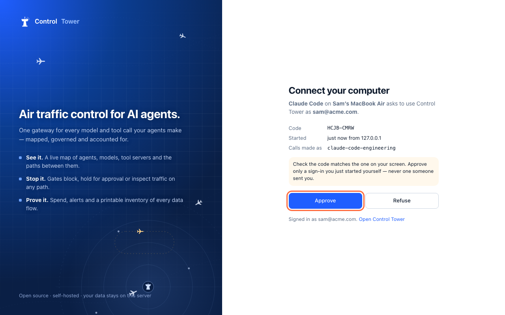

# Rolling it out: what each person does

**Enterprise:** builds on [Laptops](laptops.md), which needs a [Control Tower Enterprise](enterprise.md) license.

Most of your company never opens Control Tower. A security or platform team runs it. Everyone else opens Claude Code, Claude Desktop or Codex on their company computer, and finds it already set up. This page follows a rollout from both sides: what the team does, what reaches each computer, and what an employee sees.

## Who does what

| Who | In Control Tower | Role |
|---|---|---|
| The team running it (security, platform, IT) | Keys, rules, gates, providers, the rollout files | **Admin** |
| People who watch the traffic | The map, Flights, the Ledger, alerts, the audit log; they change nothing | **Viewer** |
| People who decide held calls | Approve or deny calls a gate holds | **Approver** |
| Team leads (with [teams](teams.md)) | Their own team's keys, budgets and held calls | **Team admin** |
| Everyone else | Nothing, or only their own computer (see [below](#the-first-time-someone-opens-claude)) | None, or **member** |

The MDM team (Jamf, Intune, Kandji, Group Policy) deploys the files the Control Tower team downloads. Often that's the same team.

## The rollout, from the team's side

1. **Decide how people sign in** (**Laptops › Roll it out**):
   - **With your identity provider:** people sign in to Okta or Entra ID directly and need no Control Tower account. Set it up as in [enforcing the gateway](enforcement.md#signing-in-with-your-identity-provider).
   - **With Control Tower:** people approve their computer in Control Tower after its single sign-on, as members. Use [single sign-on](sso.md) for a rollout: with passwords, everyone behind an office's one address shares a limit of 60 sign-ins a minute (`CT_LOGIN_IP_RPM`).
2. **Create the keys and rules.** For example:
   - a key per tool, such as `claude-code` and `claude-desktop`, with the models it may use, a budget and rate limits;
   - rules (or, signing in with your identity provider, the issuer's rules) mapping your groups to those keys;
   - [gates](airspace.md) on what needs them: require approval for a production database tool, keep a model for one team.
3. **Download the rollout files** under **Laptops**, with **Lock down** on.
4. **Pilot first.** Scope the files to a small group in your MDM, such as the platform team, then check it holds ([how](enforcement.md#4-checking-it-holds)). Then widen the scope, group by group.
5. **Deploy the apps too, if you like.** Your MDM can install them alongside their settings: Claude Desktop from its app catalogue or a package, Claude Code and Codex by a script or package. Then people don't install anything themselves. If they install the apps themselves, that works too: the settings are already there.
6. **Tell people.** A short note helps (see [below](#a-note-to-send-people)).

## What reaches each computer

When a computer comes into scope, the MDM installs three things, silently:

- **ct-auth**, the small sign-in helper;
- **its configuration:** Control Tower's address, and how to sign in;
- **each tool's managed settings:** use Control Tower, get the credential from ct-auth, use Control Tower's MCP tools and, with **Lock down**, nothing else.

Managed settings don't depend on the app being installed. Claude Desktop, Claude Code and Codex read them every time they start. A computer that gets the settings today and the app next month opens it already pointed at Control Tower.

## The first time someone opens Claude

Nothing to configure. When the tool first needs a credential, ct-auth opens the browser.

**Signing in with your identity provider:** the company's usual sign-in page (Okta, Microsoft) asks them to confirm the code shown. They're usually already signed in to it in that browser, so it's a click. Done.

**Signing in with Control Tower:** **Connect your computer** opens. They sign in with single sign-on (again, usually a click), see which tool on which computer is asking, and approve.

Then they go back to the tool, which carries on by itself. That's the only time they're asked. ct-auth renews its token in the background, for as long as the sign-in lasts: by default up to 90 days, or 30 days unused, with Control Tower sign-in, and as your identity provider decides with yours.

## Day to day, for them

- **They use the tools as normal.** Models they're allowed, Control Tower's tools as MCP tools, nothing to manage.
- **A call a gate blocks** comes back as a message the tool shows, in words: what was blocked, which gate, its reason, and what to do. For example: *Control Tower blocked this message: it contains AWS access key (gate "No credentials to models"). Credentials must never be sent to a model. Remove it and send your message again.*
- **A call a gate holds** waits while an approver decides (Claude shows *Waiting for Claude…*); the approval card names the person and the tool. If they approve in time, the answer arrives as usual. If they deny it, the person reads who did and why: *Control Tower: your request was denied by maria@acme.com: Not before the audit closes (gate "Sonnet needs a manager").* If nobody answers in time (about 20 seconds by default, `CT_HOLD_BUDGET_MS`), the tool says approval is needed; once it's approved, sending the same message again goes through, for them only, once. Once a request is approved, the steps Claude Code or Codex take to finish it (reading files, running tools) don't ask again for 30 minutes; something new they type does.
- **A new computer, or a reinstalled one:** the MDM sets it up again, and they sign in once more.
- **Changing teams:** with Control Tower sign-in, the rules apply at their next token (within the hour). With your identity provider, when the provider's groups change.
- **Leaving:** removing them in Control Tower, or deactivating them at the identity provider (also through SCIM), ends their access. With Control Tower sign-in that's at once; with your identity provider's tokens, when their current token expires (usually within the hour).
- **Without the network:** the tools need Control Tower, as they'd need the provider.

## What they ask

**Do I need a Control Tower account?** Not when you sign in with your identity provider. With Control Tower sign-in, yes, as a member, and only to approve your computer: a member sees only their own team's agents.

**Can I use my personal Claude or ChatGPT account instead?** Not in the tools your company manages. With **Lock down**, they only use Control Tower.

**What's recorded about my calls?** Who made the call, from which tool, to which model or tool, when, the outcome, tokens and cost. Prompts and answers are not stored. When a gate holds a call for approval, approvers see that call's arguments (a tool call's parameters, say), so they know what they're approving.

**Does this use our Claude Enterprise (or ChatGPT Enterprise) seats?** No. With these settings, Claude Desktop runs in its gateway mode, and Claude Code and Codex send Control Tower's credential instead of a personal or company login. Calls are billed to the provider accounts behind Control Tower, under your keys' budgets.

**Can I see my own usage?** With Control Tower sign-in, **Connect your computer** lists your signed-in computers, and members see their team's spend in the Ledger. Admins see everyone's under **Spend by person**.

## A note to send people

> **Claude Code, Claude Desktop and Codex are now set up on your company computer.**
> They go through our AI gateway, which keeps company data and spend in line with our policies. The first time you open one, your browser asks you to sign in with your work account: confirm, then go back to the app. That's all. Your personal accounts can't be used on company computers. Questions: #ai-tools.

## See also

- [Laptops](laptops.md): the rollout files, ct-auth, and signed-in computers.
- [Enforcing the gateway on every computer](enforcement.md): what's locked, closing other routes at the network, and checking every computer.
- [People and roles](people.md) and [teams](teams.md): who sees and does what in Control Tower.
