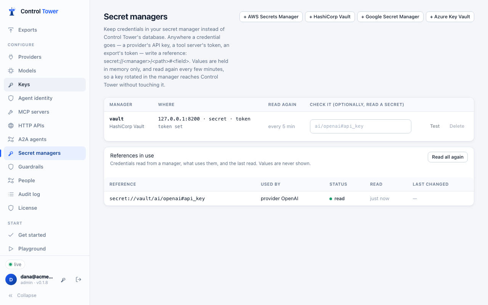
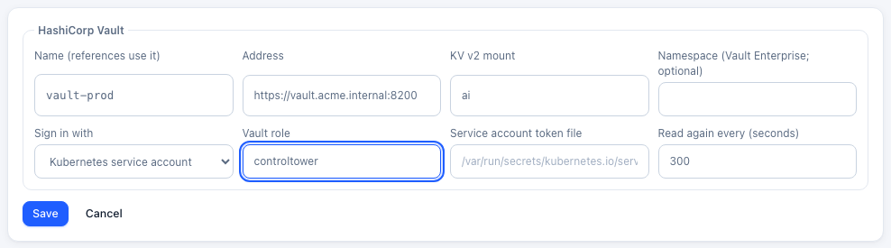

# Secret managers

**Enterprise:** secret managers need a [Control Tower Enterprise](enterprise.md) license.

Credentials can stay in your secret manager instead of Control Tower's database. Supported managers are AWS Secrets Manager, HashiCorp Vault, Google Secret Manager and Azure Key Vault. Anywhere a credential goes, write a **reference** to it instead:

```
secret://<manager>/<path>#<field>
```

For example:
- `secret://vault/ai/openai#api_key`: the `api_key` field of `ai/openai` in Vault;
- `secret://aws/prod/anthropic`: the whole secret `prod/anthropic` in AWS.

Control Tower reads the value when it's first needed and keeps it in memory only. It reads it again every few minutes, so **a key rotated in your secret manager reaches Control Tower on its own**: nothing to paste, no restart.



## Set it up

1. Open **Secret managers** and add yours (see [each manager](#each-manager) for the settings and permissions).
   - Its **name** is what references use: `secret://<name>/…`.
   - **Read again every** sets how often values are refreshed (300 seconds unless you choose; 30 seconds to a day).

   

2. **Test** checks that Control Tower can sign in. Put a path in the box to also read that secret; its length is shown, never its value.
3. Put references where the credentials go:
   - a provider's API key;
   - an [MCP server](mcp.md)'s or [HTTP API](http-apis.md)'s token;
   - an [A2A agent](a2a.md)'s credentials;
   - an [export](exports.md)'s API key or HEC token;
   - a [guardrail service](guardrails.md)'s key;
   - an [alert channel](alerts.md)'s webhook URL or secret.

   A reference can also go in a [config file](configuration.md): `api_key: secret://vault/ai/openai#api_key`.
4. **References in use** lists each reference, what uses it, when it was last read and when its value last changed.

A reference is stored as written. Editing the provider (or the tool server, export and so on) later keeps the reference, never the value read.

## Which value

| The secret holds | The reference | Reads |
|---|---|---|
| A single value | `secret://aws/prod/openai-key` | The value |
| JSON: `{"api_key": "sk-…", "org": "acme"}` | `secret://aws/prod/openai#api_key` | That field |
| JSON with one field (every Vault secret is fields) | `secret://vault/ai/openai` | That one field |
| JSON with several fields | `secret://vault/ai/openai` | Refused: name the field with `#field` |

A specific version: `secret://gcp/openai-key/versions/7` (Google) or `secret://keyvault/openai-key/<version>` (Azure). Otherwise the latest version is read.

## Reading and rotation

- **At start**, Control Tower reads every reference before it serves calls, waiting up to 15 seconds.
- **Every refresh interval**, each value is read again. When one has changed, what uses it reloads with the new value. **Read all again** does it now.
- **If a read fails** (the manager is down, or a permission was removed), the last value read stays in use and the error is shown under **References in use**. The read is tried again every 30 seconds.
- **A reference never read** (the manager was unreachable from the start) is sent as it is written, so the provider refuses the call as it would a wrong key.

To rotate a provider's key:
1. Create the new key at the provider.
2. Put it in the secret manager.
3. Wait one refresh interval, or click **Read all again**, then check **Last changed**.
4. Revoke the old key at the provider.

Control Tower's own agent keys rotate too, and can be written into your secret manager for agents to read: see [Key rotation](key-rotation.md).

## Each manager

### AWS Secrets Manager

| Setting | |
|---|---|
| Region | e.g. `us-east-1` |
| Access key | Optional. Without one, Control Tower uses the role it runs with, in the AWS SDKs' order: environment variables, EKS web identity (IRSA), the ECS task role, then the EC2 instance role |
| Endpoint | Optional: a VPC endpoint |

The path is the secret's name or ARN. Permissions:

```json
{
  "Version": "2012-10-17",
  "Statement": [
    { "Effect": "Allow", "Action": ["secretsmanager:GetSecretValue"], "Resource": "arn:aws:secretsmanager:us-east-1:123456789012:secret:prod/ai/*" },
    { "Effect": "Allow", "Action": ["secretsmanager:PutSecretValue"], "Resource": "arn:aws:secretsmanager:us-east-1:123456789012:secret:agents/*" },
    { "Effect": "Allow", "Action": ["secretsmanager:ListSecrets"], "Resource": "*" }
  ]
}
```

`PutSecretValue` is only needed to [deliver rotated keys](key-rotation.md#on-a-schedule-delivered-to-your-secret-manager). `ListSecrets` is only needed for **Test**.

### HashiCorp Vault

| Setting | |
|---|---|
| Address | e.g. `https://vault.acme.internal:8200` |
| KV v2 mount | `secret` unless you choose another |
| Namespace | Vault Enterprise namespaces |
| Sign in with | A **token**, **AppRole** (role ID and secret ID), or a **Kubernetes** service account (the Vault role; the token file defaults to the pod's own) |

The path is the secret's path inside the mount (`ai/openai`, not `secret/data/ai/openai`). A policy:

```hcl
path "secret/data/ai/*"     { capabilities = ["read"] }
path "secret/data/agents/*" { capabilities = ["read", "create", "update"] }   # delivering rotated keys
```

### Google Secret Manager

| Setting | |
|---|---|
| Project | e.g. `acme-prod` |
| Service account key | Optional. Without one, Control Tower uses the service account it runs as (GKE Workload Identity, Cloud Run, Compute Engine) |

The path is the secret's name, optionally `/versions/<n>`. Roles:
- **Secret Manager Secret Accessor** on the secrets read;
- **Secret Manager Secret Version Adder** on those it delivers rotated keys to;
- **Secret Manager Viewer** for **Test**.

### Azure Key Vault

| Setting | |
|---|---|
| Vault URL | e.g. `https://acme.vault.azure.net` |
| Tenant, client ID, client secret | An app registration. Without a client secret, Control Tower uses its managed identity: App Service, Container Apps or Arc through `IDENTITY_ENDPOINT`, otherwise the VM's; a client ID picks a user-assigned identity |

The path is the secret's name, optionally `/<version>`. Roles:
- **Key Vault Secrets User** to read;
- **Key Vault Secrets Officer** on the secrets it delivers rotated keys to.

## What's stored where

- The **manager's own credentials** (a Vault token, an AWS key, a client secret) are encrypted with Control Tower's master key and never shown again. With a role or managed identity, there are none to store.
- **Values read** are held in memory only, and are never shown in the console, logs, exports, the audit log or the support bundle.
- **Changes** to managers are in the [audit log](audit.md).

**Without a license** (or once one ends), managers can't be added or changed. References already set up keep being read, so calls never stop because of the license.

## API

Admins only.

| Method | Path | |
|---|---|---|
| GET | `/admin/api/secret-managers` | Managers (settings without their secrets) and `refs`: each reference in use, what uses it, `status` (`ok`, `error`, `reading`), `error`, `read_at`, `changed_at` |
| POST | `/admin/api/secret-managers` | `{name, kind: aws \| vault \| gcp \| azure, config, refresh_s}` |
| PATCH | `/admin/api/secret-managers/:id` | `config` (secrets left empty keep their values) or `refresh_s` |
| DELETE | `/admin/api/secret-managers/:id` | Refused (`409`) while references use it, unless `?force=true` |
| POST | `/admin/api/secret-managers/:id/test` | Sign in; with `{ref}`, also read it. `{ok, message}`, never the value |
| POST | `/admin/api/secret-managers/refresh` | Read every reference again now |

`config` by kind:

| `kind` | `config` |
|---|---|
| `aws` | `region` (required), `access_key_id`, `secret_access_key`, `session_token`, `endpoint`, `sts_endpoint` |
| `vault` | `address` (required), `mount`, `namespace`, `auth` (`token`, `approle`, `kubernetes`), `token`, `role_id`, `secret_id`, `role`, `jwt_path`, `auth_mount` |
| `gcp` | `project` (required), `service_account_json`, `api_url` |
| `azure` | `vault_url` (required), `tenant_id`, `client_id`, `client_secret`, `authority` |
