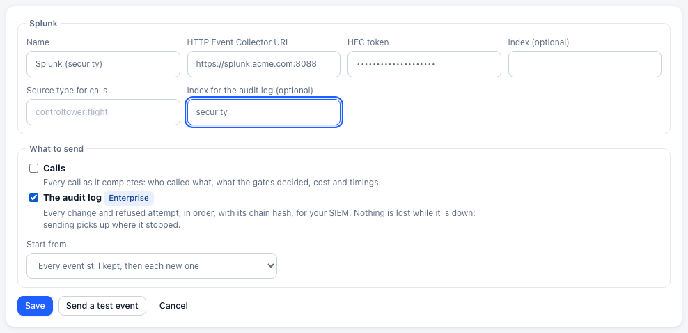

# Audit log to your SIEM

**Enterprise:** sending the audit log to a SIEM needs a [Control Tower Enterprise](enterprise.md) license.

Any [export destination](exports.md) can also receive the [audit log](audit.md): every change made in Control Tower, and every attempt that was refused, as it happens. It works with Splunk, Datadog, an OpenTelemetry collector (and through it Elastic, Microsoft Sentinel, Google SecOps and others), an S3 bucket, or any webhook. A destination can receive calls, the audit log, or both.



## Set it up

1. Open **Exports** and add a destination, or pick an existing one.
2. Under **What to send**, tick **The audit log**. Untick **Calls** if this destination is only for security events.
3. Choose where to **Start from**:
   - **New events, from now on**;
   - **Every event still kept, then each new one**, to load the history into your SIEM (up to the [retention](audit.md#retention) period, 365 days by default).
4. **Send a test event** checks the settings; then **Save**.

For a destination already saved, tick **Audit log** in its row. It starts from new events.

The row shows where the destination has got to: **up to date**, how many events are still **to send**, or **failing** with the reason.


## What each destination receives

| Destination | Audit events arrive as |
|---|---|
| **Splunk** | HTTP Event Collector events with source type `controltower:audit` and the event's own time. The **Index for the audit log** setting sends them to their own index (for example `security`); left empty, they go to the same index as calls |
| **Datadog** | Log intake v2, one log per event. `status` is `info` (done), `warn` (refused) or `error` (failed), and `message` reads like `dana@example.com providers.create: success (201)`. Datadog's standard attributes are filled in: `evt.name` (the action), `evt.outcome`, `usr.id`, `usr.email`, `network.client.ip`, `http.status_code`, `http.useragent`. The whole event is under `audit` |
| **OpenTelemetry** | Log records sent to `<endpoint>/v1/logs`, even when the destination sends calls as traces. Scope `controltower.audit`; `event.name` is `controltower.audit`. Attributes follow OpenTelemetry's conventions (`user.id`, `user.email`, `user.roles`, `client.address`, `user_agent.original`, `http.response.status_code`), plus `controltower.audit.action`, `.outcome`, `.seq`, `.hash`. The body is the whole event as JSON. Severity is `INFO`, `WARN` or `ERROR`, as above |
| **S3 archive** | Gzipped JSON Lines files under `<prefix>audit/YYYY/MM/DD/HH/`, apart from call records |
| **Webhook** | `{"type": "controltower.audit", "count": 2, "events": [...]}`, signed with `x-ct-signature` when the destination has a secret (see [checking the signature](alerts.md#webhook-payload)) |

Each event is the same as in the [audit log API](audit.md#api): who, what, the outcome, where from, the request with its secrets removed, and the chain fields `seq`, `prev_hash` and `hash`.

### Other SIEMs

- **Elastic:** send to an OpenTelemetry collector with the Elasticsearch exporter, or to Elastic's OTLP endpoint directly.
- **Microsoft Sentinel:** send to an OpenTelemetry collector with the Azure Monitor exporter, or to a webhook (a Logic App or Azure Function) that writes to a Log Analytics table.
- **Google SecOps, Sumo Logic, Cribl, Vector and others:** OpenTelemetry or a webhook.
- **Amazon Security Lake or Athena:** the S3 archive.

## Delivery

Control Tower sends from the audit log itself, not from a queue held in memory. Each destination remembers the last event it received:

- **Nothing is lost while your SIEM is down.** Events wait in the audit log. Sending retries with growing pauses (2 seconds, then up to 5 minutes between tries), and picks up from where it stopped when the SIEM is back. A restart or an upgrade loses nothing either.
- **In order.** Events arrive in `seq` order, up to 500 per batch, within a few seconds of happening.
- **At least once.** If Control Tower stops between sending a batch and noting it was received, that batch is sent again when it starts. Use `id` (or `seq`) to drop duplicates.
- **Retention.** An event removed by retention before it could be sent (after a SIEM outage longer than the retention period) is counted, and shown as *removed by retention before sending*. The SIEM sees the gap in `seq`.
- **Several instances.** With [several instances](scaling.md) on one database, one of them sends to each destination. If it stops, another takes over within 30 seconds.
- **Without a license,** or after one ends, nothing is sent. Each destination keeps its position, and sending resumes from it when a license is added. (Nothing is recorded in the meantime either: see [when a license ends](enterprise.md#when-a-license-ends).)

## Checking the chain in your SIEM

Each event carries `seq`, the SHA-256 `hash` of its contents, and `prev_hash`, the hash of the event before it. With them your SIEM (or an auditor) can check, without access to Control Tower, that no event was changed, removed or put out of order:

- `seq` goes up by one from each event to the next (a gap is an event not received);
- each event's `prev_hash` equals the previous event's `hash`;
- each event's `hash` is the SHA-256 of this JSON array, written without spaces:

```
[seq, id, time in milliseconds, actor.type, actor.id, actor.email, actor.role, action, outcome, status,
 target.type, target.id, detail as a JSON string (or null), ip, user_agent, request_id, prev_hash]
```

In Python:

```python
import hashlib, json
from datetime import datetime

def event_hash(e):
    t = e.get("target") or {}
    ms = round(datetime.fromisoformat(e["time"].replace("Z", "+00:00")).timestamp() * 1000)
    detail = None if e["detail"] is None else json.dumps(e["detail"], separators=(",", ":"), ensure_ascii=False)
    fields = [e["seq"], e["id"], ms, e["actor"]["type"], e["actor"]["id"], e["actor"]["email"], e["actor"]["role"],
              e["action"], e["outcome"], e["status"], t.get("type"), t.get("id"), detail,
              e["ip"], e["user_agent"], e["request_id"], e["prev_hash"]]
    return hashlib.sha256(json.dumps(fields, separators=(",", ":"), ensure_ascii=False).encode()).hexdigest()

def check(events):  # in seq order
    for prev, e in zip(events, events[1:]):
        assert e["seq"] == prev["seq"] + 1, f"missing events before {e['seq']}"
        assert e["prev_hash"] == prev["hash"], f"event {e['seq']} does not follow {prev['seq']}"
    for e in events:
        assert event_hash(e) == e["hash"], f"event {e['seq']} was changed"
```

A copy in your SIEM, kept by people who can't change Control Tower's database, is evidence that holds even against someone with full access to that database.

## API

Destinations are managed through the [exports API](exports.md#api) with three more fields:

| Field | |
|---|---|
| `send_flights` | `true` (default) to send calls |
| `send_audit` | `true` to send the audit log. Refused with `402` (`enterprise_required`, feature `siem_export`) without a license |
| `audit_from` | `now` (default) or `start` (every event still kept), when the audit log is turned on |

```bash
curl -X POST https://controltower.example.com/admin/api/exports \
  -H "authorization: Bearer $CT_ADMIN_KEY" -H 'content-type: application/json' \
  -d '{"name": "Splunk (security)", "kind": "splunk",
       "config": {"url": "https://splunk.example.com:8088", "token": "…", "audit_index": "security"},
       "send_flights": false, "send_audit": true, "audit_from": "start"}'
```

`GET /admin/api/exports` gives, for each destination with the audit log on, `audit: {last_seq, behind, sent, skipped, last_status, last_error, last_sent_at}`. `POST /admin/api/exports/test` with `"stream": "audit"` sends an example event. `POST /admin/api/exports/<id>/flush` sends what is waiting now.
