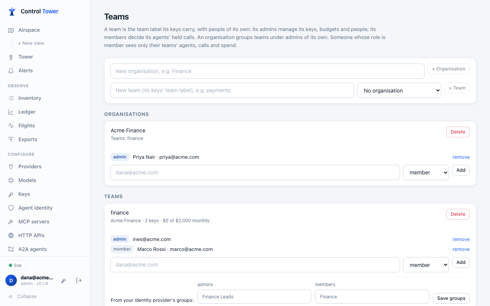
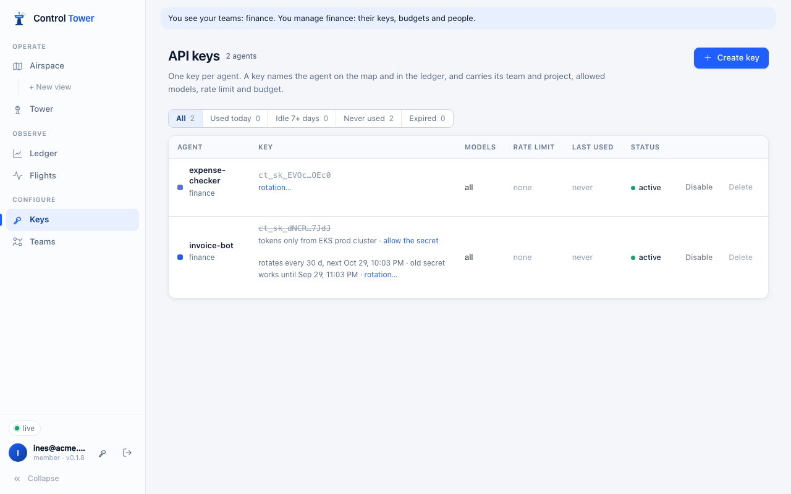
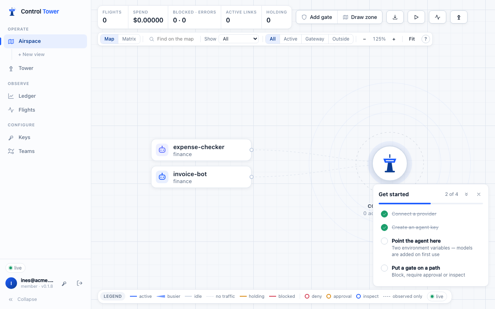

# Organisations and teams

**Enterprise:** organisations and team admins need a [Control Tower Enterprise](enterprise.md) license.

Give each department its own Control Tower inside yours. A **team** is the `team` label its [keys](keys.md) already carry, with people of its own. An **organisation** groups teams under admins of its own. Admins keep full control. Everyone else sees, and changes, only what their teams let them.

## Who can do what

**Memberships** add rights to anyone, whatever their [role](people.md):

| Membership | Can |
|---|---|
| **Team member** | Decide the team's agents' held calls: in the Tower, or from a Slack or email link |
| **Team admin** | That, and manage the team's keys: create them in the team, change and rotate them, disable or delete them, and set their limits and budgets. Also add and remove the team's people |
| **Organisation member** | Team member of every team in the organisation |
| **Organisation admin** | Team admin of every team in the organisation. Also add teams to it, set their budgets, and add and remove its people |

A team admin can't raise their team's own budget: that is for an organisation admin or an admin.

**Only admins** change everything else: providers, models, tool servers, gates, zones, exports, guardrails, alerts, secret managers, single sign-on, and organisations themselves.

### What a member sees

The **member** role sees only their teams. That covers:
- their agents' keys;
- their calls in Flights;
- their held calls in the Tower;
- their spend in the Ledger;
- their agents on the map (the Airspace), and their live traffic.

The shared catalogue their keys use stays visible: models, tool servers and gates. Anything that spans every team is hidden: other teams' agents, people, the audit log, spend by customer or tag, and settings.

The server enforces this: every list, map, count and live update is filtered for them, and everything outside their teams answers `403` (or `404` for a single item).

**Admins, approvers and viewers** still see everything. A viewer who is also a team admin sees everything and manages their own team.

## Set it up

1. On **Teams**, add an **organisation** (optional) and **teams**.
   - A team's name is the `team` label on its keys, so keys already labelled `finance` belong to the `finance` team straight away.
   - Labels your keys carry that aren't teams yet are listed, one click each to make them teams.
2. Add people to a team or organisation by email, as **admin** or **member**. Someone new to Control Tower is created with the **member** role and a one-time password, shown once. Or they sign in with [single sign-on](sso.md).
3. Give people who should see only their teams the **member** role (People, or your identity provider: see below).

Renaming a team renames the label on its keys and moves its budget with it. Past calls keep the name they were made under. Deleting a team removes its memberships; its keys keep their label.

## From your identity provider

A team can list the groups at your identity provider that make people its **admins** or **members**. At each [single sign-on](sso.md), and each [SCIM](scim.md) group change, Control Tower sets that person's team memberships from their groups:
- joining a group adds them to the team;
- leaving it removes them.

Memberships added on Teams by hand are left alone.

To have people from your identity provider land as members, map a group to **Member** in the provider's role map, or set **Anyone else** to **Member**. Their teams then decide what they see.

## When a license ends

Memberships stop giving anything: **members see nothing**, since nothing fails open. Admins, approvers and viewers keep their roles. Teams, organisations and memberships are kept, and apply again when a license is added.

## API

Admins, plus whoever the table below allows. The server checks each request.

| Method | Path | Who | |
|---|---|---|---|
| GET | `/admin/api/orgs` | Everyone with Teams | Organisations they see, with teams, members and `may_manage` |
| POST, PATCH, DELETE | `/admin/api/orgs`, `/admin/api/orgs/:id` | Admins | `{name}`. Deleting keeps its teams, outside any organisation |
| PUT, DELETE | `/admin/api/orgs/:id/members`, `…/members/:personId` | Admins, its admins | `{email, role: admin \| member}`. Someone new is created as a member: `{created: true, password}` |
| GET | `/admin/api/teams` | Everyone with Teams | Teams they see: members, key count, budget, `idp_groups`, `may_manage`, `may_budget`; for admins, `unassigned_labels` |
| POST | `/admin/api/teams` | Admins, organisation admins (into their organisation) | `{name, org_id}` |
| PATCH, DELETE | `/admin/api/teams/:id` | Admins, its organisation's admins | `{name, org_id, idp_groups: {admin: [...], member: [...]}}` |
| PUT, DELETE | `/admin/api/teams/:id/members`, `…/members/:personId` | Admins, its organisation's admins, its admins | As for organisations |

`GET /admin/api/me` includes `scope`:
- `all`: whether they see everything;
- `teams`: the teams they see;
- `manage`, `approve` and `org_admin`: team names, organisation ids, or `"all"`.

Scoped people use the same key, budget and approval endpoints as admins, answered for their teams.
